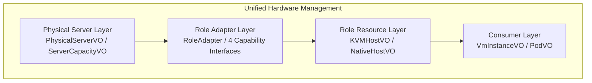

# 第一章：架构总纲 (Architecture Overview)

## 1.1 核心架构原则（必须遵守）

### 原则 1：统一架构主导，而非模块主导

**统一架构 Lead 四个模块，模块必须适配统一架构，不是架构去迁就模块的历史包袱。**

- 模块 agent 的反馈是**思考角度**，不是**设计指令**
- 架构师有权拒绝任何破坏架构一致性的特化请求
- 当模块提出特化需求时，首先考虑是否能通过统一接口 + Adapter 层实现差异

### 原则 2：禁止特化接口

| 禁止的设计 | 原因 | 正确做法 |
|-----------|------|---------|
| `ReadOnlyClusterBindable` | 只读绑定是实现细节 | 在 Adapter 层处理，统一使用 `ClusterBindable` |
| `SyncCreatable` | 同步 vs 主动创建是实现差异 | 在 Adapter 层处理，统一使用 `RoleAdapter.createRole()` |
| `ChassisOfferingManageable` | Offering 是业务概念 | 不进入统一接口层，在 Baremetal2 模块内处理 |
| `GatewayAllocatable` | Gateway 是实现细节 | 不进入统一接口层，在 Baremetal2 模块内处理 |
| `PxeBootable` | PXE 是 Baremetal 实现细节 | 通过 HardwareDiscoverable 统一处理 |
| `CapacityManageable` | 容量管理上移到资源分配层 | 使用统一的 ResourceAllocator |
| 模块特有状态字段 | 状态必须归一化 | 使用统一的 ServerState/ServerStatus |

### 原则 3：Server 层统一容量管理

**ServerCapacityVO 作为唯一容量存储，删除 HostCapacityVO 依赖**。详见第 4 章完整设计。

| 要点 | 说明 |
|------|------|
| 统一入口 | AllocateServerMsg 作为所有分配请求的入口 |
| 单一容量存储 | ServerCapacityVO 取代 HostCapacityVO |
| 悲观锁 | ServerCapacityUpdater 使用 PESSIMISTIC_WRITE |
| 责任链 | ServerAllocatorChain 可扩展 Flow |
| 兼容层 | HostAllocatorCompatibilityLayer 保证老 API 兼容 |

### 原则 4：向下兼容

- 保留现有 BaremetalChassisVO、HostVO 等结构
- 现有 API 100% 兼容
- 通过引用表关联新旧结构

---

## 1.2 架构层次设计

*   **Physical Server Layer**: 物理资源的唯一管理方，负责硬件发现、容量记账。
*   **Role Adapter Layer**: 连接物理与业务的桥梁，屏蔽底层差异。
*   **Role Resource Layer**: 现有的业务对象层，保持不变以确保兼容。
*   **Consumer Layer**: 资源的最终消费者。
