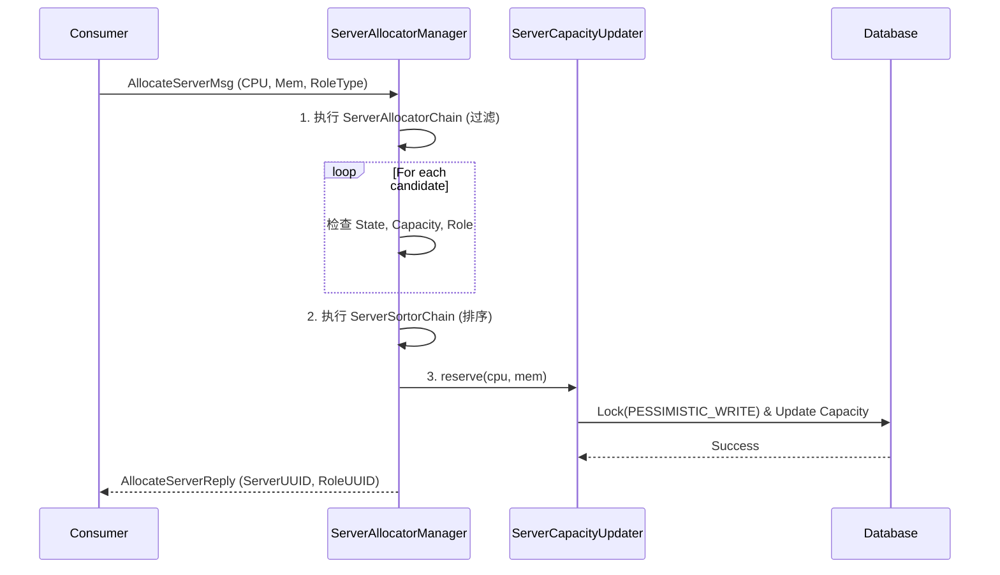

# 第四章：Server 层统一分配 (Server Allocation)

## 4.1 统一分配流程

从 v2.2 开始，**分配逻辑上移至 Server 层**。所有消费者（VM, Pod, BM）都请求 `AllocateServerMsg`。



## 4.2 核心组件设计

### 4.2.1 AllocateServerMsg
```java
@APIMessage
public class AllocateServerMsg extends NeedReplyMessage {
    @APIParam
    private String zoneUuid;
    @APIParam(required = false)
    private String clusterUuid;
    @APIParam(required = false)
    private String serverPoolUuid;
    @APIParam
    private String requiredRoleType;  // KVM_HOST / NATIVE_HOST / BARE_METAL
    @APIParam
    private long requiredCpu;
    @APIParam
    private long requiredMemory;
    @APIParam(required = false)
    private String allocatorStrategy;  // LEAST_USED / RANDOM / ...
    // 向下兼容：指定具体 Server
    @APIParam(required = false)
    private String serverUuid;
}

public class AllocateServerReply extends MessageReply {
    private String serverUuid;
    private String roleUuid;      // = hostUuid for VM, = chassisUuid for BM
    private String roleType;
    private ServerCapacityInventory capacity;
}
```

### 4.2.2 ServerCapacityUpdater (悲观锁)
确保高并发下容量不超卖。

```java
package org.zstack.server.allocator;

public class ServerCapacityUpdater {
    private String serverUuid;

    public ServerCapacityUpdater(String serverUuid) {
        this.serverUuid = serverUuid;
    }

    @Transactional
    @DeadlockAutoRestart
    public boolean reserve(long cpu, long memory) {
        ServerCapacityVO cap = dbf.getEntityManager().find(
            ServerCapacityVO.class,
            serverUuid,
            LockModeType.PESSIMISTIC_WRITE  // 悲观锁
        );

        if (cap == null) {
            logger.warn("ServerCapacityVO not found for server: " + serverUuid);
            return false;
        }

        if (cap.getAvailableCpu() < cpu) {
            throw new UnableToReserveCapacityException(operr("Not enough CPU capacity"));
        }

        if (cap.getAvailableMemory() < memory) {
            throw new UnableToReserveCapacityException(operr("Not enough memory capacity"));
        }

        cap.setAvailableCpu(cap.getAvailableCpu() - cpu);
        cap.setAvailableMemory(cap.getAvailableMemory() - memory);
        dbf.getEntityManager().merge(cap);
        return true;
    }

    @Transactional
    @DeadlockAutoRestart
    public void release(long cpu, long memory) {
        // 类似的释放逻辑，同样使用 PESSIMISTIC_WRITE
    }
}
```

### 4.2.3 分配器责任链 (Flows)

```java
// ========== 分配 Flow 接口 ==========
public interface ServerAllocatorFlow {
    void allocate(ServerAllocatorSpec spec,
                  List<PhysicalServerInventory> candidates,
                  ReturnValueCompletion<List<PhysicalServerInventory>> completion);
}

// 1. ServerStateAllocatorFlow: 过滤 state=Disabled 或 status=Disconnected
// 2. ServerCapacityAllocatorFlow: 检查 availableCpu 和 availableMemory
// 3. ServerRoleAllocatorFlow: 检查服务器是否具备请求的 roleType
// 4. ServerClusterAllocatorFlow: 如果指定了 clusterUuid，检查角色是否绑定在该集群
```

## 4.3 资源超分策略
超分逻辑下沉到 `ServerCapacityVO` 内部。
*   `totalCpu = totalPhysicalCpu * cpuOverprovisioningRatio`
*   分配时只扣减 `availableCpu`，不关心物理底层的具体核。
