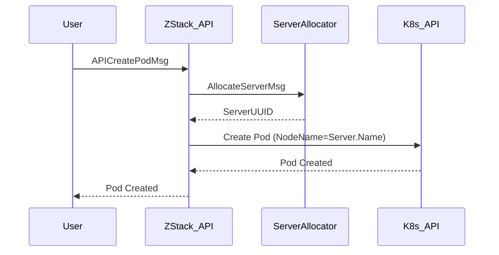

# 第六章：API 与迁移方案 (API & Migration)

## 6.1 兼容性设计 (Compatibility Layer)

为了保证现有业务代码（KVM 等模块）不修改也能运行，我们需要在 Server 层实现对旧接口的拦截与转发。

### HostAllocatorCompatibilityLayer
拦截 `AllocateHostMsg`，将其转换为 `AllocateServerMsg`。

```java
@Component
public class HostAllocatorCompatibilityLayer implements HostAllocatorStrategy {
    @Autowired
    private ServerAllocatorManager serverAllocatorManager;
    @Autowired
    private DatabaseFacade dbf;

    @Override
    public void allocate(HostAllocatorSpec spec, ReturnValueCompletion<List<HostInventory>> completion) {
        // 1. 转换为 AllocateServerMsg
        AllocateServerMsg msg = new AllocateServerMsg();
        msg.setRequiredRoleType(ServerRoleTypes.KVM_HOST.toString());
        msg.setRequiredCpu(spec.getCpuCapacity());
        msg.setRequiredMemory(spec.getMemoryCapacity());
        msg.setClusterUuid(spec.getClusterUuid());
        msg.setZoneUuid(spec.getZoneUuid());

        if (spec.getHostUuid() != null) {
            String serverUuid = findServerUuidByRoleUuid(spec.getHostUuid());
            msg.setServerUuid(serverUuid);
        }

        // 2. 调用新分配器
        serverAllocatorManager.allocate(msg, new ReturnValueCompletion<AllocateServerReply>(completion) {
            @Override
            public void success(AllocateServerReply reply) {
                // 3. 将 Server 结果反向映射回 HostInventory
                HostVO host = dbf.findByUuid(reply.getRoleUuid(), HostVO.class);
                if (host == null) {
                    completion.fail(operr("Host not found: %s", reply.getRoleUuid()));
                    return;
                }
                completion.success(Collections.singletonList(HostInventory.valueOf(host)));
            }

            @Override
            public void fail(ErrorCode errorCode) {
                completion.fail(errorCode);
            }
        });
    }

    private String findServerUuidByRoleUuid(String roleUuid) {
        // SQL query to find serverUuid from PhysicalServerRoleVO
    }
}
```

## 6.2 迁移策略 (Three-Phase Migration)

### Phase 1: 双写期 (Dual Write)
*   **目标**：上线新代码，但不影响旧数据。
*   **操作**：
    *   新创建的 Host 会同时创建 PhysicalServerVO 和 ServerCapacityVO。
    *   分配请求依然走旧的 HostAllocator，但在内部通过 Sync 更新 ServerCapacity。

### Phase 2: 迁移期 (Data Migration)
*   **目标**：存量数据标准化。
*   **脚本**：执行 SQL 脚本，为所有存量 HostVO 生成对应的 PhysicalServerVO 和 ServerCapacityVO。
*   **切换**：将 `AllocateHostMsg` 的默认处理者切换为 `HostAllocatorCompatibilityLayer`。

### Phase 3: 清理期 (Cleanup)
*   **目标**：移除冗余。
*   **操作**：
    *   删除 HostCapacityVO 表（彻底废弃）。
    *   删除旧的 HostAllocatorChain 逻辑代码。
    *   旧 API 仅作为 Facade 存在。

## 6.3 容器 Pod 创建流程适配

### 6.3.1 K8s 同步场景 (主流程)
1.  K8s 创建 Pod。
2.  ZStack 收到 `SyncContainerEndpointMsg`。
3.  ZStack 查找对应的 PhysicalServer。
4.  **直接扣减** `ServerCapacityVO` (通过 `ServerCapacityUpdater.reserve`)，不仅是记账，更是确保容量视图一致。

### 6.3.2 ZStack 主动创建场景
1.  API 发送 `APICreatePodMsg`。
2.  发送 `AllocateServerMsg` (Role=NATIVE_HOST)。
3.  获得 `ServerUUID`。
4.  调用 K8s API 创建 Pod，并指定 Node (通过 ServerUUID 对应的 NativeHost)。


