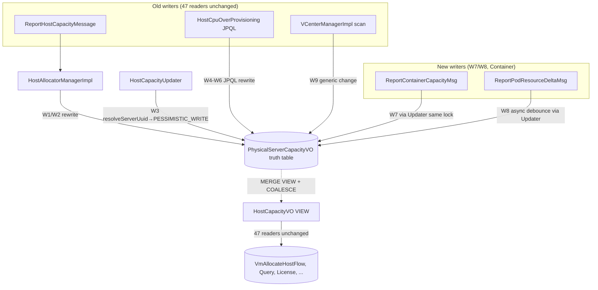

# v5.5.18 Unified Hardware Management Phase 2 Implementation

**Target repos:** `zstack` (branch `feature/unifi-host-dev`; current worktree at `/home/mj/zstack-workspace/zstack-unifi-host/`) + `premium` (branch `feature/unifi-host-dev` from 5.5.16; nested worktree at `premium/` inside the `zstack` worktree). `zstack-unifi-host` is the worktree directory name, not the repo name. Cross-repo atomicity rules are explicit per unit.

## Overview

Phase 1 landed data-model skeletons: `PhysicalServerAO/VO`, `PhysicalServerRoleVO`, `ServerPoolVO`, `PhysicalServerProvisionNetworkVO`, the `PhysicalServerRoleProvider` v3 SPI, 24 PS API Msg classes, and Phase 1 stubs for `KvmRoleProvider` / `Bm2RoleProvider` / `ContainerRoleProvider`. Phase 2 takes the skeletons to a running unified capacity + allocation + migration system with deadline **2026-05-01** (per `cloud_prd/PANORAMA.md`).

The work falls into ten themes: capacity VIEW-ization (W1-W9), Container capacity reporting (W7/W8) + Cordon (NB-5), RoleProvider wire-up (NB-11 atomicity), FlowChain integration (AutoAssociate / CreateRole / InitCapacity), hardware discovery multi-source fusion + in-memory queue (NB-19, NB-4), ProvisionProvider SPI + BM2 Gateway, LongJob provisioning API, BM2 ProvisionNetwork VIEW migration (NB-4), Flyway migrations (same-release atomicity), and admin-only + empty-shell API closure.

## Problem Frame

Current system manages KVM / BM2 / Container / vCenter hosts through 4 disjoint models with their own capacity accounting and ProvisionNetwork representations. Phase 1 introduced the unified layer as structural VOs + API skeletons but did not *route traffic* through it. Phase 2 makes the unified layer *load-bearing* for capacity and allocation while keeping the 47 existing `HostCapacityVO` readers, 13+ `AllocateHostMsg` senders, and 24 BM2 ProvisionNetwork reference sites working unchanged — by converting them to MySQL VIEWs backed by the new physical truth tables.

The core tension is **single-release atomicity** (see origin: `docs/brainstorms/next-session.md` §规矩 6): Flyway DDL that RENAMEs `HostCapacityVO` to a VIEW will break every `new HostCapacityVO()` path that hasn't been rewritten, and vice versa for code changes without DDL. All W1-W9 Java changes + VIEW DDL ship as a single atomic release.

## Requirements Trace

PRD acceptance-criteria coverage. Every R below maps to one or more units below and cites the PRD where the AC is defined.

- **R1 · AC-V2-CAP-01..12 + AC-CM-PERF-01**: Unified capacity ledger (`PhysicalServerCapacityVO` truth table, `HostCapacityVO` MERGE VIEW with COALESCE to cover vcenter half-migration, W1-W9 write-path rewrites, `@Immutable` on VIEW entity). PRD: `cloud_prd/prd/v5.5.18-unified-hardware/capacity/feat-unified_capacity_management_prd.md` §2.1, §2.3, §2.5.
- **R2 · AC-V2-ALLOC-01..07**: `AllocateServerMsg` / `ServerAllocatorChain` (7 Flows) + `ServerAllocatorFilterExtensionPoint` / `ServerReservedCapacityExtensionPoint`. PRD: capacity §2.6-2.8. *See §Scope Boundaries — Group C is intentionally carried as deferred sub-stream within v5.5.18; the M3 deadline requires ledger + VIEW-ization to land first, allocator can ride the next two-week internal beta.*
- **R3 · AC-CM-13..19**: Mixed-deployment concurrency (KVM × Container); Node Cordon via `CoreV1Api.patchNode` + `zstack.io/cordoned-by=capacity` label + RBAC self-check; `KubernetesPodInventory.requestsCpu/requestsMemory` using `max(init, main) + overhead`. PRD: capacity §2.9, §2.10.
- **R4 · AC-V2-ROLE-01..09**: RoleProvider wire-up for KVM / BM2 / Container; NB-11 atomicity; `getCapacityConsumption` / `getWorkloadStatus` with per-role `*BlockReason` rules. PRD: `feat-role_spi_adapter_prd.md` §2.1-2.4.
- **R5 · Server PRD §2.5.1**: AddHost/AddChassis FlowChain tail extension (AutoAssociate + CreatePhysicalServerRole + InitPhysicalServerCapacity + post-commit `HardwareDiscoveryQueue` enqueue); Container per-node `@Transactional` path. PRD: `feat-physical_server_model_prd.md` §2.5.1.
- **R6 · FR-033 + NB-19**: `PhysicalServerHardwareService` with three private discovery methods (`ipmiFruDiscover` / `kvmAgentDiscover` / `k8sNodeInfoDiscover`) + `HardwareDiscoveryScheduler` in-memory queue + 3 GlobalConfig. PRD: role SPI §2.5, §2.5b.
- **R7 · FR-010..012 + NB-4**: `PhysicalServerProvisionNetworkPoolRefVO` (new real ref) + BM2 `BareMetal2ProvisionNetworkVO` / `BareMetal2ProvisionNetworkClusterRefVO` converted to VIEWs; BM2 Manager's 3 write handlers redirected; `@SoftDeletionCascades` 1-line removal on `BareMetal2ProvisionNetworkClusterRefVO`. PRD: `feat-unified_provision_network_prd.md` §2.1, §2.2.
- **R8 · FR-012 + provision PRD §2.3**: `ProvisionProvider` SPI (decoupled from role registration per v2); `Bm2GatewayPxeProvisionProvider` reusing BM2 Gateway; `APIProvisionPhysicalServerMsg` as LongJob (not a dedicated session VO — aligns with BM2 existing install pattern).
- **R9 · FR-030 + AC-CB-ROLLBACK-01..03**: Idempotent migration script (ServerPool init Step 0 with BM2 1:1 / non-BM2 Zone-shared, PS/Role Step 1+, vcenter half-migration Step 8, BM2 ClusterRef history → PoolRef). PRD: `feat-legacy_migration_and_unified_infra_prd.md` §2.3.
- **R10 · FR-032 + NB-10**: Unified power API IPMI-only (no agent fallback); FR-033 discovery handler no longer an empty shell; explicit `operr` stubs for PowerOn/Off/Reset when no OOB. PRD: compat §2.5, §2.6.
- **R11 · NB-15 admin-only**: `@Action(adminOnly=true)` on all 24 PS API Msg classes; AC-SRV-ADMIN-ONLY-01..04. PRD: server §4.2.
- **R12 · NB-23 pw-scrub + NB-20**: `roleConfig: Map + @NoLogging` on `APIAttachPhysicalServerRoleMsg` and `credentials: @NoLogging` on `APIScanPhysicalServersMsg` (Phase 1 code already in place; Phase 2 verify only).

## Scope Boundaries

Phase 2 is the v5.5.18 completion sprint. Everything here ships by **2026-05-01** except explicitly deferred items below.

### Deferred to Separate Tasks

- **`APIScanPhysicalServersMsg` LongJob handler** (FR-034, server PRD §2.9): design is final but not in `next-session.md` work package table — carry as Phase 2 extension PR after U27 migration lands. Phase 2 can ship without it; it unblocks BMC range auto-discovery and is admin-only.
- **`ServerAllocatorChain` + `AllocateServerMsg` (R2)**: defer behind capacity VIEW-ization. Capacity VIEW + existing `HostAllocatorChain` already covers VM allocation through the VIEW (capacity PRD Conflict 4 rationale). Allocator is a separate Phase 2 extension PR; v5.5.18 can GA without the new allocator because VM layer is unchanged. *If schedule allows* after U30, add it; otherwise ship to v5.5.18.x post-release.
- **Watch API upgrade for Container** (NB-5 Phase 2 末期): polling `syncNodesFromCluster` already covers Cordon MVP; Watch API enhancement slips to v1.1+ if budget tight.
- **`APIProvisionAndAttachRoleMsg` orchestrator** (provision PRD §3.4): Should Have UX sugar, defer to Phase 3.
- **`LongJob cancel` for provisioning** (FR-012): BM2 has no cancel today, aligned deferral to Phase 3.
- **UI work**: all PRD §3 UI requirements are backend-only in this plan; frontend ships separately.
- **BM1 (`BaremetalChassisVO`) integration**: removed from scope per 2026-04-14 verdict.

## Context & Research

### Relevant Code and Patterns

Paths are repo-relative to their respective repos (`zstack` or `premium`); on disk the premium worktree nests inside the zstack worktree at `zstack-unifi-host/premium/...`, but repo-relative paths for premium-origin files start with `premium/...` only once (the prefix is the nesting, not a subdirectory of the `premium` repo itself).

**Capacity write paths (W1-W9 targets)**
- `compute/src/main/java/org/zstack/compute/allocator/HostAllocatorManagerImpl.java` — W1/W2 at `handle(ReportHostCapacityMessage)` lines 287-335
- `compute/src/main/java/org/zstack/compute/allocator/HostCapacityUpdater.java` — W3 at `_run()` lines 75-96; see "W3 Phase 2 实现细则" in capacity PRD §2.1
- `compute/src/main/java/org/zstack/compute/allocator/HostCpuOverProvisioningManagerImpl.java` — W4-W6, three JPQL `update HostCapacityVO` statements at lines 70/75/96
- `header/src/main/java/org/zstack/header/allocator/HostCapacityVO.java` — target for `@Immutable`
- `header/src/main/java/org/zstack/header/host/HostVO.java:26-29` — `@OneToOne(fetch=EAGER) capacity` relationship that VIEW must preserve
- `premium/mevoco/src/main/java/org/zstack/vmware/VCenterManagerImpl.java` — W9 at `getHostCapacity` (line 311) and `persistCollection` (line 1456); `ResourceScanResult.hcvos` generic change

**FlowChain extension points**
- `compute/src/main/java/org/zstack/compute/host/HostManagerImpl.java` — KVM AddHost entry (U11 target)
- `plugin/kvm/src/main/java/org/zstack/kvm/KVMHostFactory.java` — KVM-side factory
- `premium/baremetal2/src/main/java/org/zstack/baremetal2/chassis/BareMetal2ChassisManagerImpl.java` — BM2 AddChassis FlowChain (U12 target, line ~432)
- `premium/plugin-premium/container/src/main/java/org/zstack/container/ContainerEndpointBase.java` — Container per-node sync (U13 target)

**Role providers (Phase 1 stubs to wire up in NB-11 atomic PRs)**
- `plugin/kvm/src/main/java/org/zstack/kvm/KvmRoleProvider.java:67` — KVM stub with v3 SPI signature
- `plugin/physicalServer/src/main/java/org/zstack/server/Bm2RoleProvider.java:62` — BM2 stub
- `plugin/physicalServer/src/main/java/org/zstack/server/ContainerRoleProvider.java:61` — Container stub

**Hardware discovery** — `plugin/kvm/src/main/java/org/zstack/kvm/KVMHost.java:6148` `saveGeneralHostHardwareFacts` + `GetVirtualizerInfoCmd` already provide KVM-side data source (confirmed in role SPI PRD §5.7 code verification)

**BM2 provision network (NB-4)** — `premium/baremetal2/src/main/java/org/zstack/baremetal2/provisionnetwork/BareMetal2ProvisionNetworkManagerImpl.java` (3 write handlers), `BareMetal2ProvisionNetworkVO.java` (24 read call sites stay untouched), `BareMetal2ProvisionNetworkClusterRefVO.java:22` (1-line `@SoftDeletionCascades` removal)

**Admin-only wiring pattern** — use `@Action(adminOnly = true, category = PhysicalServerConstant.ACTION_CATEGORY)` per server PRD §4.2, aligning with existing `@Action` sites in the codebase.

**Idempotent migration pattern** — `INSERT ... ON DUPLICATE KEY UPDATE`; deterministic UUID via `REPLACE(MD5(CONCAT(managementIp, '-', zoneUuid)), '-', '')` per compat PRD §2.3 Step 1.4.

**LongJob pattern** — existing BM2 install flow uses `LongJobVO` for progress; follow the same model, no new session VO (per next-session.md "其它补完").

### Institutional Learnings

- `docs/brainstorms/next-session.md` §教训 — **"不动接口" ≠ "不动 VO 文件"**: removing `@SoftDeletionCascades` on a VIEW-backed VO is a runtime necessity, not cosmetic (JPQL DELETE rejects JOIN VIEW). But dead-code annotation cleanup (`@TriggerIndex`, `@SqlTrigger`) is not worth the blame churn.
- `docs/brainstorms/next-session.md` §教训 — **BM2 ClusterRefVO is a deprecated bridge, do not polish**: Set collapse on multi-cluster-same-pool is a known limit, structurally avoided by Step 0 1:1 Pool migration.
- `docs/brainstorms/next-session.md` §教训 — **commit-msg hook stops after 3 warnings**: use `zcommit` wrapper from `/home/mj/zstack-workspace/scripts/zcommit.sh` to auto-generate Change-Id + respect row width 72 + show test coverage.
- NB-24 fail-loud over silent-drop: `resolveServerUuid` throws `CloudRuntimeException` when no RoleVO match, exposing FlowChain timing bugs instead of masking them with `log null + boolean`.
- NB-28 orphan self-heal only for stable identity: BMC/motherboard swap that changes serialNumber/oobAddress/managementIp requires operator manual cleanup, no background scan job.

### External References

None required — v5.5.18 is a pure internal schema/SPI refactor on established Spring 5.2.25 / Hibernate 5.3.26 / Java 8 stack. MariaDB 10.3 / MySQL 8.x MERGE VIEW algorithm behavior is documented inline in capacity PRD §2.1.

## Key Technical Decisions

- **VIEW over Bridge** (capacity Conflict 4, compat PRD v2.0): `HostCapacityVO` becomes `ALGORITHM=MERGE` VIEW over `PhysicalServerCapacityVO` with `COALESCE(r.serverUuid, h.uuid)` to absorb vcenter half-migration. *Rationale*: 13+ `AllocateHostMsg` senders + 47 `HostCapacityVO` readers need zero changes; MERGE inlines into outer `WHERE uuid=?` for eq_ref performance.
- **Fail-loud `resolveServerUuid`** (NB-24): `HostCapacityUpdater.resolveServerUuid(hostUuid)` throws `CloudRuntimeException` when the KVM Role mapping is missing. *Rationale*: silent-drop `log null + boolean` from NB-22 would mask FlowChain timing bugs; `lockCapacity()` returning null already covers the "host deleted naturally" semantics, don't conflate the two.
- **Lock key invariant = `serverUuid`** (NB-30): every `PESSIMISTIC_WRITE` on capacity uses `serverUuid` as the single lock key. Never mix `hostUuid` and `serverUuid` in the lock path.
- **LongJob instead of a new session VO** (next-session.md): `APIProvisionPhysicalServerMsg` progress rides existing `LongJobVO`. Don't build `PhysicalServerProvisionSessionVO`, don't reinvent BM2's install pattern.
- **`ProvisionProvider` SPI is OS-only** (v2 decoupling): no `callbackMsg` field; `startProvisioning` terminates when OS is up. Role registration is a separate independent API. Orchestration belongs to the caller.
- **`RoleProvider.createRoleEntity` is internal forwarding** (role SPI PRD v3 §2.2-2.4): wraps `AddKVMHostMsg` / `AddBareMetal2ChassisMsg` / Container sync persist — not a reimplementation. Old APIs gain optional `serverUuid` field; Path 1 (PS-first) and Path 2 (legacy) share the same internal flow.
- **NB-11 atomicity per module**: when any RoleProvider method goes from stub to real in a module, the remaining 3 methods (`createRoleEntity`, `deleteRoleEntity`, `getCapacityConsumption`, `getWorkloadStatus`) must land in the same PR. Placeholder `roleUuid` strings leaking to VIEW JOIN / capacity / workload consumers are a system-level failure mode.
- **Flyway + Java same-release** (capacity §2.1): Flyway RENAME + VIEW DDL and W1-W9 Java changes ship in the same git tag / same MN upgrade. Otherwise the MN will try `INSERT INTO HostCapacityVO` (a VIEW — rejected) or EAGER-load a non-existent table.
- **No Agent fallback in power API** (NB-10): IPMI-only; no OOB → `operr("unified power API requires OOB credentials; for KVM hosts without BMC please use APIPowerResetHostMsg")`. Keep PS Manager clean of KVM-specific imports; SPI tunnel deferred to Phase 3 if needed.
- **`@Immutable` on `HostCapacityVO` entity**: Phase 2 adds `@org.hibernate.annotations.Immutable` so Hibernate dirty-check never issues UPDATE against the VIEW; the `HostCapacityUpdater` POJO exception (NB-22) is in-method only and never `em.merge`d.
- **BM2 `@SoftDeletionCascades` removed, not edited** (NB-4): deleting the annotation causes the soft-delete callback to disappear, leaving the VIEW JOIN naturally to filter. Deleting (not replacing) is the cleanest seam.
- **Cordon hysteresis, no new GlobalConfig** (NB-5): cordon at `buffer`, uncordon at `2 × buffer`, reuse existing `safetyBuffer` config; `zstack.io/cordoned-by=capacity` label for ownership.

## Open Questions

### Resolved During Planning

- **Allocator chain scope** (R2): descope `ServerAllocatorChain` / `AllocateServerMsg` from the 2026-05-01 deadline; carry as Phase 2 extension. *Resolution*: capacity VIEW is sufficient compatibility layer for VM allocation; `HostAllocatorChain` continues unchanged.
- **`APIScanPhysicalServersMsg` placement**: defer to Phase 2 extension PR after U27 Flyway lands. *Resolution*: not in next-session.md table; Must Have per server PRD but unblocking range-scan is not GA blocker.
- **Where is KVM `HostManagerImpl`?**: `compute/src/main/java/org/zstack/compute/host/HostManagerImpl.java`. KVM-specific factory is `plugin/kvm/src/main/java/org/zstack/kvm/KVMHostFactory.java` — FlowChain tail extension happens in the factory.

### Deferred to Implementation

- **Exact column list for `HostCapacityVO` VIEW `SELECT`**: 10 fields per NB-22 alignment (`uuid, totalMemory, totalCpu, cpuNum, cpuSockets, cpuCoreNum, availableMemory, availableCpu, totalPhysicalMemory, availablePhysicalMemory`). Finalize during U27 DDL authoring against live schema diff.
- **Precise `HostCapacityUpdater._run()` refactor** — direct-copy approach semantically clear; byte-level equality with existing logger output may vary. Accept as long as `HostCapacityUpdaterRunnable` signature is unchanged.
- **BMC concurrency defaults**: `unifiedHardware.discoveryConcurrency=8` baseline; validate against a 1000-host stage environment during U16 shakedown; escalate if BMC queue spikes.
- **Container multi-container / initContainer / overhead fixes** (疑点 1-3 in capacity PRD §2.10): investigate during U14, fix in independent PRs if confirmed. Don't block NB-5 mainline.

## High-Level Technical Design

> *These diagrams illustrate the intended approach and are directional guidance for review, not implementation specification. The implementing agent should treat them as context, not code to reproduce.*

### Unified capacity data flow



### NB-11 RoleProvider wire-up atomicity

```
Module PR must include ALL 4:
  createRoleEntity → bus.call(AddKVMHostMsg|AddBareMetal2ChassisMsg|...)
  deleteRoleEntity → bus.call(DeleteHostMsg|DeleteBareMetal2ChassisMsg|...)
  getCapacityConsumption → DB query, NOT RoleProvider SPI-to-SPI
  getWorkloadStatus → per-role *BlockReason rules (role SPI PRD §2.1 table)

Leakage example (why atomicity matters):
  KVM PR wires createRoleEntity only → Container getCapacityConsumption
  reads PhysicalServerCapacityVO.containerConsumption = 0 during a merged
  host's lifetime → VM overcommit invisible to scheduler.
```

### AddHost/AddChassis FlowChain tail extension (R5)

```
既有 FlowChain (NO CHANGE):
   … Connect → agent sync → persist HostVO / ChassisVO …
                      │
        ┌─────────────┴─────────────┐
        │ NEW: AutoAssociateFlow    │   (serverUuid from msg or findOrCreate)
        │ NEW: CreatePhysicalServerRoleFlow
        │ NEW: InitPhysicalServerCapacityFlow
        └─────────────┬─────────────┘
                      │ post-commit
           PhysicalServerHardwareService.enqueueDiscovery(serverUuid)
                      │
              HardwareDiscoveryScheduler
              (ThreadPoolExecutor, core=8)
```

## Implementation Units

Grouped by phase; phases inside Phase 2 reflect dependency + release-boundary constraints. Units marked **[atomic-group]** must ship in a single PR per NB-11 or same-release per capacity §2.1.

### Phase 2A — Foundation (no external deps, parallel)

- [ ] **U1: `PhysicalServerCapacityVO` entity + query infrastructure**

**Goal:** Introduce the truth-table entity used by every subsequent unit. No write paths redirected yet.

**Requirements:** R1

**Dependencies:** none

**Files:**
- Create: `header/src/main/java/org/zstack/header/server/PhysicalServerCapacityVO.java`
- Create: `header/src/main/java/org/zstack/header/server/PhysicalServerCapacityVO_.java` (JPA metamodel — generated at build, but track in plan because W3 uses it)
- Modify: `header/src/main/java/org/zstack/header/server/PhysicalServerVO.java` (add `@OneToOne` to capacity with same UUID)
- Test: `test/src/test/java/org/zstack/test/server/TestPhysicalServerCapacityVO.java`

**Approach:**
- 16 columns per capacity PRD §2.1 item 2 (10 HostCapacityVO-aligned + 6 governance).
- PK `uuid` FK CASCADE to `PhysicalServerVO.uuid`.
- No behavior yet — pure entity + metamodel + factory-level persist smoke test.

**Patterns to follow:** `header/src/main/java/org/zstack/header/allocator/HostCapacityVO.java` for column list; existing `@ForeignKey(parentEntityClass=..., onDeleteAction=CASCADE)` sites in the repo.

**Test scenarios:**
- Happy path — persist a `PhysicalServerCapacityVO` with FK to a valid `PhysicalServerVO`; verify roundtrip via `dbf.findByUuid`.
- Error path — persist with non-existent `uuid`; verify FK violation.
- Integration — delete the parent `PhysicalServerVO`; verify CASCADE removes capacity row.

**Verification:** `mvn compile` passes, entity metamodel regenerated, factory test green.

---

- [ ] **U2: `HardwareDiscoveryScheduler` + 3 GlobalConfig + `PhysicalServerHardwareService` skeleton**

**Goal:** Wire in-memory discovery queue and service skeleton; private discover methods are stubbed and return empty `UnifiedHardwareInfo`.

**Requirements:** R6

**Dependencies:** U1

**Files:**
- Create: `plugin/physicalServer/src/main/java/org/zstack/server/hardware/PhysicalServerHardwareService.java`
- Create: `plugin/physicalServer/src/main/java/org/zstack/server/hardware/HardwareDiscoveryScheduler.java`
- Create: `plugin/physicalServer/src/main/java/org/zstack/server/hardware/UnifiedHardwareInfo.java`
- Create: `plugin/physicalServer/src/main/java/org/zstack/server/PhysicalServerGlobalConfig.java` (3 new configs) — or extend an existing config file if one already exists in the same package
- Modify: `plugin/physicalServer/src/main/java/org/zstack/server/PhysicalServerManagerImpl.java` (wire Spring bean injection; MN-start scan path)
- Test: `test/src/test/java/org/zstack/test/server/TestHardwareDiscoveryScheduler.java`

**Approach:**
- `ThreadPoolExecutor` + `LinkedBlockingQueue<String serverUuid>`, core size = `unifiedHardware.discoveryConcurrency` (default 8).
- `discoveryTimeoutSec=60`, `discoveryRetryMax=3`, exponential backoff 30s/60s/120s.
- MN-start hook scans `status in (Connecting, Connected)` with no `PhysicalServerHardwareInfoVO` row — enqueue.
- Private methods `ipmiFruDiscover` / `kvmAgentDiscover` / `k8sNodeInfoDiscover` stubbed; wired in U15.
- No persistent task table; MN crash → on-start scan (b) rule refills.

**Patterns to follow:** existing `GlobalConfig` classes in `conf/globalConfig/*.xml` + Java side; `ThreadFacade` usage patterns in `utils/`.

**Test scenarios:**
- Happy path — `enqueueDiscovery(uuid)` picks up on executor, invokes `discoverHardware` once.
- Edge case — discovery fails repeatedly, backoff 30s → 60s → 120s, gives up after 3.
- Edge case — queue overflow bounded; concurrent enqueue same uuid coalesces (set semantics OR accept dup — pick one and document).
- Integration — MN start with 1000 `Connecting`-status PS rows, no `HardwareInfoVO`, all enqueued within 10s and processed within 2 minutes at concurrency 8.

**Verification:** Scheduler executes stubbed discover; log ERROR on final retry failure; `APIDiscoverPhysicalServerHardwareMsg` handler is wired (synchronous path) in U17.

---

- [ ] **U3: `PhysicalServerProvisionNetworkPoolRefVO` + Attach/Detach APIs**

**Goal:** Introduce the real Pool-centric ref table that replaces the Phase-1 ClusterRefVO; define the two replacement API Msg/Events.

**Requirements:** R7

**Dependencies:** none (header-only)

**Files:**
- Create: `header/src/main/java/org/zstack/header/server/PhysicalServerProvisionNetworkPoolRefVO.java` (entity per provision PRD §2.2 BLOCKER B7 code block)
- Create: `header/src/main/java/org/zstack/header/server/APIAttachProvisionNetworkToPoolMsg.java` + Event
- Create: `header/src/main/java/org/zstack/header/server/APIDetachProvisionNetworkFromPoolMsg.java` + Event
- Modify: `header/src/main/java/org/zstack/header/server/PhysicalServerProvisionNetworkVO.java` (replace `clusterRefs` → `poolRefs`, `attachedClusterUuids` → `attachedPoolUuids` in Inventory)
- Modify: `plugin/physicalServer/src/main/java/org/zstack/server/PhysicalServerManagerImpl.java` (handlers for the 2 new APIs)
- Test: `test/src/test/java/org/zstack/test/server/TestAttachProvisionNetworkToPool.java`

**Approach:**
- Entity signature exactly per provision PRD §2.2 BLOCKER B7.
- API handlers are pure CRUD on the ref table; `@Action(adminOnly=true)`.
- Mark existing `PhysicalServerProvisionNetworkClusterRefVO` + `APIAttachProvisionNetworkToClusterMsg` / Detach as deprecated in U26 (leave here to avoid breaking compile).

**Patterns to follow:** `header/src/main/java/org/zstack/header/storage/primary/PrimaryStorageClusterRefVO.java` (same long-id pattern); existing CRUD handler sites in `PhysicalServerManagerImpl`.

**Test scenarios:**
- Happy path — attach a network to a pool, detach, re-attach idempotently.
- Edge case — attach same `(networkUuid, poolUuid)` twice returns `operr` on UNIQUE.
- Error path — attach when `poolUuid` points to non-existent pool returns `operr`.
- Integration — delete `ServerPoolVO`; verify `PoolRef` cascades (DB FK CASCADE).

**Verification:** `mvn compile` passes; 2 new SDK Actions auto-generated during U26.

---

### Phase 2B — Capacity write-path VIEW-ization (same-release with U27)

**Release boundary:** U4 through U9 plus U27 must ship in a single MN upgrade. Any split leaves the system in an unbootable state.

- [ ] **U4: W1-W3 capacity write-path rewrite (`HostAllocatorManagerImpl` + `HostCapacityUpdater`) [atomic-group: W1-W9]**

**Goal:** Redirect W1, W2, W3 (+ W3a implicit callback path) to `PhysicalServerCapacityVO`. Keep `HostCapacityUpdaterRunnable` signature unchanged.

**Requirements:** R1

**Dependencies:** U1

**Files:**
- Modify: `compute/src/main/java/org/zstack/compute/allocator/HostAllocatorManagerImpl.java` (W1 lines 289-313 `new HostCapacityVO()` → `new PhysicalServerCapacityVO()`; W2 lines 287/315-335 modify path)
- Modify: `compute/src/main/java/org/zstack/compute/allocator/HostCapacityUpdater.java` (W3 `_run()` — add `resolveServerUuid(hostUuid)` private method per NB-24 that throws `CloudRuntimeException` on miss; `lockCapacity()` uses serverUuid + direct-copy 10 fields; `merge()` writes 3 fields back to `PhysicalServerCapacityVO`)

**Approach:**
- Follow "W3 Phase 2 实现细则" from capacity PRD §2.1 verbatim: keep `HostCapacityUpdaterRunnable.call(HostCapacityVO)` interface unchanged; construct `HostCapacityVO` POJO in-method only (NB-22 invariant exception).
- `resolveServerUuid` queries `PhysicalServerRoleVO WHERE roleUuid=hostUuid AND roleType='KVM_HOST'`; throw on null (NB-24).
- Lock key = `serverUuid` everywhere (NB-30).
- No new class files; minimize diff — only existing method bodies change.

**Execution note:** Start with unit tests against the new `resolveServerUuid` + direct-copy helpers before changing the top-level `_run` flow. The 4 callers of `HostCapacityUpdater.run()` (`HostAllocatorManagerImpl:249/836`, `HostCapacityReserveManagerImpl:253/289`) can then be verified via integration tests without editing them.

**Patterns to follow:** existing `@DeadlockAutoRestart` placement rules (NFR-010: never co-located with `@Transactional` on the same method).

**Test scenarios:**
- Happy path — `ReportHostCapacityMessage` for a host with RoleVO → `PhysicalServerCapacityVO` updated.
- Happy path — `HostCapacityUpdater.run(runnable)` with a mutating runnable — 3 target fields reflected back.
- Edge case — concurrent updates same serverUuid serialize via PESSIMISTIC_WRITE.
- Error path — `resolveServerUuid` called for a host without RoleVO → `CloudRuntimeException` with the host UUID in message.
- Error path — `lockCapacity()` returns null for a host deleted mid-flight; caller proceeds as today.
- Integration — `HostCapacityUpdaterRunnable` callers (Reserve, Allocator) — exercise all 4 untouched.

**Verification:** `mvn test -pl compute` passes; zero regressions in `HostCapacityUpdaterRunnable` consumers; grep confirms no production code creates `new HostCapacityVO()` anywhere outside the documented exception in `HostCapacityUpdater.lockCapacity()`.

---

- [ ] **U5: W4-W6 JPQL rewrite (`HostCpuOverProvisioningManagerImpl`) [atomic-group: W1-W9]**

**Goal:** Change 3 JPQL statements from `update HostCapacityVO` to `update PhysicalServerCapacityVO`.

**Requirements:** R1

**Dependencies:** U1

**Files:**
- Modify: `compute/src/main/java/org/zstack/compute/allocator/HostCpuOverProvisioningManagerImpl.java` (3 `updateQuery` strings at lines 70/75/96 — change entity name only)

**Approach:** literal string replacement. `PhysicalServerCapacityVO` has the same 4 targeted column names (availableCpu, totalCpu, cpuOverprovisioningRatio, etc.), so SQL body unchanged apart from the FROM/UPDATE clause entity name.

**Test scenarios:**
- Happy path — change global CPU ratio → 3 JPQL fire, rows updated in `PhysicalServerCapacityVO`.
- Integration — after change, `HostCapacityVO` VIEW reflects new `availableCpu` (after U27 VIEW exists).

**Verification:** `mvn test -pl compute`; unit test for `updateAllHostCapacityCpuRatio` / `updateSpecificHostCapacityCpuRatio` / `calcHostCpuRatio` paths all green.

---

- [ ] **U6: W9 vcenter half-migration rewrite (`VCenterManagerImpl`) [atomic-group: W1-W9]**

**Goal:** Redirect vcenter scan persistence to `PhysicalServerCapacityVO`; uuid stays ESXi host uuid; no PhysicalServer/Role record created (option C).

**Requirements:** R1, R9

**Dependencies:** U1

**Files:**
- Modify: `premium/mevoco/src/main/java/org/zstack/vmware/VCenterManagerImpl.java` (lines 311-334 `getHostCapacity` — `new HostCapacityVO()` → `new PhysicalServerCapacityVO()`; lines 2253-2256 `dbf.persist(cvo)`; 2968 `persistCollection`)
- Modify: `premium/mevoco/src/main/java/org/zstack/vmware/ResourceScanResult.java` (generic `List<HostCapacityVO> hcvos` → `List<PhysicalServerCapacityVO>`, lines 72-78)

**Approach:** type substitution. The 6 new governance fields (`cpuOverprovisioningRatio=1.0`, `memoryOverprovisioningRatio=1.0`, `reservedMemory=0`, `totalDisk=0`, `availableDisk=0`, `capacityState='Ready'`) are defaulted at construction to match compat PRD §2.3 Step 8 migration SQL.

**Test scenarios:**
- Happy path — vcenter scan discovers an ESXi host → `PhysicalServerCapacityVO` row written with uuid = ESXi host uuid; no `PhysicalServerVO` / `PhysicalServerRoleVO` / `AccountResourceRefVO` created.
- Integration — after U27 VIEW created, `HostVO.getCapacity()` for that ESXi host loads non-null via `COALESCE` path.

**Verification:** `mvn test -pl premium/mevoco` green; existing vcenter scan integration test unchanged.

---

- [ ] **U7: `HostCapacityVO` `@Immutable` + HostVO EAGER verification [atomic-group: W1-W9]**

**Goal:** Prevent Hibernate dirty-check from issuing UPDATE against the VIEW; verify EAGER load path works after VIEW DDL.

**Requirements:** R1

**Dependencies:** U1-U6

**Files:**
- Modify: `header/src/main/java/org/zstack/header/allocator/HostCapacityVO.java` (add `@org.hibernate.annotations.Immutable` at class level)
- Test: `test/src/test/java/org/zstack/test/allocator/TestHostCapacityVOImmutable.java`

**Approach:** `@Immutable` annotation addition. Also grep `HostCapacityVO` for every `em.merge` / `dbf.persist` / `dbf.update` call site; each must already be rewritten by U4/U5/U6/U18 (W3b `ReportHostCapacityExtensionPoint` is confirmed dead code and deleted per capacity PRD §2.1 note — remove per U15 cleanup).

**Patterns to follow:** `@org.hibernate.annotations.Immutable` existing usages in `header/src/main/java/org/zstack/header/` (grep for precedent — typically on read-only projection entities).

**Test scenarios:**
- Happy path — load `HostVO` via `dbf.findByUuid`; `getCapacity()` non-null; modify in session; Hibernate flush does not issue UPDATE (verify via log or Hibernate stats).
- Integration — full 1000-host load under 500ms (AC-CM-PERF-01) against a test DB with VIEW installed.

**Verification:** Zero `new HostCapacityVO()` / `em.merge(HostCapacityVO)` grep hits in `src/main/` outside `HostCapacityUpdater.lockCapacity` (NB-22 exception).

---

### Phase 2C — RoleProvider wire-up (NB-11 atomicity per module)

Each unit in this phase is a standalone PR that wires all 4 RoleProvider methods simultaneously. Merging any of U8/U9/U10 partial is a NB-11 violation.

- [ ] **U8: KVM RoleProvider full wire-up [atomic-group: NB-11 per-module]**

**Goal:** `KvmRoleProvider` all 4 methods real-backed (`createRoleEntity`, `deleteRoleEntity`, `getCapacityConsumption`, `getWorkloadStatus`).

**Requirements:** R4

**Dependencies:** U1, U4 (capacity table live before `getCapacityConsumption` reads it)

**Files:**
- Modify: `plugin/kvm/src/main/java/org/zstack/kvm/KvmRoleProvider.java` (replace stubs per role SPI design doc §5)
- Modify: `header/src/main/java/org/zstack/header/host/APIAddKVMHostMsg.java` (add optional `serverUuid` @APIParam)
- Modify: `header/src/main/java/org/zstack/header/host/AddKVMHostMsg.java` (internal Msg variant — add field)
- Test: `test/src/test/java/org/zstack/test/kvm/TestKvmRoleProviderWireup.java`

**Approach:**
- `createRoleEntity(ctx)` → build `AddKVMHostMsg` with `ctx.serverUuid` + roleConfig-derived username/password/sshPort; `bus.call` and return `reply.getInventory().getUuid()`.
- `deleteRoleEntity(roleUuid)` → `DeleteHostMsg` via `bus.call`.
- `getCapacityConsumption(serverUuid, roleUuid)` → SQL sum of `VmInstanceVO.cpuNum / memorySize` where `hostUuid=roleUuid AND state IN (Running, Starting, Migrating)`. Returns `CapacityUsage { usedCpu, usedMemory, exclusive=false }`.
- `getWorkloadStatus(serverUuid, roleUuid)` → fill `*BlockReason` per role SPI PRD §2.1 M8 table (KVM row): `detachBlockReason` and `powerOffBlockReason` / `powerResetBlockReason` non-null when active VM count > 0; `maintenanceBlockReason` always null; `migrationBlockReason` set when host is source/target of ongoing migration.

**Execution note:** Integration-test-first — the wire-up is best validated by end-to-end `APIAttachPhysicalServerRoleMsg(roleType=KVM_HOST)` exercising the full AddHost flow, not unit mocks.

**Patterns to follow:** `plugin/kvm/src/main/java/org/zstack/kvm/KVMHost.java` existing `@DeadlockAutoRestart` placement; `bus.makeTargetServiceIdByResourceUuid` pattern.

**Test scenarios:**
- Happy path — `APIAttachPhysicalServerRoleMsg(KVM_HOST)` → HostVO created, RoleVO created, `getCapacityConsumption` returns 0/0 (no VMs).
- Happy path — after creating 2 VMs, `getCapacityConsumption` returns sum; `getWorkloadStatus.detachBlockReason` non-null.
- Edge case — host mid-migration → `migrationBlockReason` non-null even with no Running VMs.
- Error path — `createRoleEntity` called with `clusterUuid` that doesn't exist → `OperationFailureException`, no partial state.
- Integration — `getWorkloadStatus` integrates with `APIDetachPhysicalServerRoleMsg`: `force=false` + running VMs → rejected with block reason.

**Verification:** `mvn test -pl plugin/kvm`; AC-V2-ROLE-05/06 passes.

---

- [ ] **U9: BM2 RoleProvider full wire-up [atomic-group: NB-11 per-module]**

**Goal:** `Bm2RoleProvider` all 4 methods real-backed; BM2 chassis matching via `ipmiAddress + zoneUuid`.

**Requirements:** R4

**Dependencies:** U1, U4

**Files:**
- Modify: `plugin/physicalServer/src/main/java/org/zstack/server/Bm2RoleProvider.java`
- Modify: `premium/baremetal2/src/main/java/org/zstack/baremetal2/chassis/APIAddBareMetal2ChassisMsg.java` (optional `serverUuid` @APIParam)
- Modify: `premium/baremetal2/src/main/java/org/zstack/baremetal2/chassis/AddBareMetal2ChassisMsg.java` (internal Msg — add field)
- Test: `premium/test-premium/src/test/java/org/zstack/test/server/TestBm2RoleProviderWireup.java`

**Approach:**
- `createRoleEntity(ctx)` → `AddBareMetal2ChassisMsg` forwarding.
- `deleteRoleEntity(roleUuid)` → `BareMetal2ChassisDeletionMsg`.
- `getCapacityConsumption(serverUuid, roleUuid)` → exclusive mode: if any `BareMetal2InstanceVO` on chassis has state != Stopped then `usedCpu = capacity.cpuNum, usedMemory = capacity.totalPhysicalMemory, exclusive = true`; else all-zero.
- `getWorkloadStatus(serverUuid, roleUuid)` → per role SPI PRD §2.1 M8 table BM2 row: `migrationBlockReason` always "BM2 no migration support"; other block reasons based on active instance count.

**Test scenarios:**
- Happy path — attach BM2 chassis to a PhysicalServer via `APIAttachPhysicalServerRoleMsg` → `PhysicalServerCapacityVO.availableCpu = 0` (exclusive init-at-zero per AC-V2-CAP-10).
- Edge case — chassis with no instance, `getCapacityConsumption` returns exclusive=true but zero usage (IaaS still claims full physical by exclusivity).
- Error path — `getWorkloadStatus.migrationBlockReason` is non-null regardless of workload.
- Integration — BM2 matching via `ipmiAddress + zoneUuid`, AutoAssociator Tier 2 hits correctly.

**Verification:** `premium/test-premium` green; AC-V2-ROLE-01/02/07/09.

---

- [ ] **U10: Container RoleProvider full wire-up [atomic-group: NB-11 per-module]**

**Goal:** `ContainerRoleProvider` all 4 methods real-backed; `*BlockReason` all always-null (Container EXTERNAL_READONLY).

**Requirements:** R4

**Dependencies:** U1, U4, U14 (pod inventory fields needed for `getCapacityConsumption`)

**Files:**
- Modify: `plugin/physicalServer/src/main/java/org/zstack/server/ContainerRoleProvider.java`
- Test: `premium/test-premium/src/test/java/org/zstack/test/server/TestContainerRoleProviderWireup.java`

**Approach:**
- `createRoleEntity(ctx)` → no-op (Container NativeHost creation happens in `syncNodesFromCluster` at U13, not via PS-layer API). Return placeholder throw if called directly — Container is sync-driven. Actually per provision PRD §2.3 and role SPI PRD §2.4, Container doesn't expose `APIAttachPhysicalServerRoleMsg(CONTAINER_HOST)`; the Spring bean exists only for the `getCapacityConsumption` / `getWorkloadStatus` query paths. Confirm with arch — if `APIAttachPhysicalServerRoleMsg(CONTAINER_HOST)` is admissible, route to `AddContainerEndpointMsg` flow; otherwise reject with `operr`.
- `getCapacityConsumption(serverUuid, roleUuid)` → sum `KubernetesPodInventory.requestsCpu/requestsMemory` (U14 fields) across all pods on node where `roleUuid = NativeHostVO.uuid`. Returns `exclusive=false`, standard consumption.
- `getWorkloadStatus` → all `*BlockReason` always null per role SPI PRD §2.1 M8 Container row.

**Test scenarios:**
- Happy path — pod sync reports 3 running pods with 4c/8GB requests each → `getCapacityConsumption = 12c/24GB`.
- Edge case — no `requestsCpu` filled yet (pre-U14 state) → consumption falls back to limits (current `cpuNum/memorySize`). Guard via null-check.
- Integration — `APIDetachPhysicalServerRoleMsg(CONTAINER_HOST, force=false)` on a busy node: should succeed (detachBlockReason = null).

**Verification:** `premium/test-premium` green; AC-V2-ROLE-03/04/08.

---

### Phase 2D — FlowChain integration (AddHost tail + Container sync)

- [ ] **U11: KVM AddHost FlowChain tail extension**

**Goal:** Append 3 flows + post-commit hook to KVM AddHost; reuses `KVMHostFactory` + FlowChain sites.

**Requirements:** R5

**Dependencies:** U1, U8

**Files:**
- Modify: `plugin/kvm/src/main/java/org/zstack/kvm/KVMHostFactory.java` (or the specific `AddKVMHostFlowBuilder` if separate — locate in U11 implementation)
- Create: `plugin/kvm/src/main/java/org/zstack/kvm/flows/KvmAutoAssociateFlow.java`
- Create: `plugin/kvm/src/main/java/org/zstack/kvm/flows/CreatePhysicalServerRoleFlow.java` (can be shared between KVM and BM2 — consider extracting to `plugin/physicalServer/src/main/java/org/zstack/server/flows/` for U12 reuse)
- Create: `plugin/kvm/src/main/java/org/zstack/kvm/flows/InitPhysicalServerCapacityFlow.java` (same shared-extraction consideration)
- Test: `test/src/test/java/org/zstack/test/kvm/TestKvmAddHostFlowChain.java`

**Approach:**
- Each new Flow is `@Transactional`; its `run()` does the write, its `rollback()` does a targeted `DELETE`.
- `AutoAssociateFlow`: reads `msg.serverUuid`; if null, invokes `PhysicalServerAutoAssociator.findOrCreate` with RoleMatchContext pulled from `HostSystemTags.SYSTEM_SERIAL_NUMBER` + managementIp + zoneUuid. Store resolved UUID into FlowChain data.
- `CreatePhysicalServerRoleFlow`: persist `PhysicalServerRoleVO(serverUuid, roleUuid=hostUuid, KVM_HOST, INTERNAL_SHARED)`; rollback SQL delete.
- `InitPhysicalServerCapacityFlow`: upsert `PhysicalServerCapacityVO` + backfill `PhysicalServerVO.serialNumber/manufacturer/model` from SystemTag.
- Post-commit hook in the last flow invokes `PhysicalServerHardwareService.enqueueDiscovery(serverUuid)` — fire-and-forget.

**Execution note:** Integration-test against a fresh KVM host add path; validate "no intermediate state" contract — `QueryPhysicalServerMsg` + `QueryHostMsg` + `QueryPhysicalServerRoleMsg` never observe half-complete state under FlowChain rollback.

**Patterns to follow:** existing `AddHostFlowChain` site in compute; `Flow` with `FlowRollback` in `utils/src/main/java/org/zstack/utils/flowchain/`.

**Test scenarios:**
- Happy path — AddHost with no `serverUuid` → AutoAssociator creates new PS + Role + Capacity atomically.
- Happy path — AddHost with pre-existing `serverUuid` (from PS-first Path 1) → AutoAssociateFlow validates, skips create.
- Edge case — InitCapacityFlow fails mid-way (DB out of space) → CreatePhysicalServerRoleFlow rolls back; no half-state.
- Edge case — orphan `PhysicalServer` from a previous failed AddHost → next attempt with same managementIp hits AutoAssociator Tier 3, reuses orphan, completes.
- Error path — stale `HardwareDiscoveryQueue` enqueue hook failure → logged, does not rollback the transaction (post-commit is fire-and-forget).
- Integration — concurrent AddHost of same managementIp → UNIQUE(zoneUuid, serialNumber) on serial non-null case; managementIp fallback case race window per server PRD §2.1 item 4 — DB layer wins.

**Verification:** `mvn test -pl plugin/kvm`; log check confirms `HardwareDiscoveryScheduler` sees the enqueue.

---

- [ ] **U12: BM2 AddChassis FlowChain tail extension**

**Goal:** Same 3-flow pattern for BM2, plus BM2-specific serverUuid match via ipmiAddress.

**Requirements:** R5

**Dependencies:** U1, U9, U11 (shared flows)

**Files:**
- Modify: `premium/baremetal2/src/main/java/org/zstack/baremetal2/chassis/BareMetal2ChassisManagerImpl.java` (insert 3 flows after existing chassis-persist flow, ~line 432)
- Create/reuse: shared `CreatePhysicalServerRoleFlow` and `InitPhysicalServerCapacityFlow` from U11's plugin/physicalServer extraction
- Create: `premium/baremetal2/src/main/java/org/zstack/baremetal2/flows/Bm2AutoAssociateFlow.java`
- Test: `premium/test-premium/src/test/java/org/zstack/test/baremetal2/TestBm2AddChassisFlowChain.java`

**Approach:** mirror U11 with BM2 variations:
- `Bm2AutoAssociateFlow`: context from `msg.ipmiAddress` + serialNumber (from FRU read in prior Flow) + zoneUuid.
- `CreatePhysicalServerRoleFlow` with `BAREMETAL_V2 / INTERNAL_EXCLUSIVE`.
- `InitPhysicalServerCapacityFlow` with exclusive semantics: available=0 per AC-V2-CAP-10.

**Test scenarios:**
- Happy path — AddChassis → PS/Role/Capacity atomic; `availableCpu/availableMemory = 0`.
- Edge case — IPMI connectivity fails in existing flow → entire chain including new 3 flows rolls back; no orphan PS.
- Integration — multi-cluster BM2 via Step 0 1:1 ServerPool structure (U28) — VIEW JOIN returns single row per chassis, no Set collapse observed.

**Verification:** `premium/test-premium` green; chassis-add path end-to-end test.

---

- [ ] **U13: Container per-node `@Transactional` sync (`processNodeTransactional`)**

**Goal:** Extract per-node logic in `syncNodesFromCluster` into a `@Transactional` method that runs AutoAssociate + NativeHost persist + upsert RoleVO + init Capacity atomically.

**Requirements:** R5

**Dependencies:** U1, U10

**Files:**
- Modify: `premium/plugin-premium/container/src/main/java/org/zstack/container/ContainerEndpointBase.java` (extract `processNodeTransactional(KubernetesNodeInventory node)` per role SPI PRD §2.4 sequence; 5 steps atomic)
- Test: `premium/test-premium/src/test/java/org/zstack/test/container/TestContainerProcessNodeTransactional.java`

**Approach:** per role SPI PRD §2.4 pseudo-code:
1. Build `RoleMatchContext(managementIp=node.managementIp, zoneUuid, roleType=CONTAINER_HOST)`.
2. `serverUuid = autoAssociator.findOrCreate(ctx, node.clusterUuid)`.
3. `persist(NativeHostVO)`.
4. Upsert `PhysicalServerRoleVO` via UNIQUE(serverUuid, roleType).
5. Init/update `PhysicalServerCapacityVO`.

Stale node deletion path: batch `@Transactional` SQL delete with CASCADE to RoleVO.

**Execution note:** Characterization test the current `syncNodesFromCluster` behavior first — the existing code is legacy and weakly tested. Capture node-count + state invariants before extracting.

**Test scenarios:**
- Happy path — sync with 3 new K8s nodes → 3 PS/Role/Capacity sets created.
- Edge case — sync a node already present → idempotent upsert via UNIQUE.
- Error path — single node persist fails → `@Transactional` rollback for that node; other nodes unaffected.
- Integration — Container endpoint with no K8s connectivity → sync loop continues next cycle; no partial state.

**Verification:** `premium/test-premium` green; AC-V2-ROLE-03/04.

---

- [ ] **U14: `KubernetesNativeProvider` extend `listNodes` + `getKubernetesPodInventory`**

**Goal:** Add capacity/allocatable/systemUUID to node inventory + `requestsCpu/requestsMemory` to pod inventory per NB-5 formula.

**Requirements:** R3, R4

**Dependencies:** none (premium/container only)

**Files:**
- Modify: `premium/plugin-premium/container/src/main/java/org/zstack/container/KubernetesNativeProvider.java` (extend `listNodes` per role SPI §2.4 "Container 改造说明"; extend `getKubernetesPodInventory` per capacity §2.10)
- Modify: `premium/plugin-premium/container/src/main/java/org/zstack/container/KubernetesNodeInventory.java` (add `capacityCpu/capacityMemory/allocatableCpu/allocatableMemory/systemUUID/machineID` fields)
- Modify: `premium/plugin-premium/container/src/main/java/org/zstack/container/KubernetesPodInventory.java` (add `requestsCpu/requestsMemory`)
- Test: `premium/test-premium/src/test/java/org/zstack/test/container/TestKubernetesNativeProviderExtensions.java`

**Approach:**
- `listNodes` — populate new fields from `V1Node.status.capacity/allocatable/nodeInfo`.
- `getKubernetesPodInventory` — new fields filled via capacity §2.10 formula `max(Σ initContainers.requests, Σ containers.requests) + pod.spec.overhead`. Existing `cpuNum/memorySize` (from `limits[0]`) unchanged.
- Three疑点 (multi-container, initContainers, overhead) — add unit tests; if assertions prove real bugs, file separate PRs (not blocking this unit).

**Test scenarios:**
- Happy path — single-container pod without initContainers → `requestsCpu = containers[0].requests.cpu`.
- Edge case — pod with 3 containers → `requestsCpu = Σ containers.requests.cpu`.
- Edge case — pod with 2 initContainers + 3 containers → `requestsCpu = max(init, containers) + overhead`.
- Edge case — pod with RuntimeClass overhead → included.
- Edge case — `allocatable.cpu` smaller than `capacity.cpu` (kube-reserved taxes) — accurate field mapping.
- Integration — `PhysicalServerCapacityUpdater.recalculate` Container branch (U22) consumes `requestsCpu/requestsMemory`.

**Verification:** `mvn test -pl premium/plugin-premium/container`; AC-CM-17.

---

### Phase 2E — Hardware discovery wire-up

- [ ] **U15: `PhysicalServerHardwareService` 3 private discover methods**

**Goal:** Make `ipmiFruDiscover` / `kvmAgentDiscover` / `k8sNodeInfoDiscover` real; remove `ReportHostCapacityExtensionPoint` dead code path (W3b confirmed dead in capacity PRD §2.1 note).

**Requirements:** R6

**Dependencies:** U2

**Files:**
- Modify: `plugin/physicalServer/src/main/java/org/zstack/server/hardware/PhysicalServerHardwareService.java`
- Create: `plugin/kvm/src/main/java/org/zstack/kvm/hardware/KvmAgentHardwareAdapter.java` (callable from `PhysicalServerHardwareService.kvmAgentDiscover` via Spring lookup; reuses `GetVirtualizerInfoCmd` + `HostFactResponse` mapping — no new agent cmd per role SPI PRD §5.7)
- Create: `premium/plugin-premium/container/src/main/java/org/zstack/container/hardware/K8sNodeInfoHardwareAdapter.java` (for `k8sNodeInfoDiscover` via K8s API)
- Create: `plugin/physicalServer/src/main/java/org/zstack/server/hardware/IpmiFruHardwareAdapter.java` (`ipmitool fru print` invocation)
- Delete: stale references to `ReportHostCapacityExtensionPoint` (capacity §2.1 W3b note — confirmed dead code across workspace)
- Modify: `plugin/physicalServer/src/main/java/org/zstack/server/hardware/UnifiedHardwareInfo.java` (finalize flat DTO per role SPI §2.5b, FR-003 subset fields only; FR-004 lists deferred per comment block)
- Modify: `header/src/main/java/org/zstack/header/server/PhysicalServerHardwareInfoVO.java` (confirm/align fields for persistence)
- Test: `test/src/test/java/org/zstack/test/server/TestPhysicalServerHardwareServiceMerge.java`

**Approach:**
- High-auth first merge: OOB → KVM agent → K8s. `mergeNonNull` doesn't overwrite.
- Each adapter returns `UnifiedHardwareInfo` with only the fields it can populate.
- `@NoLogging` on `oobPassword` (NB-20); confirm already in Phase 1 VO (verify-only).
- Remove `ReportHostCapacityExtensionPoint` / `HostCapacityStruct` usages and the 2 for-loops in `HostAllocatorManagerImpl:301-334` per capacity PRD §2.1 W3b.

**Test scenarios:**
- Happy path — PS with OOB + KVM role → IPMI FRU fills manufacturer/model/serial; KVM agent fills CPU flags/DIMM; merged result has both.
- Happy path — PS without OOB + KVM role → only KVM agent data; merge returns complete (serialNumber via dmidecode).
- Edge case — all three sources fail → empty result logged, row persisted with null fields, UI shows "discovery failed".
- Edge case — agent returns partial data → non-null fields preserved, null fields left for next retry.
- Integration — `HardwareDiscoveryScheduler` enqueue → discovery runs → `PhysicalServerHardwareInfoVO` updated.

**Verification:** `mvn test`; AC-CB-17/18.

---

- [ ] **U16: `HardwareDiscoveryScheduler` retry/backoff + MN-start scan hardening**

**Goal:** Finalize scheduler behavior beyond skeleton; add metrics/logs; validate on simulated 1000-host scale.

**Requirements:** R6

**Dependencies:** U2, U15

**Files:**
- Modify: `plugin/physicalServer/src/main/java/org/zstack/server/hardware/HardwareDiscoveryScheduler.java`
- Test: `test/src/test/java/org/zstack/test/server/TestHardwareDiscoverySchedulerScale.java`

**Approach:**
- Exponential backoff 30s → 60s → 120s per PRD; terminal failure logs ERROR only (no LongJob).
- MN-start scan: `PhysicalServerVO WHERE status IN (Connecting, Connected) AND NOT EXISTS (SELECT 1 FROM PhysicalServerHardwareInfoVO WHERE uuid = PhysicalServerVO.uuid)`.

**Test scenarios:** (already covered in U2 — this unit is the hardening pass.)

**Verification:** 1000 simulated hosts complete within 2 min at concurrency 8 per compat §3.3 M20.

---

- [ ] **U17: `APIDiscoverPhysicalServerHardwareMsg` handler**

**Goal:** Handler invokes `PhysicalServerHardwareService.discoverHardware(serverUuid)` synchronously for on-demand refresh (not via queue).

**Requirements:** R10

**Dependencies:** U15

**Files:**
- Modify: `plugin/physicalServer/src/main/java/org/zstack/server/PhysicalServerManagerImpl.java` (handler for `APIDiscoverPhysicalServerHardwareMsg`)

**Approach:** direct sync call to `discoverHardware` (per compat PRD §2.6). Returns `APIDiscoverPhysicalServerHardwareEvent` with discovered inventory. `@Action(adminOnly=true)`.

**Test scenarios:**
- Happy path — manual trigger from UI; hardware info updated, returned in event.
- Error path — PS not found → `operr`.
- Integration — synchronous discovery vs concurrent queued discovery: both use same `discoverHardware` code path, no race.

**Verification:** `mvn test`; `APIDiscoverPhysicalServerHardware` no longer returns "not implemented".

---

### Phase 2F — ProvisionProvider SPI + BM2 Gateway

- [ ] **U18: `ProvisionProvider` SPI interfaces**

**Goal:** Define the interface + data classes + LongJob hooks per v2 decoupled design.

**Requirements:** R8

**Dependencies:** U1

**Files:**
- Create: `header/src/main/java/org/zstack/header/server/provision/ProvisionProvider.java`
- Create: `header/src/main/java/org/zstack/header/server/provision/ProvisionRequest.java`
- Create: `header/src/main/java/org/zstack/header/server/provision/ProvisionNetworkType.java` (enum: `GATEWAY_PXE` / `STANDALONE_PXE`)
- Create: `header/src/main/java/org/zstack/header/server/provision/ProvisionSessionInventory.java` (read-only view, backed by LongJob state)
- Test: header/ only — no behavioral test until U19.

**Approach:** interfaces only; no callback fields (v2 design). `startProvisioning` terminates when OS is booted; LongJob carries progress.

**Test expectation:** none — interface-only unit; covered by U19 / U20 integration tests.

**Verification:** `mvn compile`.

---

- [ ] **U19: `Bm2GatewayPxeProvisionProvider` + BM2 Gateway helper generalization**

**Goal:** Implement `ProvisionProvider` for BM2 Gateway; extract `IpmiBootConfig` + `ProvisionTarget` so iPXE generation no longer hardcodes `BareMetal2InstanceTO`.

**Requirements:** R8

**Dependencies:** U18

**Files:**
- Create: `premium/baremetal2/src/main/java/org/zstack/baremetal2/provision/Bm2GatewayPxeProvisionProvider.java`
- Modify: `premium/baremetal2/src/main/java/org/zstack/baremetal2/chassis/BareMetal2IpmiChassisHelper.java` (add `bootWithConfig(IpmiBootConfig)` per brainstorm v2 §4.2)
- Create: `premium/baremetal2/src/main/java/org/zstack/baremetal2/provision/IpmiBootConfig.java`
- Create: `premium/baremetal2/src/main/java/org/zstack/baremetal2/provision/ProvisionTarget.java`
- Modify: `premium/baremetal2/src/main/java/org/zstack/baremetal2/gateway/BareMetal2Gateway.java` (accept `ProvisionTarget` instead of `BareMetal2InstanceTO` in `generateIpxeConfig`)

**Approach:** per brainstorm `2026-04-16-provision-provider-spi-design.md` §4. Gateway agent callback only updates LongJob state; no business message dispatch.

**Test scenarios:**
- Happy path — provision a stub "ready" OS → LongJob transitions Preparing → IPxeBooting → Installing → Succeeded.
- Edge case — PS has no OOB credentials → `startProvisioning` returns `operr` before touching Gateway.
- Error path — IPMI boot fails → LongJob Failed with error message; `ProvisionSession` state reflects.
- Integration — existing BM2 Instance install flow unchanged (backward compat).

**Verification:** `premium/test-premium` green; BM2 gateway IPMI path unchanged for existing Instance installs.

---

- [ ] **U20: `APIProvisionPhysicalServerMsg` LongJob + handler**

**Goal:** Expose the provisioning API; no new session VO — progress rides `LongJobVO`.

**Requirements:** R8, R11

**Dependencies:** U18, U19

**Files:**
- Create: `header/src/main/java/org/zstack/header/server/APIProvisionPhysicalServerMsg.java` (LongJob + `@Action(adminOnly=true)`; fields per provision PRD §2.3 API definition; `customParams` @NoLogging)
- Create: `header/src/main/java/org/zstack/header/server/APIProvisionPhysicalServerEvent.java` (returns `longJobUuid`)
- Create: `plugin/physicalServer/src/main/java/org/zstack/server/provision/ProvisionPhysicalServerLongJob.java`
- Modify: `plugin/physicalServer/src/main/java/org/zstack/server/PhysicalServerManagerImpl.java` (handler)
- Test: `test/src/test/java/org/zstack/test/server/TestProvisionPhysicalServerLongJob.java`

**Approach:** LongJob body:
1. Resolve PS + network + `ProvisionProvider` by `network.type`.
2. `provider.prepareNetwork(...)` → `startProvisioning(request, completion)` → wait for terminal state.
3. Update LongJob progress/state accordingly.

**Test scenarios:**
- Happy path — LongJob completes Succeeded; `APIGetLongJobMsg` returns state.
- Edge case — non-admin caller → `APIERR_PERMISSION_DENIED` before LongJob created.
- Error path — PS not in same Pool as ProvisionNetwork → `operr`.
- Edge case — concurrent provision request on same PS → rejected by PS-state guard (or allowed and serialized — implementer decision + test).

**Verification:** end-to-end integration: provision a stub → LongJob Succeeded → `APIAttachPhysicalServerRoleMsg(KVM_HOST)` chained by caller works.

---

### Phase 2G — Container Cordon (NB-5)

- [ ] **U21: `ContainerNodeCordonService`**

**Goal:** Wrap `CoreV1Api.patchNode` with label ownership + retry + RBAC self-check.

**Requirements:** R3

**Dependencies:** U10, U14

**Files:**
- Create: `premium/plugin-premium/container/src/main/java/org/zstack/container/ContainerNodeCordonService.java`
- Modify: `premium/plugin-premium/container/src/main/java/org/zstack/container/ContainerEndpointBase.java` (RBAC self-check on endpoint registration)
- Test: `premium/test-premium/src/test/java/org/zstack/test/container/TestContainerNodeCordonService.java`

**Approach:** per capacity §2.9:
- `cordonIfZStackNotAlreadyCordoned(nodeName, reason)` — patch `spec.unschedulable=true` + label `zstack.io/cordoned-by=capacity`, idempotent, retry 3.
- `uncordonIfZStackCordoned(nodeName)` — only uncordon if label present.
- Endpoint-registration hook: `SelfSubjectAccessReview` for `nodes/patch,update`; on fail → `ContainerManagementEndpointVO.capability = ReadOnly` + WARN log.

**Test scenarios:**
- Happy path — cordon then uncordon a node; label appears and disappears.
- Edge case — operator-cordoned node (no label) stays cordoned through uncordon call.
- Error path — K8s RBAC denied → cordon no-op; endpoint capability set to `ReadOnly`.
- Integration — `PhysicalServerCapacityUpdater.recalculate` (U22) triggers cordon at `available < buffer`.

**Verification:** `premium/test-premium`; AC-CM-15/16.

---

- [ ] **U22: `PhysicalServerCapacityUpdater.recalculate` Container cordon integration**

**Goal:** At end of recalculate, for Container-role PS, apply hysteresis cordon formula from capacity §2.9.

**Requirements:** R3

**Dependencies:** U4, U21

**Files:**
- Create: `compute/src/main/java/org/zstack/compute/allocator/PhysicalServerCapacityUpdater.java` (if not already stubbed by U2 — may be co-located with scheduler, confirm in impl)
- Modify: same `PhysicalServerCapacityUpdater.recalculate()` or equivalent

**Approach:** at recalculate end, if PS has `CONTAINER_HOST` role, compute cordon decision per capacity §2.9:
```
if availableCpu < cpuBuffer || availableMemory < memoryBuffer:
    cordonService.cordonIfZStackNotAlreadyCordoned(nodeName, "ZSTACK_CAPACITY_FULL")
else if availableCpu >= 2*cpuBuffer && availableMemory >= 2*memoryBuffer:
    cordonService.uncordonIfZStackCordoned(nodeName)
```

**Test scenarios:**
- Happy path — KVM VM allocation drops Container available below buffer → next recalculate cordons node.
- Edge case — right at buffer threshold → cordon; uncordon only above `2*buffer`, hysteresis verified.
- Edge case — CPU < buffer but memory fine → cordon (any-dimension trigger).
- Integration — with U14 `requestsCpu/requestsMemory`, pod scheduling → recalculate → cordon round-trip.

**Verification:** `mvn test`; AC-CM-13/14.

---

### Phase 2H — BM2 ProvisionNetwork VIEW-ization (NB-4, bridge)

- [ ] **U23: BM2 `BareMetal2ProvisionNetworkManagerImpl` write-path redirect**

**Goal:** Redirect the 3 BM2 write handlers (Create/Attach/Detach) to the unified PS tables per NB-4 BLOCKER B8 honest description.

**Requirements:** R7

**Dependencies:** U3

**Files:**
- Modify: `premium/baremetal2/src/main/java/org/zstack/baremetal2/provisionnetwork/BareMetal2ProvisionNetworkManagerImpl.java` (3 handlers)

**Approach:** exact handlers per provision PRD §2.2 table:
- `APICreateBareMetal2ProvisionNetworkMsg` → `new PhysicalServerProvisionNetworkVO(type=GATEWAY_PXE)` then persist.
- `APIAttachBareMetal2ProvisionNetworkToClusterMsg` → lookup `ClusterVO.serverPoolUuid`; if null, return `operr("cluster[uuid:%s] has no ServerPool attached")`; otherwise insert `PhysicalServerProvisionNetworkPoolRefVO`.
- `APIDetachBareMetal2ProvisionNetworkFromClusterMsg` → same lookup, SQL delete `PhysicalServerProvisionNetworkPoolRefVO` by `(networkUuid, poolUuid)`.

**Test scenarios:**
- Happy path — create BM2 provision network → `PhysicalServerProvisionNetworkVO` row with type=GATEWAY_PXE; BM2 VIEW (U27) returns it.
- Edge case — attach to Cluster without ServerPool → explicit `operr`.
- Integration — BM2 24 read call sites still see the same data through VIEW.

**Verification:** `premium/test-premium`; AC-PN-05b, AC-PN-06b, AC-V2-MIG-10.

---

- [ ] **U24: `BareMetal2ProvisionNetworkClusterRefVO` `@SoftDeletionCascades` removal**

**Goal:** Delete the 1-line annotation group that triggers the JPQL DELETE on VIEW (which MySQL rejects).

**Requirements:** R7

**Dependencies:** U27 (needs the VIEW DDL to actually materialize)

**Files:**
- Modify: `premium/baremetal2/src/main/java/org/zstack/baremetal2/provisionnetwork/BareMetal2ProvisionNetworkClusterRefVO.java` (delete `@SoftDeletionCascades({...})` block per next-session.md "NB-4 重写" — 1 line annotation group)

**Approach:** no behavioral replacement needed — VIEW JOIN naturally filters out soft-deleted parent clusters.

**Test scenarios:**
- Happy path — soft-delete a `ClusterVO` → `BareMetal2ProvisionNetworkClusterRefVO` VIEW row for that cluster disappears, Cluster-delete transaction completes.
- Edge case — `@TriggerIndex`/`@SqlTrigger` annotations remain; verify dead code unchanged, no runtime side-effects.
- Integration — BM2 24 read sites unchanged behavior.

**Verification:** `premium/test-premium`; Cluster delete no longer blocks on VIEW DELETE.

---

- [ ] **U25: `testlib/ApiHelper.groovy` DSL migration**

**Goal:** Rewrite 15 test call sites from `attachProvisionNetworkToCluster` → `attachProvisionNetworkToPool`.

**Requirements:** R7

**Dependencies:** U3

**Files:**
- Modify: `testlib/src/main/groovy/org/zstack/testlib/ApiHelper.groovy` (lines ~57328-57347 DSL methods)
- Find+modify: any `.groovy` integration test calling the old DSL (git grep before editing)

**Approach:** DSL-level rename; thin shim — new method is pure wrapper. Redirecting 15 caller sites requires editing each test; don't leave both DSL forms live.

**Test expectation:** integration-test DSL; any test that was green before should stay green after rename. No new tests needed.

**Verification:** `mvn test` in `testlib/` and all modules with groovy integration tests; no references to old DSL remain (`rg attachProvisionNetworkToCluster`).

---

- [ ] **U26: Delete deprecated `PhysicalServerProvisionNetworkClusterRefVO` + 4 SDK Actions**

**Goal:** Remove Phase-1-era ClusterRef VO + Phase-1 API Msgs/Events + generated SDK Actions (per provision PRD §2.2 M14/M15 废弃项 list).

**Requirements:** R7

**Dependencies:** U3, U23, U25

**Files:**
- Delete: `header/src/main/java/org/zstack/header/server/PhysicalServerProvisionNetworkClusterRefVO.java`
- Delete: `header/src/main/java/org/zstack/header/server/PhysicalServerProvisionNetworkClusterRefVO_.java` (metamodel)
- Delete: `header/src/main/java/org/zstack/header/server/APIAttachProvisionNetworkToClusterMsg.java` + Event
- Delete: `header/src/main/java/org/zstack/header/server/APIDetachProvisionNetworkFromClusterMsg.java` + Event
- Modify: `header/src/main/java/org/zstack/header/server/PhysicalServerProvisionNetworkVO.java` (remove `clusterRefs`; confirm `poolRefs` in from U3)
- Delete: `sdk/src/main/java/org/zstack/sdk/AttachProvisionNetworkToClusterAction.java` + Result
- Delete: `sdk/src/main/java/org/zstack/sdk/DetachProvisionNetworkFromClusterAction.java` + Result
- Modify: `PhysicalServerProvisionNetworkInventory` (replace `attachedClusterUuids` → `attachedPoolUuids`)

**Approach:** pure deletion. Verify no live consumers via `rg` before delete. Since these are Phase-1 artifacts not yet released, no deprecation cycle needed.

**Test scenarios:**
- Happy path — full `mvn compile` green after deletion.
- Integration — `APIQueryProvisionNetwork` returns inventory with `attachedPoolUuids` (not `attachedClusterUuids`).

**Verification:** SDK rebuild clean.

---

### Phase 2I — Flyway migration (SAME-RELEASE with Phase 2B)

- [ ] **U27: `V5.5.18.1__schema.sql` (DDL + HCV VIEW)**

**Goal:** Flyway DDL that creates `PhysicalServerCapacityVO` truth table + `PhysicalServerProvisionNetworkPoolRefVO` + `idx_role_uuid_type` index + HCV DROP-FK / RENAME to `_backup` / MERGE VIEW with COALESCE over PSC. BM2 ProvisionNetwork VIEW-ization moved to U28 because it requires prior data migration that depends on Step 0 populating `ClusterEO.serverPoolUuid`.

**Requirements:** R1, R7, R9

**Dependencies:** U1 (PSC entity), U3 (PoolRef entity), Phase 1 `V5.5.18__schema.sql` applied

**Files:**
- Create: `conf/db/upgrade/V5.5.18.1__schema.sql` (path confirmed — `zstack` repo only; `premium` repo has no separate Flyway directory; Phase 1 file `V5.5.18__schema.sql` already committed, U27 uses 4-segment version suffix)

**Approach:** ordered per capacity PRD §2.1 + provision PRD §2.2:
1. Idempotent catchup: `ALTER TABLE HostCapacityVO ADD COLUMN IF NOT EXISTS cpuCoreNum INT UNSIGNED NOT NULL DEFAULT 0` — covers envs that skipped V5.4.0 (e.g. 4.8.x upgrade line).
2. `CREATE INDEX idx_role_uuid_type ON PhysicalServerRoleVO (roleUuid, roleType)` — required by VIEW's `LEFT JOIN r ON r.roleUuid = h.uuid`; UNIQUE(serverUuid, roleType) cannot serve leading-column lookup. AC-CM-PERF-01 dependency.
3. `CREATE TABLE PhysicalServerCapacityVO` — 10 HCV-aligned cols (unsigned matching HCV production schema; availableMemory/availableCpu signed per V1.0/V2.1.0 history) + 6 governance cols (ratios default 1.0, reserved/disk/state). **No DB FK to PhysicalServerVO** — vcenter option C writes rows with uuid = ESXi host uuid without matching PS row; application-level cascade via PhysicalServerCascadeExtension (future).
4. `CREATE TABLE PhysicalServerProvisionNetworkPoolRefVO` — per provision PRD §2.2 BLOCKER B7; UNIQUE(networkUuid, poolUuid); FK CASCADE to both parents.
5. `ALTER TABLE HostCapacityVO DROP FOREIGN KEY fkHostCapacityVOHostEO`.
6. `RENAME TABLE HostCapacityVO TO HostCapacityVO_backup` (30-day retention per AC-CB-ROLLBACK-01).
7. `CREATE OR REPLACE ALGORITHM = MERGE VIEW HostCapacityVO` with `LEFT JOIN PhysicalServerRoleVO r ON r.roleUuid=h.uuid AND r.roleType='KVM_HOST'` + `JOIN PhysicalServerCapacityVO c ON c.uuid = COALESCE(r.serverUuid, h.uuid)`. MERGE algorithm fail-fast prevents silent TEMPTABLE fallback.

BM2 VIEW-ization (`BareMetal2ProvisionNetworkVO` / `BareMetal2ProvisionNetworkClusterRefVO`) moved to U28 because it requires `PhysicalServerProvisionNetworkPoolRefVO` data already populated (Step 0 fills `ClusterEO.serverPoolUuid` first, then BM2 ClusterRef history migrates via that mapping).

**Test scenarios (executed 2026-04-23 against cloned live DB snapshot on local MariaDB 10.11):**
- Happy path — seed `PhysicalServerVO + PhysicalServerRoleVO(KVM_HOST, roleUuid=hostUuid, serverUuid=psUuid) + PhysicalServerCapacityVO(uuid=psUuid)`; VIEW `SELECT * FROM HostCapacityVO WHERE uuid=hostUuid` returns the row via COALESCE KVM branch. ✓
- vcenter half-migration — seed `PhysicalServerCapacityVO(uuid=esxiHostUuid)` with no RoleVO; VIEW returns row via COALESCE `h.uuid` fallback branch. ✓
- Empty state — before any PSC rows, VIEW returns 0 rows without error. ✓
- EXPLAIN — `const` on HostEO PK, `ref` on idx_role_uuid_type, `eq_ref` on PhysicalServerCapacityVO PK (AC-CM-PERF-01 satisfied). ✓

**Live-DB test findings (2026-04-23, carried into U29 runbook):**
- **DEFINER caveat**: `mysqldump` of VIEWs carries `SQL SECURITY DEFINER + DEFINER=user@remote_host`. Restoring on a host where that user does not exist triggers `ERROR 1356 references invalid table(s)` whenever the VIEW is queried — breaks HostCapacityVO's upstream JOIN on HostVO. Operations/staging environments migrating via mysqldump must recreate `HostVO / ClusterVO / ZoneVO` VIEWs with `SQL SECURITY INVOKER` or grant the original DEFINER user locally. Add to U29 rollback/test-drill runbook.
- **MERGE feasibility confirmed on MariaDB 10.11.14**: `information_schema.VIEWS.ALGORITHM = MERGE` after creation, EXPLAIN shows fully inlined plan. Production target is MariaDB 10.3 — smoke-test on a 10.3 staging instance before cutover; if MariaDB rejects MERGE there (rare, but the engine retains the right to refuse based on JOIN shape), fallback is `ALGORITHM = UNDEFINED` with performance re-validation.

**Verification:** Flyway run green on cloned live DB; all 8 test scenarios above pass; `conf/db/upgrade/V5.5.18.1__schema.sql` applied cleanly on top of Phase 1 `V5.5.18__schema.sql` with no conflicts.

---

- [ ] **U28: `V5.5.18.2__schema.sql` (data migration + BM2 VIEW-ization)**

**Goal:** Idempotent data migration covering Step 0 ServerPool init (NB-4 BM2 1:1 vs non-BM2 zone-shared), Step 1+ PS/Role/AccountResourceRef, Step 8 vcenter half-migration, BM2 ClusterRef history.

**Requirements:** R9

**Dependencies:** U27

**Files:**
- Create: `conf/db/upgrade/V5.5.18.2__schema.sql` (U27 already occupies `V5.5.18.1__schema.sql`)

**Approach:** exact SQL per compat PRD §2.3:
- **Step 0a** — BM2 cluster 1:1 pool creation (compat §2.3 Step 0a SQL block).
- **Step 0b** — non-BM2 zone-shared pool (compat §2.3 Step 0b SQL block).
- **Step 1+** — `INSERT ... ON DUPLICATE KEY UPDATE` for `PhysicalServerVO` from `HostVO/BareMetal2ChassisVO/NativeHostVO`; generate deterministic UUID via `REPLACE(MD5(CONCAT(managementIp,'-',zoneUuid)),'-','')` when serialNumber null.
- **Step 1.5** — `PhysicalServerRoleVO` for each migrated server.
- **Step 1.6** — `ResourceVO` + `AccountResourceRefVO` (hardcoded admin UUID `36c27e8ff05c4780bf6d2fa65700f22e` per NB-15).
- **Step 8 vcenter** — `INSERT INTO PhysicalServerCapacityVO SELECT ... FROM HostCapacityVO_backup JOIN ESXHostVO` per compat §2.3 Step 8; skip `AccountResourceRefVO` for vcenter rows (NB-25).
- **BM2 ClusterRef history** — `INSERT INTO PhysicalServerProvisionNetworkPoolRefVO SELECT DISTINCT ... FROM BareMetal2ProvisionNetworkClusterRefVO_backup JOIN ClusterVO WHERE c.serverPoolUuid IS NOT NULL` per provision §2.2.
- Log "BM V1 chassis count: N, skipped (out of unified hardware scope)".
- Log "vcenter ESXi hosts migrated to PhysicalServerCapacityVO: N rows (no PhysicalServerVO / RoleVO / AccountResourceRefVO created, half-migration)".

**Test scenarios:**
- Happy path — run on prod-like schema with 500 KVM hosts + 100 BM2 chassis + 50 Container nodes → all counted, 0 duplicates.
- Edge case — rerun → zero new rows, zero errors.
- Edge case — Cluster.serverPoolUuid = NULL → BM2 ClusterRef history row skipped, logged.
- Edge case — migration fails halfway → transaction rollback per Flyway; rerun picks up from restart.

**Verification:** AC-V2-MIG-01..11 all pass; post-migration queries return migrated inventory.

---

- [ ] **U29: Rollback runbook (release-note attachment)**

**Goal:** Author the DB-level rollback procedure per compat PRD §4.5.

**Requirements:** R9

**Dependencies:** U27, U28

**Files:**
- Create: `docs/runbooks/v5518-unified-hardware-rollback.md`

**Approach:** exact procedure from compat §4.5:
1. `DROP VIEW` HostCapacityVO / BareMetal2ProvisionNetworkVO / BareMetal2ProvisionNetworkClusterRefVO.
2. Restore from `*_backup` tables.
3. `DROP TABLE` PhysicalServer* / ServerPool* / PhysicalServerCapacity*.
4. Run `RecalculateHostCapacityMsg` if backup age is stale.
5. Restart MN.

**Test expectation:** none — documentation unit; validated via dry-run in staging before release.

**Verification:** runbook reviewed by an operator persona; referenced in release notes.

---

### Phase 2J — Admin-only + empty-shell handlers

- [ ] **U30: `@Action(adminOnly=true)` on 24 PS API Msgs + AC-SRV-ADMIN-ONLY tests**

**Goal:** Verify Phase 1 annotations + close gap; add 4 AC tests.

**Requirements:** R11

**Dependencies:** none

**Files:**
- Modify (if needed): 24 files under `header/src/main/java/org/zstack/header/server/API*.java`
- Test: `test/src/test/java/org/zstack/test/server/TestPhysicalServerAdminOnly.java`

**Approach:** grep-verify existing annotations; add missing. Category `PhysicalServerConstant.ACTION_CATEGORY`.

**Test scenarios:**
- Happy path — admin calls each of 24 APIs → success path.
- Error path — non-admin calls → `APIERR_PERMISSION_DENIED` before handler.

**Verification:** AC-SRV-ADMIN-ONLY-01..04.

---

- [ ] **U31: Power API `operr` stubs (no agent fallback, NB-10)**

**Goal:** PowerOn/Off/Reset handlers return `operr` when `oobAddress` null; IPMI path is the only implementation.

**Requirements:** R10

**Dependencies:** none

**Files:**
- Modify: `plugin/physicalServer/src/main/java/org/zstack/server/PhysicalServerManagerImpl.java` (3 handlers)
- Modify: `plugin/physicalServer/src/main/java/org/zstack/server/power/HostIpmiPowerExecutor.java` (if not existing, create; reuse BM2's pattern)

**Approach:** per compat PRD §2.5 pseudocode:
```
if (ps.oobAddress == null) throw operr("unified power API requires OOB credentials on server[uuid:%s]; for KVM hosts without BMC please use APIPowerResetHostMsg (and analogues for powerOn/powerOff)", ps.uuid);
try { ipmiPowerExecutor.powerReset(ps); return; } catch (Exception e) { throw operr("IPMI powerReset failed: %s", e.getMessage()); }
```

**Test scenarios:**
- Happy path — PS with OOB → IPMI executes.
- Error path — PS without OOB → `operr` with helpful fallback guidance.
- Edge case — IPMI timeout → `operr("IPMI powerReset failed: ...")`.

**Verification:** `mvn test`; AC-CB-14/15/16.

---

## Output Structure

```
zstack/ (worktree: zstack-unifi-host/)
├── header/src/main/java/org/zstack/header/server/
│   ├── PhysicalServerCapacityVO.java                     [U1 new]
│   ├── PhysicalServerProvisionNetworkPoolRefVO.java      [U3 new]
│   ├── APIAttachProvisionNetworkToPoolMsg.java + Event   [U3 new]
│   ├── APIDetachProvisionNetworkFromPoolMsg.java + Event [U3 new]
│   ├── APIProvisionPhysicalServerMsg.java + Event        [U20 new]
│   ├── provision/
│   │   ├── ProvisionProvider.java                        [U18 new]
│   │   ├── ProvisionRequest.java                         [U18 new]
│   │   ├── ProvisionNetworkType.java                     [U18 new]
│   │   └── ProvisionSessionInventory.java                [U18 new]
│   └── (24 pre-existing PS API Msg files modified if @Action missing) [U30]
├── plugin/physicalServer/src/main/java/org/zstack/server/
│   ├── Bm2RoleProvider.java                              [U9 wire-up]
│   ├── ContainerRoleProvider.java                        [U10 wire-up]
│   ├── PhysicalServerManagerImpl.java                    [U3/U17/U20/U31 handlers]
│   ├── hardware/
│   │   ├── PhysicalServerHardwareService.java            [U2 skel, U15 real]
│   │   ├── HardwareDiscoveryScheduler.java               [U2 new]
│   │   ├── UnifiedHardwareInfo.java                      [U2 new]
│   │   └── IpmiFruHardwareAdapter.java                   [U15 new]
│   ├── flows/
│   │   ├── CreatePhysicalServerRoleFlow.java             [U11/U12 shared]
│   │   └── InitPhysicalServerCapacityFlow.java           [U11/U12 shared]
│   ├── power/
│   │   └── HostIpmiPowerExecutor.java                    [U31 if new]
│   └── provision/
│       └── ProvisionPhysicalServerLongJob.java           [U20 new]
├── compute/src/main/java/org/zstack/compute/allocator/
│   ├── HostAllocatorManagerImpl.java                     [U4 modify]
│   ├── HostCapacityUpdater.java                          [U4 modify]
│   ├── HostCpuOverProvisioningManagerImpl.java           [U5 modify]
│   └── PhysicalServerCapacityUpdater.java                [U22 new if not co-located]
├── header/src/main/java/org/zstack/header/allocator/
│   └── HostCapacityVO.java                               [U7 + @Immutable]
├── plugin/kvm/src/main/java/org/zstack/kvm/
│   ├── KvmRoleProvider.java                              [U8 wire-up]
│   ├── KVMHostFactory.java                               [U11 FlowChain tail]
│   ├── flows/KvmAutoAssociateFlow.java                   [U11 new]
│   └── hardware/KvmAgentHardwareAdapter.java             [U15 new]
├── conf/db/upgrade/
│   ├── V5.5.18__schema.sql                               [Phase 1 — pre-existing PS/Role/Pool/PSN skeleton tables]
│   ├── V5.5.18.1__schema.sql                             [U27 new — DDL: PhysicalServerCapacityVO, PoolRef, idx_role_uuid_type, HCV→VIEW]
│   └── V5.5.18.2__schema.sql                             [U28 new — data migration: ServerPool init + PS/Role + vcenter half-migration + BM2 VIEW-ization]
├── docs/runbooks/
│   └── v5518-unified-hardware-rollback.md                [U29 new]
└── testlib/src/main/groovy/org/zstack/testlib/
    └── ApiHelper.groovy                                  [U25 modify]

premium/ (repo `premium`, nested worktree at zstack-unifi-host/premium/)
├── baremetal2/src/main/java/org/zstack/baremetal2/
│   ├── chassis/BareMetal2ChassisManagerImpl.java         [U12 FlowChain tail]
│   ├── chassis/BareMetal2IpmiChassisHelper.java          [U19 bootWithConfig]
│   ├── flows/Bm2AutoAssociateFlow.java                   [U12 new]
│   ├── gateway/BareMetal2Gateway.java                    [U19 generalize]
│   ├── provision/
│   │   ├── Bm2GatewayPxeProvisionProvider.java           [U19 new]
│   │   ├── IpmiBootConfig.java                           [U19 new]
│   │   └── ProvisionTarget.java                          [U19 new]
│   └── provisionnetwork/
│       ├── BareMetal2ProvisionNetworkManagerImpl.java    [U23 handlers]
│       └── BareMetal2ProvisionNetworkClusterRefVO.java   [U24 -@SoftDeletionCascades]
├── mevoco/src/main/java/org/zstack/vmware/
│   ├── VCenterManagerImpl.java                           [U6 modify]
│   └── ResourceScanResult.java                           [U6 generic change]
└── plugin-premium/container/src/main/java/org/zstack/container/
    ├── ContainerEndpointBase.java                        [U13 processNodeTransactional, U21 RBAC]
    ├── ContainerNodeCordonService.java                   [U21 new]
    ├── KubernetesNativeProvider.java                     [U14 modify]
    ├── KubernetesNodeInventory.java                      [U14 new fields]
    ├── KubernetesPodInventory.java                       [U14 new fields]
    └── hardware/K8sNodeInfoHardwareAdapter.java          [U15 new]
```

## System-Wide Impact

- **Interaction graph:** `HostCapacityUpdaterRunnable` 4 callers (`HostAllocatorManagerImpl:249/836`, `HostCapacityReserveManagerImpl:253/289`) continue to work unchanged; `HostVO @OneToOne capacity` EAGER relationship continues to resolve via VIEW; `VmAllocateHostFlow` and 13+ `AllocateHostMsg` senders stay on existing `HostAllocatorChain`.
- **Error propagation:** `resolveServerUuid` throws `CloudRuntimeException` loudly (NB-24) — propagates up through `HostCapacityUpdater.run()` → caller must handle or crash fast; deliberately chosen over silent-drop.
- **State lifecycle risks:** FlowChain compensation can leave orphan `PhysicalServerVO` on basedinfra crash (MN crash / DB split); NB-8 + NB-28 accept this — no RoleVO ⇒ no allocation participation ⇒ no capacity pollution; operator cleanup only when identity changes (BMC swap).
- **API surface parity:** Phase 1 API shape frozen; Phase 2 adds `APIAttachProvisionNetworkToPoolMsg` / `APIDetachProvisionNetworkFromPoolMsg` / `APIProvisionPhysicalServerMsg` (new); removes `APIAttachProvisionNetworkToClusterMsg` / `APIDetachProvisionNetworkFromClusterMsg` (Phase 1 errant); preserves all 24 pre-existing PS API Msg classes.
- **Integration coverage:** the atomic-groups (W1-W9 + U27, NB-11 per-module) require integration tests that mocks alone won't prove — specifically (a) full MN upgrade with DDL + Java applied in one go; (b) RoleProvider consumer paths exercising `getCapacityConsumption` after wire-up.
- **Unchanged invariants:**
  - `HostCapacityVO` readable API unchanged (47 readers zero-change).
  - `AllocateHostMsg` signature unchanged.
  - `HostCapacityUpdaterRunnable` interface unchanged (NFR-005 Git Blame).
  - `AddKVMHostMsg` / `AddBareMetal2ChassisMsg` existing fields unchanged; only optional `serverUuid` added.
  - BM2 24 read sites through `BareMetal2ProvisionNetworkVO` / `BareMetal2ProvisionNetworkClusterRefVO` behavior unchanged post-VIEW.
  - Legacy KVM power APIs (`APIPowerResetHostMsg` etc.) stay as the no-OOB fallback per NB-10.

## High-Level Risks & Dependencies

| Risk | Likelihood | Impact | Mitigation |
|------|-----------|--------|------------|
| Flyway DDL + Java split across releases breaks MN startup | Medium | Critical | Cross-repo release tagging discipline; single MN upgrade ships both; U27 + U4-U7 in one PR if possible or at least same git tag |
| `HostVO @OneToOne EAGER` returns null after VIEW due to COALESCE join mismatch | Medium | Critical | Full integration test in staging before prod; explicit test with orphan RoleVO (r.serverUuid NULL path) |
| `PESSIMISTIC_WRITE` deadlock under mixed KVM+Container write contention | Medium | High | Same-key (`serverUuid`) lock invariant; `@DeadlockAutoRestart`; stress test at U4 |
| Non-NB-11 atomic PR leaks placeholder roleUuid | Medium | Critical | PR review gate: RoleProvider file change → must include all 4 methods; CI check rejecting stubs |
| BMC queue flood on MN restart (hardware discovery burst) | Low | Medium | U16 stage test with 1000 simulated hosts; `unifiedHardware.discoveryConcurrency` adjustable |
| `@Immutable` on HostCapacityVO breaks an unknown JPQL update path | Low | High | U7 grep sweep; CI test exercises all read paths |
| vcenter ESXi host COALESCE VIEW path not exercised | Medium | Medium | Add VIEW-level integration test (U27) against a stubbed ESXHostVO |
| BM2 Set collapse on multi-cluster-same-pool breaks BM2 UI | Medium | Low (deprecated bridge) | Step 0a 1:1 pool structure (U28); document as known limit; no mitigation investment per NB-4 |
| Container Cordon race with operator manual cordon | Low | Medium | `zstack.io/cordoned-by=capacity` label ownership check; `uncordonIfZStackCordoned` never touches non-labeled cordons |
| K8s RBAC insufficient in production endpoint registration | Medium | Low | U21 `SelfSubjectAccessReview` at registration; `capability=ReadOnly` + WARN log gracefully degrades |
| FlowChain rollback leaves AccountResourceRefVO orphan | Low | Medium | Same-transaction creation in InitCapacityFlow; rollback deletes; orphan acceptable per NB-8 |
| `ProvisionProvider` interface change mid-flight (LongJob semantics) | Low | Low | v2 design already decoupled; no callback semantic to unwind |

## Effort Estimation

Ideal person-days (low-high), assuming a developer familiar with ZStack's Spring/Hibernate patterns.

| Phase | Units | Effort (p-d low-high) | Notes |
|-------|-------|-----------------------|-------|
| 2A Foundation | U1, U2, U3 | 3-5 | Parallelizable; no deep dependencies |
| 2B Capacity VIEW-ization | U4, U5, U6, U7 | 6-9 | U4 is the trickiest (W3 direct-copy + resolveServerUuid throw); must integrate-test before U27 |
| 2C RoleProvider wire-up | U8, U9, U10 | 6-9 | 3 atomic PRs; each 2-3 p-d; parallelizable across developers but atomicity per PR enforced |
| 2D FlowChain integration | U11, U12, U13, U14 | 6-9 | U14 includes疑点 triage; U11/U12 share flows |
| 2E Hardware discovery | U15, U16, U17 | 4-6 | U15 = 3 adapter impls; U16 scale-test polish; U17 simple handler |
| 2F ProvisionProvider + Bm2 Gateway | U18, U19, U20 | 5-7 | U19 requires BM2 Gateway refactor understanding |
| 2G Container Cordon | U21, U22 | 3-4 | RBAC self-check + hysteresis integration |
| 2H BM2 ProvisionNetwork VIEW | U23, U24, U25, U26 | 3-5 | U23 = 3 handlers; U25 = 15 DSL call site rewrites |
| 2I Flyway migration | U27, U28, U29 | 5-7 | DDL accuracy + 1000-host staging validation |
| 2J Admin-only + stubs | U30, U31 | 1-2 | Mostly verification |
| **Phase 2 total** | **31 units** | **42-63 p-d** | Aligned with PANORAMA 68-89 p-d total (Phase 1 already consumed ~20-25 p-d) |

Calendar view (assuming 2-3 developers split by stream):
- **Week 1** (2026-04-22 to 04-29): 2A foundation in flight; 2C KVM wire-up start in parallel
- **Week 2** (04-30 to 05-06): 2B capacity VIEW-ization (must precede U27); 2D FlowChain integration
- **Week 3** (05-07 to 05-13): 2E hardware discovery; 2F provision provider; 2G cordon
- **Week 4** (05-14 to 05-20): 2H BM2 VIEW migration; 2I Flyway; 2J admin-only; integration freeze
- **Deadline: 2026-05-01** — per PANORAMA; the week-by-week above overruns; realistic expectation is a schedule slip to 05-20 unless parallelism increases or `ServerAllocatorChain` (R2) + `APIScanPhysicalServers` stay deferred (already scoped out in §Scope Boundaries).

## Documentation / Operational Notes

- **Release notes must include**:
  - "one-way migration" banner per compat PRD NFR-008.
  - Backup table retention policy (30 days per AC-CB-ROLLBACK-01).
  - "No feature flag to revert" warning (AC-CB-ROLLBACK-03).
  - Rollback runbook link (from U29).
  - Flyway + Java atomicity (no partial MN upgrades).
- **Operational runbooks**:
  - Orphan PS cleanup: "status=Connecting + no RoleVO" rows after BMC/motherboard swap (NB-28).
  - BMC flood diagnostics: if MN-start discovery scan times out, raise `unifiedHardware.discoveryConcurrency` or stagger MN restarts.
  - K8s RBAC gap: if endpoint WARN logs "nodes/patch not granted", grant RBAC via sample YAML and re-register endpoint.
- **Monitoring hooks** (not in scope here, flagged for Ops):
  - `PhysicalServerCapacityVO` row count vs `HostVO` row count — orphan detection metric.
  - Cordon events with `zstack.io/cordoned-by=capacity` label — capacity exhaustion alarm.
  - `HardwareDiscoveryScheduler` backlog depth / failure count — BMC health proxy.
- **Doc updates**:
  - FAQ-13/14 (compat PRD §7) — update to remove "feature flag" mentions.
  - FAQ-17 (provision PRD §7) — ProvisionNetwork field mapping for users.
  - Release note附件 — rollback runbook.

## Alternative Approaches Considered

- **CompatibilityBridge (original compat PRD v1 design)** — rejected 2026-04-16. Required intercepting `AllocateHostMsg` → `AllocateServerMsg` bridge with feature flag + bidirectional conversion. VM layer's 13+ senders would need conversion wiring. **Why rejected**: `HostCapacityVO → VIEW` migration IS the compatibility layer — no message interception, no feature flag, no double-write logic. VM layer reads unified data through the VIEW automatically. FR-028/029 removed entirely from scope.
- **`PhysicalServerProvisionSessionVO`** — rejected per next-session.md "其它补完". Would duplicate `LongJobVO` patterns; BM2's install flow already uses LongJob. **Why rejected**: don't reinvent the wheel; one fewer entity to manage.
- **Hash-collapsed VIEW id for BM2 ClusterRef** (NB-4) — rejected. Constructing synthetic `id` via hash would hide Set collapse but make diagnostics impossible. **Why rejected**: deprecated bridge — accept the limit; 1:1 pool structure at Step 0 avoids collapse in upgrade; new-cluster-to-existing-pool is documented as operator-visible "少返".
- **`HardwareDiscoveryStrategy` SPI with plugin registry** — rejected 2026-04-21 (NB-19). Originally v3 design; downgraded to 3 private methods in `PhysicalServerHardwareService`. **Why rejected**: no known third-party plugin business case; SPI overhead (priority tie-breaker, `DiscoverySource` audit, `extraInfo` escape hatch) not worth concrete-known 3 sources; revisit if v1.1+ surfaces external plugin need.
- **Agent-level power fallback SPI** (NB-10) — rejected. Would add `tryAgentPowerAction` default method to `PhysicalServerRoleProvider`; original design was `PhysicalServerManagerImpl` calls KVM agent directly. **Why rejected**: coupling violation (PS Manager imports KVM types); cleaner alternative is legacy API handoff via error message; SPI path on hold until concrete user complaint.
- **v3 `BareMetal2ChassisLifecycleExtensionPoint` + hook-based** (role SPI PRD §2.3) — rejected. Early versions proposed post-hook ExtensionPoint for chassis add/delete. **Why rejected**: v3 direct FlowChain append is deterministic + transactional; hooks are "eventually consistent" and generate operator-visible intermediate states during Query.
- **Watch API for Container sync** — deferred, not rejected. Enhances cordon latency from polling-cycle to seconds. **Why deferred**: polling MVP per NB-5 covers the functional requirement; Watch is perf polish slipped to v1.1+ if budget tight.

## Success Metrics

- **2026-05-01 ship metric**: Phase 2A through 2I land in a single tagged release; Phase 2J ships with it or within 1 week patch.
- **Zero regression**: `mvn test` in `compute/`, `plugin/kvm/`, `premium/baremetal2/`, `premium/plugin-premium/container/` all green with new tests added.
- **VIEW performance**: 1000-host EAGER load < 500ms (AC-CM-PERF-01) on MariaDB 10.3 staging.
- **Atomicity enforcement**: zero placeholder roleUuid leakage detected in 30-day post-release period.
- **Migration idempotency**: rerun of `V5.5.18.2__schema.sql` adds 0 rows (AC-V2-MIG-01).
- **Mixed-deployment safety**: Safety Buffer + Cordon hysteresis prevents overcommit in 72-hour soak test with KVM+Container mixed workload.

## Phased Delivery

> Delivery matches dependency graph above. Same-release boundaries marked.

### Release 1: `v5.5.18-beta1` (target 2026-05-01)

**Scope:** 2A + 2B + 2C + 2D + 2I (Phase 2 minimum viable)
**Purpose:** Unified capacity + RoleProvider wire-up + FlowChain integration + Flyway migration
**Sign-off gates:** 
- W1-W9 + U27 atomic bundle staged through one migration
- NB-11 per-module atomicity verified by PR review
- AC-V2-CAP-01..12 + AC-V2-ROLE-01..09 + AC-V2-MIG-01..11 passing

### Release 2: `v5.5.18` (target 2026-05-14)

**Scope:** Release 1 + 2E + 2F + 2G + 2H + 2J
**Purpose:** Hardware discovery + ProvisionProvider + Cordon + BM2 VIEW + admin-only + empty-shell stubs
**Sign-off gates:**
- AC-CM-13..19 + AC-CB-01..19 + AC-PN-01..06b + AC-SRV-ADMIN-ONLY-01..04 passing

### Release 3: `v5.5.18.1` (patch, target 2026-05-20)

**Scope:** Deferred `APIScanPhysicalServersMsg` + `ServerAllocatorChain` if schedule permitted; Watch API upgrade for Container if budget remains.

## Sources & References

- **Origin context:** `docs/brainstorms/next-session.md` (work package table + atomicity rules + NB-23..34 verdicts) — `zstack` repo
- **Phase 2 scope doc:** `docs/brainstorms/2026-04-15-phase2-full-requirements.md` (pre-PRD consolidation; several sections superseded by the 5 PRDs) — `zstack` repo
- **ProvisionProvider SPI v2 design:** `docs/brainstorms/2026-04-16-provision-provider-spi-design.md` — `zstack` repo
- **RoleProvider SPI v3 + HardwareDiscovery design:** `docs/brainstorms/2026-04-16-role-provider-spi-design.md` — `zstack` repo
- **5 PRDs (blueprint level):**
  - `cloud_prd/PANORAMA.md` (Phase → Release map, repo org)
  - `cloud_prd/prd/v5.5.18-unified-hardware/server/feat-physical_server_model_prd.md`
  - `cloud_prd/prd/v5.5.18-unified-hardware/server/feat-role_spi_adapter_prd.md`
  - `cloud_prd/prd/v5.5.18-unified-hardware/capacity/feat-unified_capacity_management_prd.md`
  - `cloud_prd/prd/v5.5.18-unified-hardware/provision/feat-unified_provision_network_prd.md`
  - `cloud_prd/prd/v5.5.18-unified-hardware/compat/feat-legacy_migration_and_unified_infra_prd.md`
- **Phase 1 inventory (verified 2026-04-22):**
  - 24 PS API Msg classes at `header/src/main/java/org/zstack/header/server/`
  - Phase 1 stubs at `plugin/kvm/...KvmRoleProvider`, `plugin/physicalServer/...{Bm2,Container}RoleProvider`
  - Phase 1 last commit: `59153745d7 <feature>[server]: NB-1..28 Phase 1 code align with PRD v5.5.18`
- **Commit protocol:** `source /home/mj/zstack-workspace/scripts/zcommit.sh && zcommit feature server "" "desc" "body"` — line-width 72, Change-Id auto-generated.
