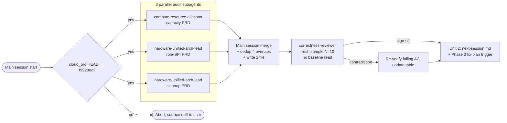

# v5.5.18 Phase 2 PRD audit — capacity / role-SPI / cleanup (lean)

> **Revision note (2026-04-27)**: 第一版 plan (572 行 / 6 units / sub-dispatch matrices / template artifact / 12 risk rows) 经 product-lens + adversarial review 判 over-engineered。本 lean 版砍到 1 audit unit + 1 handoff unit，输出 **1 个 keyed-by-AC table** 直接喂 Phase 3 fix-plan。详见 §Key Technical Decisions Q1=C / Q2 / Q3=B。

## Overview

Phase 2D 收尾后（KVM / Container / BM2 三个 RoleProviderIntegrationCase 全绿），把 3 份 v5.5.18 PRD（capacity / role-SPI / compat-cleanup）逐 AC 对照实际代码找 gap。

**1 个 keyed-by-AC table** 输出到 `docs/audits/2026-04-27-phase2-prd-audit.md`，直接作 Phase 3 fix-plan 输入。**不**做 baseline / template / 三独立 sub-report / consolidate index 等中间 artifact。

**不在本计划范围**：

- 真去修代码（→ `docs/plans/2026-04-28-001-fix-phase2-prd-gaps-plan.md`）
- 其它 PRD（server / provision-network）

## Problem Frame

3 PRD 经 NB-1..34 consolidation 至 cloud_prd commit `f9928ec`，约 1634 行规约文本，**约 63 显式 AC** + FR-013..033（实际 AC 段枚举：AC-CM-01..19=19, AC-AL-01..05=5, AC-CM-PERF-01=1, AC-RS-01..23=23, AC-CB-07..18=12, AC-CB-ROLLBACK-01..03=3 → 63 条）。

session 内已 spot-check 的高确定性结论（**直接进最终报告 ✅，无须 subagent 复审 — Q3=B reviewer 会 sample-verify**）：

- ✅ `header/.../HostCapacityVO.java:17` 用 `@org.hibernate.annotations.Immutable`（注意 FQN form，非 short `@Immutable`）
- ✅ `conf/db/upgrade/V5.5.18__schema.sql:224,598` 双 `ALGORITHM = MERGE`，`:616` `COALESCE(r.serverUuid, h.uuid)` 正确
- ✅ `HostCapacityUpdater.java:137,149` `new HostCapacityVO()` 仅 NB-22 例外（POJO 载体）
- ✅ `PhysicalServerRoleProvider` SPI v3 五方法齐全
- ✅ KVM / BM2 / Container 三 RoleProvider implements 完整
- ✅ `PhysicalServerHardwareService.java` 存在
- ✅ Attach/Detach/Power/Discover/Query API 头部齐全
- 🔁 `ServerAllocator*` / `AllocateServerMsg` 缺失 — Group C deferred 到 v5.5.18.x
- 🅿 AC-CB-ROLLBACK-01..03（要求保留 *_backup 表）— **PRD stale per ADR-007**（Q2 用户决策：不需要 backup 表，PRD 应改写删除 backup 期待，audit 不进 fix list）

## Requirements Trace

**Audit scope & methodology**:
- **R1** — 每条 in-scope AC 在最终 table 里有明确 status（✅/⚠️/❌/🔁/🅿）
- **R2** — 每个非 ✅ AC 附 file:line 证据 + 简短 gap 描述
- **R4** — 全程 read-only：subagent 不得 Write/Edit 生产代码
- **R6** — 跨 PRD 重叠（W7 / HardwareDiscoveryQueue / `PhysicalServerHardwareService` / `@Action(adminOnly=true)`）由主 session 合并时 dedup
- **R7** — Group C allocator / AC-RS-13-P2 标 🔁；ADR-superseded AC（典型 ROLLBACK-01..03）标 🅿，**都不进 critical-gap list**

**Output & prioritization**:
- **R3** — table 直接作 Phase 3 fix-plan 输入：critical-gaps（❌ 与 high-severity ⚠️）按 Owner 分组，每条对应 fix-plan 一个 U-unit 候选

**Execution model**:
- **R5** — 3 个 PRD 审计**并行 dispatch**，wall-clock = max(subagent_runtime)；shared-resource serialization（API rate / 重叠文件 read）算固有成本，不打优化

## Scope Boundaries

**In scope** — 3 PRD 内：
- `capacity/feat-unified_capacity_management_prd.md` — FR-013..021, AC-CM-01..19, AC-AL-01..05（标 🔁）, AC-CM-PERF-01
- `server/feat-role_spi_adapter_prd.md` — FR-022..027, AC-RS-01..23（含 13-P2 标 🔁）
- `compat/feat-legacy_migration_and_unified_infra_prd.md` — FR-030..033, AC-CB-07..18, AC-CB-ROLLBACK-01..03（标 🅿）

**Out of scope**:
- 其它 PRD（server-model / provision-network）
- UI 层 AC（AC-UI-*）
- ServerAllocator R2 Group C（plan §Scope Boundaries 已 deferred）
- AC-CB-ROLLBACK-01..03（Q2：PRD stale per ADR-007）

### Deferred to Separate Tasks

- **真修代码** → `docs/plans/2026-04-28-001-fix-phase2-prd-gaps-plan.md`
- **PRD 自身改写**（删 backup 表 AC、对齐 ADR-013/007）→ 上游 cloud_prd 维护者，不在本仓 scope
- **Provision PRD audit** → 单独立项

## Context & Research

### Relevant Code Roots

Subagent grep targets（按 PRD 分组，并集扁平化）:

- `header/src/main/java/org/zstack/header/server/` — PhysicalServer*VO + RoleProvider SPI + API messages + RoleWorkloadStatus
- `header/src/main/java/org/zstack/header/allocator/HostCapacityVO.java`
- `compute/src/main/java/org/zstack/compute/allocator/` — HostAllocatorManagerImpl / HostCapacityUpdater / HostCpuOverProvisioningManagerImpl / PhysicalServerCapacityUpdater
- `plugin/physicalServer/src/main/java/org/zstack/server/` — Manager / AutoAssociator / hardware/PhysicalServerHardwareService
- `plugin/kvm/src/main/java/org/zstack/kvm/KvmRoleProvider.java`
- `premium/baremetal2/src/main/java/org/zstack/baremetal2/server/Bm2RoleProvider.java`
- `premium/plugin-premium/container/src/main/java/org/zstack/container/{server/ContainerRoleProvider,ContainerEndpointBase,KubernetesNativeProvider}.java`
- `premium/mevoco/src/main/java/org/zstack/vmware/VCenterManagerImpl.java`（W9）
- `conf/db/upgrade/V5.5.18__schema.sql`

### Institutional Learnings

- ADR-005 (HCV VIEW MERGE) / ADR-007 (no backup tables) / ADR-010 (BM1 out) / ADR-011 (MD5 UUID) / ADR-013 (BM2 ClusterRef stays table)
- `docs/runbooks/v5518-sql-ddl-pitfalls.md` / `docs/runbooks/v5518-unified-hardware-rollback.md`
- `docs/brainstorms/next-session.md` §0 铁律 12

### External References

无 — audit self-contained。

## Key Technical Decisions

- **Decision Q1=C: lean shape, 1 audit unit + 1 handoff unit**（user 决策 2026-04-27 after document-review）
  - **Rationale**: product-lens + adversarial reviewer 共识 — 第一版 plan ceremony > work（6 unit / sub-dispatch / template / consolidate / 12 risk row 全为产 read-only doc）。lean 版直出最终 table，省去 baseline / template / sub-report 中间产物
  - **Trade-off**: 失去 sub-dispatch 的 module-expert 细粒度优势 → 用 Q3=B independent reviewer pass 兜底质量；失去 cross-PRD overlap dedup unit → 主 session 在合并阶段直接 dedup 4 个已知 overlap

- **Decision Q2: AC-CB-ROLLBACK-01..03 标 🅿（PRD stale per ADR）不进 fix list**（user 决策 2026-04-27）
  - **Rationale**: ADR-007 明示"备份归 operator，不留 *_backup 表"。PRD 的 ROLLBACK 三条 AC 期待 schema 保留 backup 表，与 ADR-007 直接冲突。User 拍板：ADR 是 source of truth，PRD 应改写。Audit 不打开"修代码加 backup"任务
  - **Action**: 加第 5 个状态 emoji **🅿 = PRD stale per ADR**；audit table 该行注 "see ADR-007"

- **Decision Q3=B: correctness-reviewer 用 fresh re-verify 模式（不读 audit table 直接 grep 抽样）**（user 决策 2026-04-27）
  - **Rationale**: adversarial reviewer 指出"correctness-reviewer 跟 audit subagent 用同一份 baseline → 无独立 oracle"。Q3=B 让 reviewer 拿 PRD + 代码作两端独立输入，**不读 audit subagent 输出**，N=10 抽样自验，sign off
  - **Implementation**: reviewer prompt 显式禁读 `docs/audits/`，只输入 PRD AC 列表（10 条随机）+ 代码 root；reviewer 自己 grep 得出 ✅/⚠️/❌，与 audit table 比对找 contradiction

- **Decision: 5 个 emoji** ✅=完全实现 / ⚠️=偏离规约 / ❌=缺失 / 🔁=已知 deferred / 🅿=PRD stale per ADR

- **Decision: 主 session 合并 + Q3=B reviewer，不引入 lead 角色**（per product-lens P6）
  - 3 subagent 并行返回各自 markdown table chunk（in tool response，不写 scratch file）
  - 主 session 把 3 chunk 合并 + dedup 4 个已知 overlap → 单一 `docs/audits/2026-04-27-phase2-prd-audit.md`
  - dedup 规则: overlap AC 选 owning audit 的 status，另一边在 Notes 列写 "(also seen by <other-audit>; status agrees/diverges)"

- **Decision: read-only enforcement = prompt + git status sweep**（无 tool allow-list 机制可用）
  - 接受 mitigation 不是 prevention；reviewer 收尾跑 `git status -- 'src/**' '*.java' '*.sql'` 0 改即过

- **Decision: cloud_prd HEAD pin 检查内置在 audit unit 启动**
  - 主 session 启动时 `git -C /home/mj/zstack-workspace/cloud_prd rev-parse HEAD`，与 `f9928ec` 比对；不一致 → abort 让 user 决定 pin 或 update plan

## Open Questions

### Resolved During Planning

- Q1=C / Q2=🅿 / Q3=B（见 Key Technical Decisions）
- 输出位置：`docs/audits/2026-04-27-phase2-prd-audit.md`（1 文件）
- Audit subagent 派给谁？ — Capacity → `compute-resource-allocator`；Role-SPI → `hardware-unified-arch-lead`；Cleanup → `hardware-unified-arch-lead`（**不再** 内部 sub-dispatch；直接读 4 模块自审）
- ServerAllocator deferred、AC-RS-13-P2 deferred —— 都 🔁 不进 fix list
- 是否 Phase 3 fix-plan = 同一 session 续写？— 由 user 后续决定；本 plan 只到 next-session.md handoff

### Deferred to Implementation

- **Subagent 失败重试边界**：约定**最多重试 1 次**该 unit；2 次失败即把该 PRD 的 audit chunk 标"partial — see error log"，不阻塞其它两份合并
- **AC count drift**：plan 写"约 63 AC"，实际 subagent 返回的 AC 数与此 ±10% 内皆视正常；超出 → 主 session 跑 grep `^- \[ \] \*\*AC-` 校 PRD 自身 AC 数变化
- **Owner 词汇命中**：subagent prompt 内置 6 词词汇表（kvm-host-expert / baremetal2-architect / container-module-architect / compute-resource-allocator / hardware-unified-arch-lead / general-purpose）；不命中由主 session merge 时纠正

## Output Structure

```text
docs/audits/                                              ← 新建
└── 2026-04-27-phase2-prd-audit.md                        ← Unit 1 输出，单一文件
```

`docs/brainstorms/next-session.md` 由 Unit 2 modify-only（§2.4 标 done + §2.5 fix-plan 入口）。

## High-Level Technical Design

> *Directional guidance, not implementation specification.*



**Subagent dispatch prompt skeleton**（每个并行 agent 收到的核心指令）:

```text
TASK: read-only PRD-vs-code gap audit for <area>.

INPUTS:
  PRD path: /home/mj/zstack-workspace/cloud_prd/prd/v5.5.18-unified-hardware/<area>/<file>.md
  Code root: /home/mj/zstack-workspace/zstack-unifi-host/  (branch feature/unifi-host-dev)
  PRD §8 acceptance criteria: audit each AC literally.

CONSTRAINTS:
  Write/Edit/NotebookEdit FORBIDDEN to all paths under repo (no exceptions).
  At end run `git status -- 'src/**' '*.java' '*.sql' '*.xml'` and report.
  Read-only access to /home/mj/zstack-workspace/cloud_prd/.

OUTPUT FORMAT (return as tool response, not file write):
  Header line: counts ✅ N · ⚠️ M · ❌ K · 🔁 J · 🅿 P
  Markdown table:
    | AC | Status | Evidence | Notes | Owner |
    |---|---|---|---|---|
    | AC-XX-NN: <one-line desc> | ✅/⚠️/❌/🔁/🅿 | path:line OR "missing" | <gap detail or "see ADR-XXX"> | <CLAUDE.md routing word> |
  Owner word vocabulary (verbatim):
    kvm-host-expert / baremetal2-architect / container-module-architect /
    compute-resource-allocator / hardware-unified-arch-lead / general-purpose
  Status emoji semantics:
    ✅=完全实现 / ⚠️=偏离规约 / ❌=缺失 / 🔁=已知 deferred per plan / 🅿=PRD stale per ADR

SKIP RULES:
  AC-AL-01..05 → 🔁 (Allocator deferred to v5.5.18.x per phase2 plan)
  AC-RS-13-P2 → 🔁 (cross-role serialNumber deferred to v1.1+)
  AC-CB-ROLLBACK-01..03 → 🅿 (PRD stale per ADR-007: no backup tables)

WRAP-UP:
  Critical-gaps list: ❌ 与 high-severity ⚠️ ordered by severity DESC then PRD order;
                     each entry has Owner + suggested-fix-scope (1 line, no code).
  Cross-PRD overlap notes: if you grep'd the same code as another PRD, note it.
```

## Implementation Units

- [ ] **Unit 1: 3-PRD parallel audit + merge + independent reviewer pass**

**Goal:** 派 3 并行 subagent 审 capacity / role-SPI / cleanup PRD，主 session 合并去重，独立 reviewer fresh re-verify N=10 抽样，写出 1 个 keyed-by-AC table。

**Requirements:** R1, R2, R3, R4, R5, R6, R7

**Dependencies:** None — audit unit 是入口

**Files:**
- Read: 3 份 PRD（路径见 §Scope Boundaries）+ §Context & Research 列出的代码 root
- Create: `docs/audits/2026-04-27-phase2-prd-audit.md`

**Approach:**

1. **Pre-flight gate**（主 session）:
   - `git -C /home/mj/zstack-workspace/cloud_prd rev-parse HEAD` 比 `f9928ec`；不一致 abort + surface drift
   - `mkdir -p docs/audits/`
   - record session HEAD: `git rev-parse HEAD` of feature/unifi-host-dev → 写入即将产出文件的 frontmatter

2. **Parallel dispatch**（主 session 一次性 fan-out 3 agent）:
   - **Capacity** → `compute-resource-allocator`：审 FR-013..021, AC-CM-01..19, AC-AL-01..05（自动 🔁）, AC-CM-PERF-01。重点：W1-W9 写路径 / VIEW + @Immutable / W3 NB-22-24 / 三模式 / 超分比 / Cordon §2.9 / Pod §2.10
   - **Role-SPI** → `hardware-unified-arch-lead`：审 FR-022..027, AC-RS-01..23（13-P2 自动 🔁）。重点：SPI v3 五方法 / FlowChain 尾部 3 Flow / AutoAssociator 三级降级 / `PhysicalServerHardwareService` 3 private discover / KubernetesNodeInventory 字段扩展 / RoleWorkloadStatus *BlockReason 表 / Attach/Detach API
   - **Cleanup** → `hardware-unified-arch-lead`：审 FR-030..033, AC-CB-07..18, AC-CB-ROLLBACK-01..03（自动 🅿 per Q2）。重点：Step 0 ServerPool / Step 1+ PS·Role 迁移 / `ResourceVO + AccountResourceRefVO` 注册 / admin-only / BM V1 跳过 / vcenter 半迁移 / 统一 power IPMI-only / hardware discovery handler 接线
   - 每个 agent prompt 含 §High-Level Technical Design 的 dispatch skeleton verbatim

3. **Merge**（主 session 收 3 tool response 后）:
   - 把 3 markdown table chunk 拼接，header 行重算总 counts
   - dedup 4 个已知 cross-PRD overlap（W7 / HardwareDiscoveryQueue / `PhysicalServerHardwareService` / `@Action(adminOnly=true)`）：保留 owning audit 的 status，另一边写 "(also seen by <X>-audit; status agrees|diverges)"
   - 主 session 自审 critical-gaps list：分 Owner module 排序，删 🔁/🅿 行
   - 写 `docs/audits/2026-04-27-phase2-prd-audit.md` 一次性

4. **Independent reviewer pass (Q3=B)**:
   - 派 `compound-engineering:review:correctness-reviewer`（fallback `code-reviewer`），prompt:
     - 输入：随机抽 N=10 AC（含 ❌/⚠️ 至少 5 条 + ✅ 至少 3 条 + 🔁/🅿 至少 1 条），仅给 AC 文本 + PRD path + 代码 root
     - **禁止读** `docs/audits/2026-04-27-phase2-prd-audit.md`（避免 baseline contamination）
     - reviewer 自己 grep 得出 status/file:line，返回 JSON
   - 主 session 比对 reviewer 结果 vs audit table：
     - 一致 → sign-off，进 Unit 2
     - 不一致 → 该 AC 标 ⚠️-disputed，主 session 第三方决议（grep 自验），更新 table

5. **Read-only sweep**:
   - `git status --porcelain -- '*.java' '*.sql' '*.xml' '*.groovy'` 必须空
   - `git status` 应只显示新文件 `docs/audits/2026-04-27-phase2-prd-audit.md` + Unit 2 的 `docs/brainstorms/next-session.md` 修改

**Patterns to follow:**
- `docs/decisions/ADR-005-hcv-view-algorithm-merge.md` 简洁论证格式（critical-gap 描述借鉴）
- `docs/runbooks/v5518-sql-ddl-pitfalls.md` 主题分节格式（如最终 table 太长，可分节但保单一文件）

**Verification:**
- `docs/audits/2026-04-27-phase2-prd-audit.md` 存在，含 frontmatter（feature-branch SHA + cloud_prd SHA）
- header 计数行存在：`✅ N · ⚠️ M · ❌ K · 🔁 J · 🅿 P`，N+M+K+J+P 在 [55, 70] 内（约 63 ±10%）
- table 每行 5 列填齐，Owner 列严格 6 词词汇之一
- 4 个已知 overlap 在 Notes 列出现 dedup 注释
- correctness-reviewer pass JSON 已 sign-off（或处理过 disputed）
- `git status --porcelain -- '*.java' '*.sql' '*.xml' '*.groovy'` 空输出
- critical-gaps section 里无 🔁 / 🅿 行

**Test expectation:** none — read-only 文档产出 unit；正确性由上面 6 条 Verification 检查 + Q3=B reviewer 抽样验证覆盖。

---

- [ ] **Unit 2: next-session.md handoff + Phase 3 fix-plan trigger**

**Goal:** 让下个 session 立即 pick up audit 结果开 fix-plan。

**Requirements:** R3

**Dependencies:** Unit 1

**Files:**
- Modify: `docs/brainstorms/next-session.md`

**Approach:**
- §2.4 加 ✅ 完成标记 + link 到 `docs/audits/2026-04-27-phase2-prd-audit.md`
- 新增 **H3** §2.5（注意 next-session.md `## 2. 下一步` 下用 H3 子节）"Phase 3 fix plan 起点"：
  - critical-gap 总数 + 按 Owner 分组数（kvm / bm2 / container / compute-allocator / arch-lead）
  - 建议 plan 文件名 `docs/plans/2026-04-28-001-fix-phase2-prd-gaps-plan.md`
  - 1 段提示：fix-plan 第一 unit 应是"PRD/ADR 对齐校正"（如果有 🅿 行，列 PRD 应改的位置；这是 cloud_prd 仓的事）
- **不**修 CLAUDE.md（铁律候选评估留给 fix-plan）

**Verification:**
- `grep -nE '^### 2\.5 ' docs/brainstorms/next-session.md` 命中
- `grep -q '2026-04-27-phase2-prd-audit' docs/brainstorms/next-session.md` 命中
- `grep -q '2026-04-28-001-fix-phase2-prd-gaps-plan' docs/brainstorms/next-session.md` 命中
- `git diff docs/brainstorms/next-session.md` 仅含 §2.4 + §2.5 改动，无误删历史

**Test expectation:** none — doc handoff unit。

## System-Wide Impact

- **State changes**: 仅 `docs/audits/2026-04-27-phase2-prd-audit.md`（新建）+ `docs/brainstorms/next-session.md`（modify §2.4/§2.5）。0 src 改动
- **Cross-PRD dedup**: 4 known overlap（W7 / HardwareDiscoveryQueue / `PhysicalServerHardwareService` / `@Action(adminOnly=true)`）由主 session merge 时保留 owning audit status + reference note 在 Notes 列
- **Unchanged invariants**: 所有 src 代码 / git history / 已 push commits 不变；feature/unifi-host-dev 三 case 全绿状态保持

## Risks & Dependencies

| Risk | Mitigation |
|------|------------|
| Subagent 顺手 Write src/* | dispatch prompt 头部强制 forbid + 收尾 `git status` 0-change 检查 |
| 1 个 subagent 失败 | 重试 1 次；2 次失败标 "partial — see error log"，不阻塞另两份合并 |
| cloud_prd HEAD drift（非 f9928ec） | Pre-flight gate abort，surface 给 user 决定 pin 或更新 plan AC count |
| Subagent grep 漏 AC | 主 session merge 时 cross-check PRD §8 完整 AC 列表；缺则单条重 grep（不重派整个 unit） |
| Cross-PRD 重叠 status 矛盾 | merge 阶段保留 owning audit 结论，diverging 在 Notes 标 "diverges from <X>-audit"，留给 fix-plan 决议 |
| Q3=B reviewer 抽样大量 disputed | reviewer prompt 拒读 audit table → 真矛盾才 dispute；> 3 dispute 触发主 session 全量 grep 自验该 PRD（极少） |
| 主 session context 跑满 | subagent 用 background dispatch；merge 阶段只读 3 tool response（< 30K token），写 1 文件 |
| AC count 与 plan 假设 ±10% 偏差 | plan 假设"约 63 AC"，header 计数 [55, 70] 内 OK；超出则 grep PRD 自身 AC 数变更 |

## Documentation / Operational Notes

- **本计划**: `docs/plans/2026-04-27-001-feat-v5518-phase2-prd-audit-plan.md`
- **下一份 fix-plan 文件名约定**: `docs/plans/2026-04-28-001-fix-phase2-prd-gaps-plan.md`
- **Audit 报告生命周期**: `docs/audits/` 是 Phase 2 → Phase 3 桥梁；Phase 3 fix-plan 提交后 audit 文件保持只读，作 fix-plan 的 traceability
- **🅿 状态语义**: 仅本 audit 引入。未来如继续用 audit 流程，把 🅿 写进 audit-report-template；本 plan 不出 template

## Sources & References

- **Origin context**: [docs/brainstorms/2026-04-15-phase2-full-requirements.md](../brainstorms/2026-04-15-phase2-full-requirements.md)
- **Trigger**: [docs/brainstorms/next-session.md](../brainstorms/next-session.md) §2.4
- **PRD sources** (cloud_prd commit `f9928ec` NB-1..34 final consolidation):
  - `prd/v5.5.18-unified-hardware/capacity/feat-unified_capacity_management_prd.md`
  - `prd/v5.5.18-unified-hardware/server/feat-role_spi_adapter_prd.md`
  - `prd/v5.5.18-unified-hardware/compat/feat-legacy_migration_and_unified_infra_prd.md`
- **Phase 2 master plan**: [docs/plans/2026-04-22-001-feat-v5518-unified-hardware-phase2-plan.md](2026-04-22-001-feat-v5518-unified-hardware-phase2-plan.md)
- **Related ADRs**: ADR-005, ADR-007 (Q2 决策依据), ADR-010, ADR-011, ADR-013
- **Related runbooks**: `docs/runbooks/v5518-sql-ddl-pitfalls.md`, `docs/runbooks/v5518-unified-hardware-rollback.md`
- **CLAUDE.md routing table**: 项目根 CLAUDE.md "Agent Routing / 什么时候叫谁" 节
- **Reviewer findings driving lean rewrite**: 4 reviewer outputs from 2026-04-27 document-review pass:
  - architecture-strategist (Issue 1/2/4/5) — partially adopted in v1, mostly subsumed by Q1=C
  - pattern-recognition-specialist (Issue 1/3/5) — subsumed by Q1=C
  - product-lens-reviewer (P1/P2/P3/P6) — primary driver of Q1=C
  - adversarial-document-reviewer (A1/A2/A4/A8) — Q3=B + Q2 derived from these
