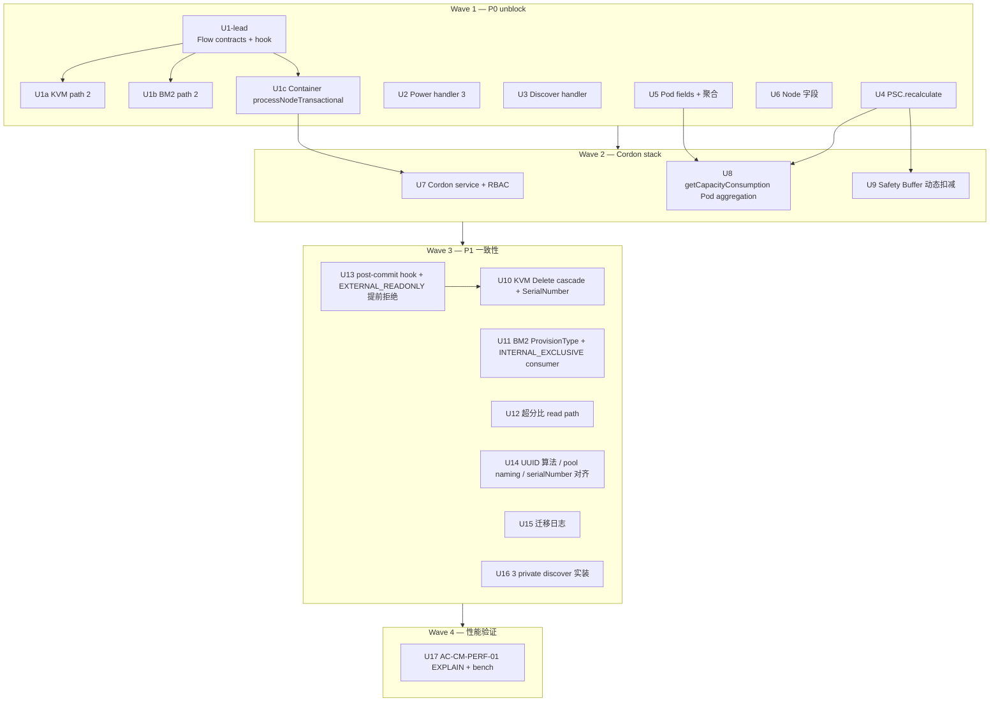

# v5.5.18 Phase 3 fix-plan — 闭合 Phase 2 PRD audit 缺口

> Phase 2 PRD audit（[`docs/audits/2026-04-27-phase2-prd-audit.md`](../audits/2026-04-27-phase2-prd-audit.md)）
> 在 72 AC 中识别 21 ❌ + 13 ⚠️ + 1 PERF 待验证 = **35 条 in-scope gap**，
> 加 6 🔁 + 3 🅿 共 9 条 deferred/out-of-scope。本 plan 把 35 条 gap 拆成
> **20 个 U-unit**（4 wave）+ **1 段 cloud_prd handoff**，按 Owner 分派
> 6 个 domain agent 并行/串行落地。

## Overview

Phase 2 落地完整但路径覆盖不全（integration case 三家走的都是路径 1 Attach API），
audit 暴露：

- **3 P0 blocker**：路径 2 (传统 AddHost/AddChassis) FlowChain 全缺 / 统一 power handler 完全不存在 / Container 容量管道完全断
- **9 P1 gap**：UUID 算法漂移 / serialNumber 未提取 / `DeleteHostMsg` 不 cascade RoleVO / BM2 ProvisionType 硬编码 / 超分比 read path 没绑 PSC 列 / EXTERNAL_READONLY 不提前拒绝 / 迁移日志缺 / `PhysicalServerHardwareService` 3 private discover 仍 stub / Pod 聚合公式缺
- **1 P0 性能验证**：AC-CM-PERF-01 EXPLAIN 证据 + 1000-host bench

本 plan 不立新 ADR、不改 PRD、不引入新硬件类型。仅按 audit 定的 file:line
逐条改 src + schema，把 `❌` 翻成 `✅`。

**不在本计划范围**：

- AC-AL-01..05 (ServerAllocator R2 Group C) → v5.5.18.x
- AC-RS-13-P2 (跨角色 serialNumber 归一化) → v1.1+
- AC-CB-ROLLBACK-01..03 (PRD stale per ADR-007) → §Cloud_prd handoff
- 新 ADR / 新 PRD（仅消费现存 ADR-001..014）
- Provision PRD audit / 实装（独立立项）

## Problem Frame

3 P0 + 9 P1 gap 集中在 5 个代码 root：

| 代码 root | 主问题 | 受影响 AC | Owner |
|---|---|---|---|
| `compute/.../allocator/` | `PhysicalServerCapacityUpdater.recalculate()` 不存在；超分比 read path 没绑 PSC 列 | AC-CM-04/08/11/13 | compute-resource-allocator |
| `plugin/physicalServer/.../server/` | 路径 2 FlowChain 缺 / power handler 缺 / discover handler 缺 / 3 private discover stub | AC-RS-04+07+10 / AC-CB-14/15/16/18 / §2.5b | hardware-unified-arch-lead + 3 module |
| `plugin/kvm/.../HostManagerImpl` | path 2 不读 `serverUuid` / `DeleteHostMsg` 不 cascade / SerialNumber 未注入 | AC-RS-04/05/14 | kvm-host-expert |
| `premium/baremetal2/.../` | path 2 不读 `serverUuid` / Power IPMI executor 缺 / ProvisionType 硬编码 / INTERNAL_EXCLUSIVE consumer 缺 | AC-RS-07/08 / AC-CM-07 / AC-CB-14/15/16 | baremetal2-architect |
| `premium/.../container/` | `processNodeTransactional` 不存在 / `getCapacityConsumption` 返 0 / Cordon service 缺 / Pod 聚合公式缺 / Node 字段缺 | AC-RS-10/11/12 / AC-CM-04/08/13-19 | container-module-architect |
| `conf/db/upgrade/V5.5.18__schema.sql` | UUID 算法 / pool naming / serialNumber 提取 / 迁移日志 缺 | AC-CB-08/09/M18 / Step0a/0b | hardware-unified-arch-lead |

PRD vs ADR 冲突 (🅿) 在 cloud_prd 仓改，**不在本仓**。

## Requirements Trace

- **R1**：21 ❌ AC 全部翻 ✅（一次 `git grep` 验证 file:line 现状）
- **R2**：13 ⚠️ AC 全部翻 ✅（含 cosmetic drift 对齐：UUID 算法、pool naming）
- **R3**：AC-CM-PERF-01 性能验证（EXPLAIN + 1000-host bench）有 PR 附证据
- **R4**：所有改动遵守**铁律 12**（改 header/共享 entity 后必须 `mvn clean install`）
- **R5**：所有新增函数签名向后兼容（CLAUDE.md §"新增函数签名要向后兼容"）
- **R6**：Producer agent ≠ Reviewer agent（每 unit anti-self-evaluation）
- **R7**：Plan 内不立新 ADR / 不改 PRD（cloud_prd 改写归 §Handoff section）
- **R8**：每 unit 至少一条 verification command（mvn / grep / EXPLAIN / integration case）
- **R9**：Wave 间依赖明确（Wave 2 ⊃ Wave 1 / Wave 4 ⊃ all）

## Scope Boundaries

**In scope** — `feature/unifi-host-dev` 分支内 Java + SQL：

| AC 段 | 数量 | 处理 |
|---|---|---|
| AC-CM-01..19 | 19 (含 ❌/⚠️) | Wave 1 U4+U5+U6, Wave 2 U7+U8+U9, Wave 3 U12 |
| AC-RS-01..23 (含 13-P2 🔁) | 22 in-scope | Wave 1 U1*+U6, Wave 2 U7+U8, Wave 3 U10+U11+U13 |
| AC-CB-07..18 | 12 | Wave 1 U2+U3, Wave 3 U14+U15+U16 |
| AC-CM-PERF-01 | 1 | Wave 4 U17 |

**Out of scope** — 见 §Overview 末尾；Cloud_prd 改写见 §Handoff。

### Deferred to Separate Tasks

- ServerAllocatorChain (R2 Group C) → v5.5.18.x
- AC-RS-13-P2 跨角色 serialNumber → v1.1+
- ProvisionAndAttachRole orchestrator API → v1.1+
- Provision PRD audit → 独立立项

## Context & Research

### Relevant Code Roots

- `header/src/main/java/org/zstack/header/server/` — PhysicalServer*VO + RoleProvider SPI + API messages + RoleWorkloadStatus
- `header/src/main/java/org/zstack/header/allocator/HostCapacityVO.java` — VIEW-mapped @Immutable
- `compute/src/main/java/org/zstack/compute/allocator/`
  — `HostAllocatorManagerImpl` / `HostCapacityUpdater` / `HostCpuOverProvisioningManagerImpl` / **新建 `PhysicalServerCapacityUpdater`**
- `plugin/physicalServer/src/main/java/org/zstack/server/`
  — `PhysicalServerManagerImpl` / `AutoAssociator` / `hardware/PhysicalServerHardwareService` / **新建 3 Flow + post-commit hook**
- `plugin/kvm/src/main/java/org/zstack/kvm/`
  — `HostManagerImpl` / `KvmRoleProvider` / `KVMHostBase`
- `premium/baremetal2/src/main/java/org/zstack/baremetal2/`
  — `BareMetal2ChassisManagerImpl` / `Bm2RoleProvider` / `oob/HostIpmiPowerExecutor`
- `premium/plugin-premium/container/src/main/java/org/zstack/container/`
  — `ContainerEndpointBase` / `KubernetesNativeProvider` / `KubernetesPodInventory` / `KubernetesNodeInventory` / `server/ContainerRoleProvider` / **新建 `ContainerNodeCordonService`**
- `conf/db/upgrade/V5.5.18__schema.sql` — Flyway DDL（Step 0 / Step 1+ / vcenter / migration log）

### Institutional Learnings

- **ADR-001/002**：`HostCapacityUpdater` static resolve + UUID 语义 — **W3 fail-loud 已落**，新 `PhysicalServerCapacityUpdater.recalculate()` 沿用 NB-30 锁 key
- **ADR-005**：HCV VIEW ALGORITHM=MERGE — 不动
- **ADR-007**：no backup tables — Q2 决策依据，PRD ROLLBACK 三条 🅿（cloud_prd handoff）
- **ADR-010**：BM1 out of scope — 本 plan 不动 `premium/baremetal/`
- **ADR-011**：MD5 salt UUID 派生算法 — Wave 3 U14 schema 与 PRD 对齐
- **ADR-012**：RoleProvider 接 `CreateRoleEntityContext.preGeneratedRoleUuid` — Wave 1 U1-lead 设计 Flow 时遵守
- **ADR-013**：BM2 ClusterRef stays as table — 本 plan 不再触动
- **ADR-014**：incremental rebuild 反模式 — 所有 verification 走 `mvn clean install -P premium`
- `docs/runbooks/v5518-sql-ddl-pitfalls.md` — Wave 3 U14/U15 schema 改动必读
- `docs/runbooks/v5518-unified-hardware-rollback.md` — 升级回滚手册参考
- `docs/runbooks/testing-envs.md` — bench env (Wave 4 U17)
- `docs/brainstorms/next-session.md` §0 4 个常见坑

### External References

- 3 PRD（cloud_prd `f9928ec`）：capacity / role-SPI / cleanup（仅 read，不 edit）

## Key Technical Decisions

### Q1（user 决策 2026-04-28）：U1 拆 4 子 unit

audit 把 "FlowChain 3 Flow + post-commit hook"（AC-RS-04/07/10 共同根因）压成单 U1
给 4 个 owner 协调。本 plan 拆为：

- **U1-lead**（hardware-unified-arch-lead）：在 `header/` + `compute/` 设计 3 Flow contract +
  post-commit `enqueueDiscovery` hook 接口 + `CreateRoleEntityContext.preGeneratedRoleUuid`
  pattern (ADR-012 normative) — **shared infrastructure**
- **U1a**（kvm-host-expert）：`HostManagerImpl.doAddHost` 尾部接 3 Flow（消费 contract）
- **U1b**（baremetal2-architect）：`BareMetal2ChassisManagerImpl.handle(APIAddBareMetal2ChassisMsg)`
  尾部接 3 Flow（同 KVM contract）
- **U1c**（container-module-architect）：`ContainerEndpointBase.processNodeTransactional`
  5 步原子（**独立形态**，per PRD §2.4 NB-7 走 `@Transactional` 不走 FlowChain）

**Rationale**：单 U1 跨 4 owner 协调成本高 / contract-first 让模块 owner 并行接入 /
拆完后 unit 数 18→21（含 U18 demote 后 20）接近 audit 文本 "~22 unit" 估值。

### Q2（user 决策 2026-04-28）：U18 降级到 §Handoff

Audit 骨架 Wave 4 U18 = "PRD 上游改写"（删 ROLLBACK-01..03 / 选定 UUID / 选定 pool naming），
对象是 `cloud_prd` 仓，不在 `feature/unifi-host-dev` 分支 scope。

**决策**：U18 不作 U-unit。改为本 plan 末尾 §Cloud_prd handoff section，列出待
cloud_prd 维护者改写的 PRD 项，并 cross-ref 本 plan U14（schema UUID 选 ADR-011 形式 +
对齐 PRD）+ U15（pool naming）+ ADR-007（ROLLBACK 删除）。

### Q3：每 unit 强制 producer ≠ reviewer

每 U-unit 含 `producer_agent` + `reviewer_agent` 两栏。reviewer 默认 `code-reviewer`，
设计/SPI 类用 `architecture-strategist`，性能用 `verifier`，schema 用 `data-migration-expert` /
`data-migrations-reviewer`（compound-engineering)。**reviewer 必 != producer**（CLAUDE.md
"keep authoring and review as separate passes"）。

### Decision: Verification gate per unit

每 U-unit Verification 段 mandatory 包含：

1. **Build gate**（铁律 12）：`./scripts/mvn-safe-install.sh -pl <units-touched-modules>,compute,plugin/physicalServer -am -P premium`
2. **AC gate**：grep 命令证明 file:line 改动落地
3. **Test gate**：相关 integration case run（KVM / Bm2 / Container Case 至少一个）

Wave 4 U17 额外加 EXPLAIN 输出 + 1000-host bench 数字。

### Decision: Dispatch model — Wave 内 ultrawork 并行 / Wave 间 sequential

- Wave 1 (9 unit)：U1-lead 独立先行（contract-first），完成后 U1a/U1b/U1c 并行；U2-U6 平行 Wave 1 全程跑
- Wave 2 (3 unit)：依赖 Wave 1 U1c+U4+U5；3 unit 内 U7+U8 并行，U9 依赖 U4（recalculate 已建）
- Wave 3 (7 unit)：独立 P1，全部并行
- Wave 4 (1 unit)：依赖前 3 Wave 全部完成

每 Wave 用 `/oh-my-claudecode:ultrawork` 派 N 个 executor，每 executor 包 1 unit
(producer agent + reviewer agent 串接)。Wave 切换由主 session 验证。

## Open Questions

### Resolved During Planning

- Q1 = U1 拆 4 / Q2 = U18 → §Handoff / Q3 = 每 unit reviewer pairing
- Plan 文件位置：`docs/plans/2026-04-28-001-fix-phase2-prd-gaps-plan.md`
- 状态体系沿用 audit：✅/⚠️/❌（plan 内不会出现 🔁/🅿，因都已剔除）
- ADR 立新策略：**本 plan 不立新 ADR**；如发现 audit 之外的设计冲突，开 ADR-015+ 单独立项再回填

### Deferred to Implementation

- **U17 bench env**：1000-host bench 用 simulator 还是 staging 测试环境？由 U17 producer 起跑前确认 `docs/runbooks/testing-envs.md`
- **U14 UUID 选型**：schema 现 `MD5(src.uuid+'-ps')` vs PRD `MD5(mgmtIp+zoneUuid)`。ADR-011
  写的是 "MD5 salt 派生"未具化输入。U14 producer 决策时回 update ADR-011 注明选型理由
- **U15 pool naming 选型**：`bm2-pool-<uuid8>` vs `bm2-<name>-pool` / `default-pool` vs
  `default-shared-pool`，audit 标 P3 cosmetic — U15 producer 任选一种 + 同步更新 PRD 期待值（写进 §Handoff）
- **U7 Cordon RBAC self-check**：`SelfSubjectAccessReview` API 调用模式由 U7 producer
  在 `KubernetesNativeProvider` 现有 K8s client 上扩展（不引入新 K8s SDK 依赖）

## Output Structure

```text
docs/
├── plans/
│   └── 2026-04-28-001-fix-phase2-prd-gaps-plan.md      ← 本文件
└── audits/
    └── 2026-04-27-phase2-prd-audit.md                  ← 输入（不动）

src 改动（按 Wave 分布）:
header/src/main/java/org/zstack/header/server/
  ├── PhysicalServerEnqueueDiscoveryHook.java           [U1-lead 新建]
  └── flow/                                             [U1-lead 新建]
      ├── AutoAssociateFlow.java
      ├── CreatePhysicalServerRoleFlow.java
      └── InitPhysicalServerCapacityFlow.java

compute/src/main/java/org/zstack/compute/allocator/
  ├── PhysicalServerCapacityUpdater.java                [U4 新建]
  └── HostCpuOverProvisioningManagerImpl.java           [U12 modify read path]

plugin/physicalServer/src/main/java/org/zstack/server/
  ├── PhysicalServerManagerImpl.java                    [U2/U3/U13 modify dispatcher]
  └── hardware/PhysicalServerHardwareService.java       [U16 实装 3 private discover]

plugin/kvm/src/main/java/org/zstack/kvm/
  ├── HostManagerImpl.java                              [U1a/U10 modify]
  └── KvmRoleProvider.java                              [U10 SerialNumber RoleMatchContext]

premium/baremetal2/src/main/java/org/zstack/baremetal2/
  ├── BareMetal2ChassisManagerImpl.java                 [U1b modify]
  ├── server/Bm2RoleProvider.java                       [U11 ProvisionType 映射]
  └── oob/HostIpmiPowerExecutor.java (or new)           [U2 power executor]

premium/plugin-premium/container/src/main/java/org/zstack/container/
  ├── ContainerEndpointBase.java                        [U1c processNodeTransactional]
  ├── KubernetesNativeProvider.java                     [U5/U6 fields/aggregation]
  ├── KubernetesPodInventory.java                       [U5 requestsCpu/Memory]
  ├── KubernetesNodeInventory.java                      [U6 systemUUID/capacity/allocatable]
  ├── ContainerNodeCordonService.java                   [U7 新建]
  └── server/ContainerRoleProvider.java                 [U8 getCapacityConsumption]

conf/db/upgrade/V5.5.18__schema.sql                     [U14/U15 modify]
```

`docs/STATUS.md` + `docs/brainstorms/next-session.md` Phase 3 启动后 modify-only refresh
（不在 U-unit 内，由主 session 在 Wave 1 完成时增量更新）。

## High-Level Technical Design



**Dispatch flow**：

```text
主 session
  ├─ Wave 1 起动 (ultrawork)
  │   ├─ executor → hardware-unified-arch-lead [U1-lead]  → architecture-strategist review
  │   │   (U1-lead 完成后，3 模块并行起)
  │   ├─ executor → kvm-host-expert [U1a]                 → code-reviewer
  │   ├─ executor → baremetal2-architect [U1b]            → code-reviewer
  │   ├─ executor → container-module-architect [U1c]      → code-reviewer
  │   ├─ executor → baremetal2-architect [U2]             → code-reviewer
  │   ├─ executor → hardware-unified-arch-lead [U3]       → code-reviewer
  │   ├─ executor → compute-resource-allocator [U4]       → code-reviewer
  │   ├─ executor → container-module-architect [U5]       → code-reviewer
  │   └─ executor → container-module-architect [U6]       → code-reviewer
  │
  ├─ 主 session 收尾验证 → STATUS.md refresh →
  │
  ├─ Wave 2 起动 (ultrawork)         (依赖 Wave 1 全绿)
  │   ├─ U7 / U8 / U9 三 unit 并行，3 个 executor
  │
  ├─ Wave 3 起动 (ultrawork) — 7 unit 全并行
  │
  └─ Wave 4 — U17 单 executor，verifier review，附 bench / EXPLAIN
```

## Implementation Units

> 每 unit 头部 6 字段 (`AC` / `Producer` / `Reviewer` / `Files` / `Depends-on` / `Severity`)。
> Approach 步骤分解；Verification 含 build gate / AC gate / test gate 三类。

### Wave 1 — P0 unblock (9 units, parallelizable post-U1-lead)

---

- [ ] **U1-lead — FlowChain contract + post-commit hook 抽象**

| 字段 | 值 |
|---|---|
| AC | AC-RS-04+07+10 共同根因 |
| Producer | hardware-unified-arch-lead |
| Reviewer | architecture-strategist |
| Files | `header/.../server/flow/AutoAssociateFlow.java` (new), `CreatePhysicalServerRoleFlow.java` (new), `InitPhysicalServerCapacityFlow.java` (new), `header/.../server/PhysicalServerEnqueueDiscoveryHook.java` (new), `compute/.../allocator/` (FlowChain 注册) |
| Depends-on | — |
| Severity | P0 |

**Approach**：

1. 在 `header/.../server/flow/` 新建 3 abstract Flow（参考 `compute/host/HostBase` 现 FlowChain 模式）
2. `AutoAssociateFlow` 入参 `host/chassis context`，调 `AutoAssociator.findOrCreate` → 输出 `serverUuid`
3. `CreatePhysicalServerRoleFlow` 入参 `serverUuid + roleType + roleConfig + preGeneratedRoleUuid`（ADR-012），写 `PhysicalServerRoleVO`；rollback 删 RoleVO
4. `InitPhysicalServerCapacityFlow` 入参 `serverUuid`，初始化 `PhysicalServerCapacityVO`（W3 锁 key by serverUuid，NB-30）；rollback 删 PSC 行
5. `PhysicalServerEnqueueDiscoveryHook` SPI（post-commit only-once），由 KVM/BM2 在 Flow 链尾 commit 后调；Container 路径在 `processNodeTransactional` 末尾调
6. 不立新 ADR — 引用 ADR-012 normative pattern

**Verification**：

- Build: `./scripts/mvn-safe-install.sh -pl header,compute,plugin/physicalServer -am -P premium`
- AC: `git grep -nE 'class (AutoAssociate|CreatePhysicalServerRole|InitPhysicalServerCapacity)Flow' header/`
- AC: `git grep -nE 'PhysicalServerEnqueueDiscoveryHook' header/`
- Test: 现有 Phase 2D 三 case 全绿 (no regression)

---

- [ ] **U1a — KVM path 2 接 3 Flow**

| 字段 | 值 |
|---|---|
| AC | AC-RS-04 |
| Producer | kvm-host-expert |
| Reviewer | code-reviewer |
| Files | `plugin/kvm/.../HostManagerImpl.java` (handle `AddKVMHostMsg.serverUuid`) |
| Depends-on | U1-lead |
| Severity | P0 |

**Approach**：

1. `HostManagerImpl.doAddHost` 尾部读 `AddKVMHostMsg.serverUuid`（现 carrier-only），如非 null：
   - 1) `AutoAssociateFlow` (skip 如 serverUuid 已给)
   - 2) `CreatePhysicalServerRoleFlow` (roleType=KVM, preGeneratedRoleUuid=msg.resourceUuid pattern per ADR-012)
   - 3) `InitPhysicalServerCapacityFlow`
   - 4) post-commit `enqueueDiscoveryHook`
2. failure rollback 由 FlowChain 处理；现有 HostVO 写已在 ChainFlow 内不需重写
3. 不动 `AddKVMHostMsg` 字段（已加），不动 `KvmRoleProvider`（路径 1 已 wire）

**Verification**：

- Build: `./scripts/mvn-safe-install.sh -pl plugin/kvm,compute,plugin/physicalServer -am -P premium`
- AC: `git grep -nE 'serverUuid|preGeneratedRoleUuid' plugin/kvm/src/main/java/org/zstack/kvm/HostManagerImpl.java`
- Test: 新 integration case `AddKvmHostPath2Case.groovy`（path 2 入口走 AddKVMHostMsg 含 serverUuid，断言 PhysicalServerRoleVO + PSC 创建）

---

- [ ] **U1b — BM2 path 2 接 3 Flow**

| 字段 | 值 |
|---|---|
| AC | AC-RS-07 |
| Producer | baremetal2-architect |
| Reviewer | code-reviewer |
| Files | `premium/baremetal2/.../BareMetal2ChassisManagerImpl.java` (handle `APIAddBareMetal2ChassisMsg.serverUuid`) |
| Depends-on | U1-lead |
| Severity | P0 |

**Approach**：同 U1a 模式（共用 3 Flow contract）；roleType=BareMetal2，
`Bm2RoleProvider.createRoleEntity` 接受 `preGeneratedRoleUuid`（已落 commit `4f78791cb1` ADR-012）。

**Verification**：

- Build: `./scripts/mvn-safe-install.sh -pl premium/baremetal2,compute,plugin/physicalServer -am -P premium`
- AC: `git grep -nE 'serverUuid|3.Flow' premium/baremetal2/src/main/java/org/zstack/baremetal2/BareMetal2ChassisManagerImpl.java`
- Test: 新 integration case `AddBm2ChassisPath2Case.groovy`

---

- [ ] **U1c — Container processNodeTransactional**

| 字段 | 值 |
|---|---|
| AC | AC-RS-10 |
| Producer | container-module-architect |
| Reviewer | code-reviewer |
| Files | `premium/plugin-premium/container/.../ContainerEndpointBase.java` (afterSyncNodes hook → 改造为 `processNodeTransactional`) |
| Depends-on | U1-lead (post-commit hook 接口) |
| Severity | P0 |

**Approach**：

1. 在 `ContainerEndpointBase` 新增 `@Transactional processNodeTransactional(NodeContext)` 方法
2. 内含 5 步原子（NB-7 PRD §2.4）：
   - 1) `AutoAssociator.findOrCreate(serialNumber/oobAddress/managementIp)`
   - 2) `persist NativeHostVO`（现 `syncNodesFromCluster` 已写，搬入事务）
   - 3) 幂等 upsert `PhysicalServerRoleVO`（roleType=Container，preGeneratedRoleUuid=NativeHost.uuid）
   - 4) init `PhysicalServerCapacityVO`（同 NB-30 锁 key 模式）
   - 5) post-commit `enqueueDiscoveryHook`
3. **不走** FlowChain（Container per-node 5 步事务一致，不需 saga rollback）
4. 现 `syncNodesFromCluster` 调用点改为 per-node 循环 + `processNodeTransactional`

**Verification**：

- Build: `./scripts/mvn-safe-install.sh -pl premium/plugin-premium/container,compute,plugin/physicalServer -am -P premium`
- AC: `git grep -nE 'processNodeTransactional' premium/plugin-premium/container/src/main/java/org/zstack/container/ContainerEndpointBase.java`
- AC: `git grep -nE '@Transactional' premium/plugin-premium/container/src/main/java/org/zstack/container/ContainerEndpointBase.java`
- Test: `ContainerRoleProviderIntegrationCase` 仍绿；新 `ContainerSyncNodesPath3Case.groovy` 断言 RoleVO + PSC 同事务创建

---

- [ ] **U2 — 统一 Power handler 3 个**

| 字段 | 值 |
|---|---|
| AC | AC-CB-14, AC-CB-15, AC-CB-16 |
| Producer | baremetal2-architect |
| Reviewer | code-reviewer |
| Files | `plugin/physicalServer/.../PhysicalServerManagerImpl.java`, `premium/baremetal2/.../oob/HostIpmiPowerExecutor.java` (or new) |
| Depends-on | — |
| Severity | P0 |

**Approach**：

1. `PhysicalServerManagerImpl.handleApiMessage` 加 dispatch：
   - `APIPowerOnPhysicalServerMsg`
   - `APIPowerOffPhysicalServerMsg`
   - `APIResetPhysicalServerMsg`
2. handler 内：
   - `if ps.oobAddress == null` → operr "for KVM hosts use APIPowerResetHostMsg" (NB-10)
   - else → 调 `HostIpmiPowerExecutor.power<On|Off|Reset>(ps.oobAddress, ps.oobPort, ps.oobUsername, ps.oobPassword)`
3. 成功后更新 `PhysicalServerVO.powerStatus` (AC-CB-15)
4. **不引入** KVM legacy `RebootHostMsg` 入 PS Manager（NB-10 砍 agent 兜底）

**Verification**：

- Build: `./scripts/mvn-safe-install.sh -pl plugin/physicalServer,premium/baremetal2 -am -P premium`
- AC: `git grep -nE 'APIPowerOn|APIPowerOff|APIResetPhysicalServer' plugin/physicalServer/src/main/java/org/zstack/server/PhysicalServerManagerImpl.java`
- Test: 新 `PhysicalServerPowerCase.groovy` (BM2 fixture，断言 IPMI mock 调用 + powerStatus update + KVM ps 走 operr)

---

- [ ] **U3 — APIDiscoverPhysicalServerHardwareMsg dispatch**

| 字段 | 值 |
|---|---|
| AC | AC-CB-18 |
| Producer | hardware-unified-arch-lead |
| Reviewer | code-reviewer |
| Files | `plugin/physicalServer/.../PhysicalServerManagerImpl.java` (handler) |
| Depends-on | — |
| Severity | P0 |

**Approach**：

1. `handleApiMessage` 加 `instanceof APIDiscoverPhysicalServerHardwareMsg` 分支
2. 调 `hardwareService.discoverHardware(msg.getUuid())`（service 已 ready，骨架 + UnifiedHardwareInfo flat DTO）
3. 返回 `APIDiscoverPhysicalServerHardwareEvent`（包含 UnifiedHardwareInfo 或 error）
4. 不动 `PhysicalServerHardwareService` 内部 — U16 处理 3 private discover stub

**Verification**：

- Build: `./scripts/mvn-safe-install.sh -pl plugin/physicalServer -am -P premium`
- AC: `git grep -nE 'APIDiscoverPhysicalServerHardware' plugin/physicalServer/src/main/java/org/zstack/server/PhysicalServerManagerImpl.java`
- Test: 新 `PhysicalServerDiscoverHardwareCase.groovy`

---

- [ ] **U4 — PhysicalServerCapacityUpdater.recalculate()**

| 字段 | 值 |
|---|---|
| AC | AC-CM-04, AC-CM-08 |
| Producer | compute-resource-allocator |
| Reviewer | code-reviewer |
| Files | `compute/.../allocator/PhysicalServerCapacityUpdater.java` (new) |
| Depends-on | — |
| Severity | P0 |

**Approach**：

1. 新建 `PhysicalServerCapacityUpdater`（命名对齐现 `HostCapacityUpdater`）
2. `recalculate(serverUuid)`：
   - PESSIMISTIC_WRITE 锁 PSC by `serverUuid`（NB-30）
   - 查所有 active `PhysicalServerRoleVO`（roleType + roleProvider）
   - 调每个 `RoleProvider.getCapacityConsumption(roleVO)` 累加 (AC-CM-08 EXTERNAL_READONLY 包含)
   - `available = total - Σ consumption - systemReserved - safetyBuffer`
   - `safetyBuffer` 从 `ServerReservedCapacityExtensionPoint` 拿（U9 实装动态扣减）
   - `safetyBuffer` 此 unit 内先用 GlobalConfig 静态值（U9 后续替换为动态）
3. 复用 `HostCapacityUpdater` 的 lock + retry 模板
4. 不动 W1-W6 现有 `HostCapacityUpdater`（这是 path 1 attach 路径，仍 ok）

**Verification**：

- Build: `./scripts/mvn-safe-install.sh -pl compute,plugin/physicalServer -am -P premium`
- AC: `git grep -nE 'class PhysicalServerCapacityUpdater' compute/`
- AC: `git grep -nE 'recalculate.*serverUuid' compute/src/main/java/org/zstack/compute/allocator/PhysicalServerCapacityUpdater.java`
- Test: 单元测试 `PhysicalServerCapacityUpdaterTest` (mock RoleProvider)

---

- [ ] **U5 — KubernetesPodInventory.requestsCpu/requestsMemory + 聚合公式**

| 字段 | 值 |
|---|---|
| AC | AC-CM-17, AC-CM-18, AC-CM-19 |
| Producer | container-module-architect |
| Reviewer | code-reviewer |
| Files | `premium/.../KubernetesPodInventory.java`, `KubernetesNativeProvider.java:189,195-196,200-201` |
| Depends-on | — |
| Severity | P0 |

**Approach**：

1. `KubernetesPodInventory` 加 `requestsCpu` / `requestsMemory` 字段（与现 `cpuNum`/`memorySize` 并列；不动后者，AC-CM-19 防 regression）
2. `KubernetesNativeProvider` 在 `getKubernetesPodInventory()` 填充：
   - `requestsCpu = max(Σ initContainers.requests.cpu, Σ mainContainers.requests.cpu) + overhead.cpu`
   - `requestsMemory` 同公式 (NB-5 / PRD §2.10)
3. AC-CM-18 unit-test：`KubernetesNativeProviderTest` 三疑点（multi-container/initContainers/overhead）
4. 现 `cpuNum`/`memorySize` (reads `limits[0]`) 不变 — 后续 v1.1+ 决定是否归一

**Verification**：

- Build: `./scripts/mvn-safe-install.sh -pl premium/plugin-premium/container -am -P premium`
- AC: `git grep -nE 'requestsCpu|requestsMemory' premium/plugin-premium/container/src/main/java/org/zstack/container/KubernetesPodInventory.java`
- AC: unit test 跑通 `KubernetesNativeProviderTest`

---

- [ ] **U6 — KubernetesNodeInventory 字段扩展**

| 字段 | 值 |
|---|---|
| AC | AC-RS-12 |
| Producer | container-module-architect |
| Reviewer | code-reviewer |
| Files | `premium/.../KubernetesNodeInventory.java`, `KubernetesNativeProvider.java` |
| Depends-on | — |
| Severity | P1 |

**Approach**：

1. `KubernetesNodeInventory` 加 `systemUUID` / `machineID` / `capacityCpu` / `capacityMemory` /
   `allocatableCpu` / `allocatableMemory` 字段
2. `NativeProvider.listNodes()` 从 `V1NodeStatus.capacity/allocatable` + `V1NodeSystemInfo.systemUUID/machineID` 提取
3. `AutoAssociator` (U1c 调用方) 利用 `systemUUID` 走 serialNumber 三级降级第一档

**Verification**：

- Build: `./scripts/mvn-safe-install.sh -pl premium/plugin-premium/container -am -P premium`
- AC: `git grep -nE 'systemUUID|machineID|capacityCpu|allocatableCpu' premium/plugin-premium/container/src/main/java/org/zstack/container/KubernetesNodeInventory.java`
- Test: `ContainerRoleProviderIntegrationCase` 仍绿，断言新字段非空

### Wave 2 — Cordon stack (3 units, depends on Wave 1 U1c+U4+U5)

---

- [ ] **U7 — ContainerNodeCordonService + RBAC self-check**

| 字段 | 值 |
|---|---|
| AC | AC-CM-14, AC-CM-15, AC-CM-16 |
| Producer | container-module-architect |
| Reviewer | code-reviewer |
| Files | `premium/.../ContainerNodeCordonService.java` (new), `ContainerEndpointBase.java` (注册自检) |
| Depends-on | U1c |
| Severity | P0 |

**Approach**：

1. 新建 `ContainerNodeCordonService`：
   - `cordonNode(nodeUuid, reason)` → `CoreV1Api.patchNode(spec.unschedulable=true)` + label `zstack.io/cordoned-by=capacity` + 重试 ×3
   - `uncordonNode(nodeUuid)` → 仅对带 label `zstack.io/cordoned-by=capacity` 的 cordon 操作（AC-CM-16）
   - 迟滞 buffer / 2× buffer 检查（NB-5 PRD §2.9）
2. `ContainerEndpointBase` 注册路径加 `SelfSubjectAccessReview` 自检（K8s 现有 client）；
   缺 RBAC → `ContainerManagementEndpointVO.capability=ReadOnly` + WARN log (AC-CM-15)
3. 不引入新 K8s SDK 依赖（用现 `KubernetesNativeProvider` client）

**Verification**：

- Build: `./scripts/mvn-safe-install.sh -pl premium/plugin-premium/container -am -P premium`
- AC: `git grep -nE 'class ContainerNodeCordonService' premium/`
- AC: `git grep -nE 'SelfSubjectAccessReview|zstack.io/cordoned-by' premium/`
- Test: 新 `ContainerNodeCordonCase.groovy`（mock K8s API 验 cordon/uncordon + label match + RBAC ReadOnly fallback）

---

- [ ] **U8 — getCapacityConsumption 接 Pod aggregation**

| 字段 | 值 |
|---|---|
| AC | AC-CM-08, AC-RS-11 |
| Producer | container-module-architect |
| Reviewer | code-reviewer |
| Files | `premium/.../server/ContainerRoleProvider.java` |
| Depends-on | U4, U5 |
| Severity | P0 |

**Approach**：

1. `ContainerRoleProvider.getCapacityConsumption(roleVO)` 现返 0
2. 改为查 `KubernetesPodInventory` (U5 字段) 累加 `requestsCpu`/`requestsMemory` for nodeUuid=roleVO.targetUuid
3. EXTERNAL_READONLY 模式下仍计入 available（AC-RS-11）— `recalculate` (U4) 调本方法时不区分 mode

**Verification**：

- Build: `./scripts/mvn-safe-install.sh -pl premium/plugin-premium/container,compute -am -P premium`
- AC: `git grep -nE 'getCapacityConsumption' premium/plugin-premium/container/src/main/java/org/zstack/container/server/ContainerRoleProvider.java`
- Test: `ContainerRoleProviderIntegrationCase` 断言 PSC.availableCpu/Memory < total（非 0 consumption）

---

- [ ] **U9 — Safety Buffer 动态扣减 + ServerReservedCapacityExtensionPoint**

| 字段 | 值 |
|---|---|
| AC | AC-CM-13 |
| Producer | compute-resource-allocator |
| Reviewer | code-reviewer |
| Files | `compute/.../allocator/PhysicalServerCapacityUpdater.java` (modify), `header/.../allocator/ServerReservedCapacityExtensionPoint.java` (new SPI if not exists) |
| Depends-on | U4 |
| Severity | P0 |

**Approach**：

1. `PhysicalServerCapacityUpdater.recalculate()` 末段按公式：
   - `cpuBuffer = max(4, cpuNum × 5%)`
   - `memBuffer = max(4G, totalMem × 10%)`
   - 从 GlobalConfig 读 percentage（默认 5%/10%）
2. 走 `ServerReservedCapacityExtensionPoint`（如不存在新建 SPI），让 Container/BM2 各自贡献额外 reserved (Cordon 触发时 dynamic 增加)
3. U7 ContainerNodeCordonService 内 cordon 触发时把 cordoned node 的 capacity 计入 reserved

**Verification**：

- Build: `./scripts/mvn-safe-install.sh -pl compute,plugin/physicalServer,premium/plugin-premium/container -am -P premium`
- AC: `git grep -nE 'cpuBuffer|memBuffer|safetyBuffer' compute/src/main/java/org/zstack/compute/allocator/PhysicalServerCapacityUpdater.java`
- Test: `PhysicalServerCapacityUpdaterTest` 断言 buffer 公式 + cordoned 节点 reserved

### Wave 3 — P1 一致性 (7 units, all parallelizable)

---

- [ ] **U10 — KVM DeleteHostMsg cascade RoleVO + SYSTEM_SERIAL_NUMBER 注入 RoleMatchContext**

| 字段 | 值 |
|---|---|
| AC | AC-RS-05, AC-RS-14 |
| Producer | kvm-host-expert |
| Reviewer | code-reviewer |
| Files | `plugin/kvm/.../HostManagerImpl.java`, `KvmRoleProvider.java` |
| Depends-on | U1a |
| Severity | P1 |

**Approach**：

1. `HostManagerImpl.handle(DeleteHostMsg)` 内同事务 SQL 级联删 `PhysicalServerRoleVO` (where targetUuid=hostUuid)
2. KVM PostHostConnect 钩子构建 `RoleMatchContext` 时注入：
   `setSerialNumber(HostSystemTags.SYSTEM_SERIAL_NUMBER.getTokenByResourceUuid(hostUuid))`
3. `KvmRoleProvider.getCapacityConsumption` 不动（已 ✅）

**Verification**：

- Build: `./scripts/mvn-safe-install.sh -pl plugin/kvm,plugin/physicalServer -am -P premium`
- AC: `git grep -nE 'PhysicalServerRoleVO.*delete|SYSTEM_SERIAL_NUMBER.*RoleMatchContext' plugin/kvm/`
- Test: `KvmRoleProviderIntegrationCase` 加 deleteHost 断言 + serialNumber 注入断言

---

- [ ] **U11 — BM2 ProvisionType 弹性/绑定映射 + INTERNAL_EXCLUSIVE consumer**

| 字段 | 值 |
|---|---|
| AC | AC-RS-08, AC-CM-07 |
| Producer | baremetal2-architect |
| Reviewer | code-reviewer |
| Files | `premium/baremetal2/.../server/Bm2RoleProvider.java`, `compute/.../PhysicalServerCapacityUpdater.java` (BM2 分支) |
| Depends-on | U4 |
| Severity | P1 |

**Approach**：

1. `Bm2RoleProvider.createRoleEntity` 现硬编码 `provisionType=Remote`：改为 `roleConfig.get("provisionType")` 透传，缺则 default Remote (AC-RS-08)
2. `PhysicalServerCapacityUpdater.recalculate()` BM2 分支：`if CapacityUsage.exclusive=true → zero availableCpu/availableMemory` (AC-CM-07)
3. exclusive flag 来源：BM2 RoleVO state 或 BareMetal2InstanceVO 关联

**Verification**：

- Build: `./scripts/mvn-safe-install.sh -pl premium/baremetal2,compute -am -P premium`
- AC: `git grep -nE 'provisionType.*roleConfig|exclusive.*availableCpu' premium/baremetal2/`
- Test: `Bm2RoleProviderIntegrationCase` 加 INTERNAL_EXCLUSIVE 断言 PSC.available=0

---

- [ ] **U12 — 超分比 read path 绑 PSC 列**

| 字段 | 值 |
|---|---|
| AC | AC-CM-11 |
| Producer | compute-resource-allocator |
| Reviewer | code-reviewer |
| Files | `compute/.../allocator/HostCpuOverProvisioningManagerImpl.java` |
| Depends-on | — |
| Severity | P1 |

**Approach**：

1. `HostCpuOverProvisioningManagerImpl.getRatio(hostUuid)`：
   - 优先查 `PhysicalServerCapacityVO.cpuOverprovisioningRatio` (per-server override)
   - fallback 现 `ResourceConfig` (全局默认)
2. 同样改 `HostMemoryOverProvisioningManagerImpl`（如存在）

**Verification**：

- Build: `./scripts/mvn-safe-install.sh -pl compute -am -P premium`
- AC: `git grep -nE 'PhysicalServerCapacityVO.*cpuOverprovisioningRatio|memOverprovisioningRatio' compute/`
- Test: 单测 `HostCpuOverProvisioningManagerImplTest`

---

- [ ] **U13 — post-commit enqueueDiscovery hook + EXTERNAL_READONLY dispatcher 提前拒绝**

| 字段 | 值 |
|---|---|
| AC | post-commit hook (AC-RS-20) + EXTERNAL_READONLY (Manager dispatcher) |
| Producer | hardware-unified-arch-lead |
| Reviewer | code-reviewer |
| Files | `plugin/physicalServer/.../PhysicalServerManagerImpl.java` (Attach handler), `header/.../server/PhysicalServerEnqueueDiscoveryHook.java` (U1-lead 接口) |
| Depends-on | U1-lead |
| Severity | P1 |

**Approach**：

1. `APIAttachPhysicalServerRoleMsg` handler 在 commit 后调 `PhysicalServerEnqueueDiscoveryHook` (与 §2.5b NB-4 一致)
2. handler 入口前判：
   `if (provider.getSchedulingMode() == EXTERNAL_READONLY) return operr("role provider is read-only, attach not supported")`
   不再让 Container `createRoleEntity` 抛错栈给用户

**Verification**：

- Build: `./scripts/mvn-safe-install.sh -pl plugin/physicalServer -am -P premium`
- AC: `git grep -nE 'EXTERNAL_READONLY|enqueueDiscovery' plugin/physicalServer/src/main/java/org/zstack/server/PhysicalServerManagerImpl.java`
- Test: `ContainerRoleProviderIntegrationCase` 加 attach 断言 operr 提前返回

---

- [ ] **U14 — UUID 算法 / pool naming / serialNumber 提取 schema 对齐**

| 字段 | 值 |
|---|---|
| AC | AC-CB-08, AC-CB-09, AC-CB-Step0a, AC-CB-Step0b |
| Producer | hardware-unified-arch-lead |
| Reviewer | data-migrations-reviewer |
| Files | `conf/db/upgrade/V5.5.18__schema.sql` |
| Depends-on | — |
| Severity | P1 |

**Approach**：

1. UUID 算法选型：决定 schema 用 `MD5(src.uuid+'-ps')` 或 PRD `MD5(mgmtIp+zoneUuid)` —— **U14 producer 决策时同步在 ADR-011 注明选型**（不立新 ADR）；选型后回写 §Handoff
2. Pool naming：`bm2-pool-<uuid8>` 或 `bm2-<name>-pool` / `default-pool` 或 `default-shared-pool` 二选一，统一 schema + 列入 §Handoff 让 cloud_prd 同步
3. `serialNumber` BM2 块 `LEFT JOIN BareMetal2HardwareInfoVO` 提取（KVM/Native 留 NULL，由 U16 discover-time 回填）
4. 遵守 `docs/runbooks/v5518-sql-ddl-pitfalls.md`（idempotent / no DROP / no DELETE）

**Verification**：

- Build: `./scripts/mvn-safe-install.sh -pl conf -am -P premium` (Flyway)
- AC: `git grep -nE 'MD5|serialNumber|pool' conf/db/upgrade/V5.5.18__schema.sql`
- Test: testlib H2 init schema 跑通；nightly upgrade-from-5.5.0 测试

---

- [ ] **U15 — 迁移日志 (M18 / NB25)**

| 字段 | 值 |
|---|---|
| AC | AC-CB-M18, NB-25 logging |
| Producer | hardware-unified-arch-lead |
| Reviewer | data-migrations-reviewer |
| Files | `conf/db/upgrade/V5.5.18__schema.sql` |
| Depends-on | — |
| Severity | P2 |

**Approach**：

1. BM V1 块加：`SELECT count(*) INTO @bmv1_cnt FROM BaremetalChassisVO; INSERT INTO MigrationLogVO(message) VALUES (CONCAT('BM V1 chassis count: ', @bmv1_cnt, ', skipped per ADR-010'))`
2. vcenter 块同模式：`vcenter ESXi hosts migrated: N rows`
3. 如无 `MigrationLogVO` 表则用 Flyway 标准 history 表（schema_version description column 可承载 short string）

**Verification**：

- Build: `./scripts/mvn-safe-install.sh -pl conf -am -P premium`
- AC: `git grep -nE 'BM V1 chassis count|vcenter ESXi hosts migrated' conf/db/upgrade/V5.5.18__schema.sql`
- Test: H2 testlib 启动后查 log table 行数 ≥ 2

---

- [ ] **U16 — PhysicalServerHardwareService 3 private discover 实装**

| 字段 | 值 |
|---|---|
| AC | §2.5b NB-19 |
| Producer | hardware-unified-arch-lead |
| Reviewer | code-reviewer |
| Files | `plugin/physicalServer/.../hardware/PhysicalServerHardwareService.java`, `header/.../server/PhysicalServerHardwareInfoVO.java` (new) |
| Depends-on | — |
| Severity | P2 |

**Approach**：

1. `ipmiFruDiscover(ps)` — 调 BM2 OOB FRU 接口（IPMItool / Redfish），抓 manufacturer / model / serialNumber
2. `kvmAgentDiscover(ps)` — 调 KVMHostAgent `/api/host/info` 端点
3. `k8sNodeInfoDiscover(ps)` — 读 `KubernetesNodeInventory.systemInfo` (U6 已扩字段)
4. `persistHardwareInfo(UnifiedHardwareInfo)` 写 `PhysicalServerHardwareInfoVO` (新真表，非现 BareMetal2HardwareInfoVO)
5. mergeNonNull 策略 (NB-19)：existing row + new row → 仅覆盖非 null 字段

**Verification**：

- Build: `./scripts/mvn-safe-install.sh -pl header,plugin/physicalServer -am -P premium`
- AC: `git grep -nE 'ipmiFruDiscover|kvmAgentDiscover|k8sNodeInfoDiscover|persistHardwareInfo' plugin/physicalServer/`
- Test: 单测 + 走 U3 dispatch 路径的 integration case

### Wave 4 — 性能验证 (1 unit, depends on all prior)

---

- [ ] **U17 — AC-CM-PERF-01 EXPLAIN + 1000-host bench**

| 字段 | 值 |
|---|---|
| AC | AC-CM-PERF-01 |
| Producer | compute-resource-allocator |
| Reviewer | verifier |
| Files | bench script under `scripts/bench/` (new), PR 描述附 EXPLAIN 输出 |
| Depends-on | Wave 1+2+3 全绿 |
| Severity | P1 |

**Approach**：

1. 在测试环境（见 `docs/runbooks/testing-envs.md`）准备 1000 个 PhysicalServerVO + RoleVO + PSC 行
2. 跑 `EXPLAIN SELECT ... FROM HostCapacityVO WHERE uuid=?`，断言 type=ref/eq_ref，rows=1，索引命中
3. 跑 1000-host 容量查询 bench：单查询 < 50ms，批量 1000 < 5s
4. 把 EXPLAIN 输出 + bench 数字附在 PR 描述

**Verification**：

- Build: `./scripts/mvn-safe-install.sh -pl compute -am -P premium`
- AC: PR 描述含 EXPLAIN 输出 + bench 数字
- Test: bench script 可重跑，输出 reproducible 数字

## System-Wide Impact

- **State changes**:
  - 新建 5 文件：`AutoAssociateFlow` / `CreatePhysicalServerRoleFlow` / `InitPhysicalServerCapacityFlow` / `PhysicalServerEnqueueDiscoveryHook` / `PhysicalServerCapacityUpdater` / `ContainerNodeCordonService` / `PhysicalServerHardwareInfoVO` (7 unit-touched class)
  - Modify 8 现有 class（`HostManagerImpl` × 2 unit / `BareMetal2ChassisManagerImpl` / `ContainerEndpointBase` / `PhysicalServerManagerImpl` × 3 unit / `KvmRoleProvider` / `Bm2RoleProvider` / `ContainerRoleProvider` / `KubernetesNativeProvider` / `KubernetesPodInventory` / `KubernetesNodeInventory` / `HostCpuOverProvisioningManagerImpl` / `PhysicalServerHardwareService`）
  - Modify schema：`conf/db/upgrade/V5.5.18__schema.sql`（U14/U15）
- **API surface**:
  - `APIPowerOn|Off|ResetPhysicalServerMsg` 从 unknownMessage → 真 dispatch（**SDK regen 必需**，see §Risks）
  - `APIDiscoverPhysicalServerHardwareMsg` 同上
  - `APIAttachPhysicalServerRoleMsg` EXTERNAL_READONLY 提前 operr（行为 change，文档需注）
- **Data model**:
  - `PhysicalServerHardwareInfoVO` 新表（U16）— Flyway DDL 在 V5.5.19 还是 V5.5.18 续写需 U14 producer 决策
- **Cross-PRD dedup**: 本 plan 直接消费 audit 4 cross-PRD overlap 结论，不重新 dedup
- **Backward compat**: 所有现有 attach 路径 1 行为不变（HostCapacityUpdater path 不动）；path 2 + path 3 是新路径，无回归风险

## Risks & Dependencies

| Risk | Severity | Mitigation |
|---|---|---|
| **铁律 12 违反 → VerifyError** | P0 | 每 unit Verification 段强制 `mvn-safe-install.sh`；Wave 切换主 session 自审 mvn 输出 |
| **U1-lead 设计接口推翻 U1a/U1b/U1c 假设** | P0 | U1-lead 单 unit 先行 + reviewer architecture-strategist sign-off **后**才起 U1a/b/c |
| **API 改动后 SDK / apihelper 未 regen** | P0 | U2/U3 后跑 `./runMavenProfile sdk` 然后 `./runMavenProfile apihelper`（顺序重要 — next-session §0 坑 1）|
| **Container `processNodeTransactional` `@Transactional` proxy 不生效** | P1 | producer 验 `@Transactional` 在 Spring proxy 类上（非 self-call）；reviewer 检 final/private 方法 |
| **U14 UUID 算法选型推翻已 push 的 schema 行** | P1 | U14 producer 起前先 grep 现 schema 用法 + 检查 PR 上是否有 dependent 数据；选型在 ADR-011 注明 |
| **U17 bench env 不可达** | P1 | producer 起前确认 `docs/runbooks/testing-envs.md` 的 1000-host env 状态；不可达则 simulator + GlobalConfig 模拟 |
| **`ServerReservedCapacityExtensionPoint` 已存在但定义不同** | P1 | U9 producer 先 grep；存在则复用 + 评估签名兼容性，不存在则新建（CLAUDE.md "新增函数签名要向后兼容"） |
| **path 2 integration case 没人写就上线** | P0 | U1a/U1b 显式 deliverable 含 path-2 case (`AddKvmHostPath2Case` / `AddBm2ChassisPath2Case`)；reviewer 必检 |
| **EXTERNAL_READONLY 提前 reject 改了 path 1 测试** | P1 | U13 producer 跑 `ContainerRoleProviderIntegrationCase` 验旧 attach 路径仍走（EXTERNAL_READONLY=Container）+ adversarial reviewer 跑场景 |
| **Schema U14/U15 idempotency 漏** | P0 | U14/U15 producer 加 `IF NOT EXISTS` / `INSERT IGNORE`；reviewer 默认 `data-migrations-reviewer` 严查 |
| **Wave 内 unit 互踩同文件** | P1 | U1-lead 完成后 U1a/U1b/U1c 各自动 `HostManagerImpl` / `BareMetal2ChassisManagerImpl` / `ContainerEndpointBase` 不同文件 — 真冲突点是 `PhysicalServerManagerImpl`（U2/U3/U13），建议 U2 → U3 → U13 串行 |
| **Cross-Wave 测试性能（每 unit 跑 mvn clean install ~ 5min）** | P1 | ultrawork 内并行 executor 共用 .m2 cache；建议本机 8 并发上限；**或** Wave 头部主 session 跑一次 baseline `mvn clean install` 后各 executor 仅 `mvn install -pl X` (但要小心铁律 12) |

## Cloud_prd Handoff (audit 原 U18 demoted)

本 plan 不在 `cloud_prd` 仓改 PRD。下列 3 项需 cloud_prd 维护者改写，由本 plan
完成 Wave 3 后**主 session 提单或开 GitLab MR** 推过去：

| PRD 改写项 | 原因 | 依据 ADR / Plan U-unit |
|---|---|---|
| 删 `compat/feat-legacy_migration_and_unified_infra_prd.md` §AC-CB-ROLLBACK-01..03 | PRD 期望保留 *_backup 表与 ADR-007 直接冲突 | ADR-007 (no backup tables) |
| `server/feat-physical_server_model_prd.md` UUID 派生公式选定 | 现 PRD 写 `MD5(mgmtIp+zoneUuid)`，schema 落 `MD5(src.uuid+'-ps')`；U14 producer 选定哪种后 PRD 同步 | U14 + ADR-011 注明选型 |
| `server/feat-physical_server_model_prd.md` Pool naming 选定 | 现 PRD 写 `bm2-<name>-pool` / `default-shared-pool`，schema 落 `bm2-pool-<uuid8>` / `default-pool`；U15 producer 选定后 PRD 同步 | U15 |

主 session 在 Wave 3 完成时把"待 cloud_prd 改写清单"写到 `docs/brainstorms/next-session.md`
+ 开 GitLab issue（不修代码，仅 doc PR）。

## Documentation / Operational Notes

- **本计划**: `docs/plans/2026-04-28-001-fix-phase2-prd-gaps-plan.md`
- **STATUS.md refresh 时机**: Wave 1 完成时增量更新 §4.1/§4.2 R-unit/U-unit table；Wave 2/3/4 完成时同样
- **next-session.md refresh 时机**: 每个 Wave 切换时把 done unit + active blocker + Handoff 进展 sync
- **Per-unit checkbox**: 本 plan 内 `- [ ]`（unchecked）由各 producer agent 完成后在 PR 内勾上 `- [x]`；主 session 验 PR 后合并
- **U14/U15 schema 改动**: 走 V5.5.18 续写还是 V5.5.19 新文件由 U14 producer 决策；如 V5.5.18 已 release（看 STATUS HEAD pin），新增动作在 V5.5.19
- **铁律候选**: 如 fix 暴露新铁律（典型：W7/W8 路径未接 ReportContainerCapacityMsg），由 unit producer 在 PR 描述提候选，主 session 在 Wave 切换时评估收入 CLAUDE.md
- **不立新 ADR**: 见 §Key Technical Decisions Q1 / Q3；如需新 ADR，开独立 doc commit，不与代码 commit 混

## Sources & References

- **Origin**: [docs/audits/2026-04-27-phase2-prd-audit.md](../audits/2026-04-27-phase2-prd-audit.md) — Phase 2 PRD audit critical-gap list
- **Phase 2 master plan**: [docs/plans/2026-04-22-001-feat-v5518-unified-hardware-phase2-plan.md](2026-04-22-001-feat-v5518-unified-hardware-phase2-plan.md)
- **Audit 自身 plan**: [docs/plans/2026-04-27-001-feat-v5518-phase2-prd-audit-plan.md](2026-04-27-001-feat-v5518-phase2-prd-audit-plan.md)
- **STATUS**: [docs/STATUS.md](../STATUS.md)
- **PRD sources** (cloud_prd commit `f9928ec` NB-1..34 final consolidation):
  - `prd/v5.5.18-unified-hardware/capacity/feat-unified_capacity_management_prd.md`
  - `prd/v5.5.18-unified-hardware/server/feat-role_spi_adapter_prd.md`
  - `prd/v5.5.18-unified-hardware/server/feat-physical_server_model_prd.md`
  - `prd/v5.5.18-unified-hardware/compat/feat-legacy_migration_and_unified_infra_prd.md`
- **Related ADRs (consume only, no new ADR in this plan)**:
  - [ADR-001](../decisions/ADR-001-hostcapacity-updater-static-resolve.md), [ADR-002](../decisions/ADR-002-hostcapacity-updater-uuid-semantics.md)
  - [ADR-005](../decisions/ADR-005-hcv-view-algorithm-merge.md), [ADR-007](../decisions/ADR-007-no-backup-tables.md)
  - [ADR-010](../decisions/ADR-010-bm1-out-of-scope.md), [ADR-011](../decisions/ADR-011-md5-salt-uuid-derivation.md) (U14 注明选型)
  - [ADR-012](../decisions/ADR-012-roleprovider-pre-generated-role-uuid.md) (U1-lead normative pattern)
  - [ADR-013](../decisions/ADR-013-bm2-clusterref-table-not-view.md), [ADR-014](../decisions/ADR-014-incremental-rebuild-antipattern.md)
- **Runbooks**:
  - `docs/runbooks/v5518-sql-ddl-pitfalls.md` (U14/U15 必读)
  - `docs/runbooks/v5518-unified-hardware-rollback.md`
  - `docs/runbooks/testing-envs.md` (U17 bench env)
- **CLAUDE.md routing**: 项目根 §Agent Routing 节
- **next-session.md**: §0 4 个常见坑 (SDK regen / Groovy GString / Thread.start 黑洞 / dbf 注入)
