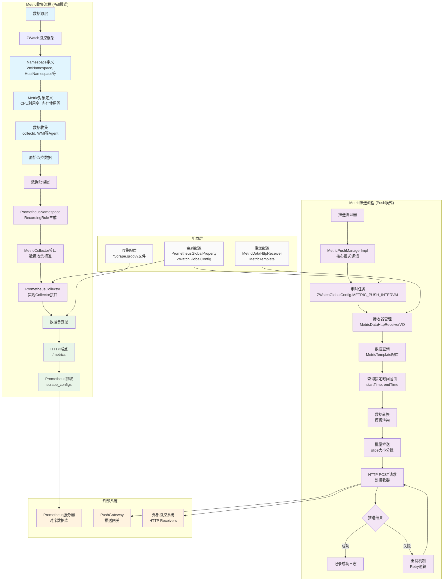

# ZStack与Prometheus交互流程详解

## 概述

本文档详细描述了ZStack监控系统（ZWatch）与Prometheus的集成流程，包括Metric收集（Pull模式）和推送（Push模式）两个主要流程。

## 架构组件

### ZWatch监控框架
- **位置**: `premium/zwatch/`
- **功能**: ZStack的核心监控模块，定义监控指标和数据收集逻辑
- **关键类**:
  - `ZWatchManager`: 监控管理器
  - `Namespace`: 资源类型命名空间（如VmNamespace, HostNamespace）
  - `Metric`: 监控指标定义

### Prometheus集成组件
- **位置**: `premium/zwatch/src/main/java/org/zstack/zwatch/prometheus/`
- **功能**: 处理与Prometheus的数据交互
- **关键类**:
  - `PrometheusCollector`: 实现Prometheus Collector接口
  - `PrometheusNamespace`: 为每个Metric生成RecordingRule
  - `MetricCollector`: 收集器接口定义

### 推送组件
- **位置**: `premium/zwatch/src/main/java/org/zstack/zwatch/metricpusher/`
- **功能**: 实现监控数据的推送功能
- **关键类**:
  - `MetricPushManagerImpl`: 推送管理器实现
  - `MetricDataHttpReceiverVO`: HTTP接收器配置
  - `MetricTemplateVO`: 数据模板配置

## 详细流程图



## 流程详解

### 1. Metric收集流程 (Pull模式)

#### 1.1 数据源层
- **ZWatch监控框架**: 定义监控指标体系
- **Namespace定义**: 每个资源类型（如VM、Host、Storage等）有对应的Namespace类
- **Metric对象定义**: 具体指标如CPU利用率、内存使用、网络流量等
- **数据收集**: 通过各种Agent（collectd、WMI、node_exporter等）收集原始数据

#### 1.2 数据处理层
- **PrometheusNamespace**: 为每个ZWatch Metric生成对应的Prometheus RecordingRule
- **MetricCollector接口**: 标准化数据收集接口
- **PrometheusCollector**: 实现Prometheus官方Collector接口，聚合所有收集器数据

#### 1.3 数据暴露层
- **HTTP端点**: 启动HTTPServer（默认端口9090），提供`/metrics`端点
- **Prometheus抓取**: Prometheus通过配置的`scrape_configs`定期拉取数据

### 2. Metric推送流程 (Push模式)

#### 2.1 推送管理器
- **MetricPushManagerImpl**: 核心推送逻辑实现
- **定时任务**: 根据`ZWatchGlobalConfig.METRIC_PUSH_INTERVAL`配置的间隔执行推送

#### 2.2 数据查询与转换
- **接收器管理**: 管理配置的`MetricDataHttpReceiverVO`推送目标
- **数据查询**: 根据`MetricTemplate`配置查询指定时间范围的数据
- **模板渲染**: 使用配置的模板将数据转换为目标格式

#### 2.3 推送执行
- **批量推送**: 按`ZWatchGlobalConfig.METRIC_PUSH_SLICE_SIZE`配置的大小分批推送
- **HTTP请求**: 发送POST请求到配置的接收器URL
- **错误处理**: 支持重试机制，记录成功/失败状态

## 关键代码示例

### Metric定义示例 (VmNamespace.java)
```java
public static final Metric CPUUsedUtilization = new GaugeMetric("CPUUsedUtilization", metrics, false,
    VmAbstractNamespace.LabelNames.VMUuid, VmAbstractNamespace.LabelNames.CPUNum);

public static final Metric MemoryUsedBytes = new GaugeMetric("MemoryUsedBytes", metrics, false,
    VmAbstractNamespace.LabelNames.VMUuid);
```

### RecordingRule生成示例 (VmPrometheusNamespace.java)
```java
if (metric == VmNamespace.CPUUsedUtilization) {
    rule.setExpression("rate(collectd_virt_virt_vcpu[1m]) / 10000000");
    rule.labelMapping("type", VmNamespace.LabelNames.CPUNum.toString());
}
```

### 推送逻辑示例 (MetricPushManagerImpl.java)
```java
private void pushMetricData(String httpUrl, MetricTemplateVO templateVO) {
    // 查询数据
    MetricQueryObject qo = MetricQueryObject.New()
        .namespace(namespace)
        .startTime(startTime)
        .endTime(endTime)
        .labels(labels)
        .metricName(templateVO.getMetricName())
        .build();

    List<Datapoint> datas = ns.query(qo);

    // 模板渲染
    List<String> metrics = MetricTemplateUtils.render(templateVO.getTemplate(), params);

    // 批量推送
    for (List<String> metricPart : metricParts) {
        ResponseEntity<String> rsp = restf.getRESTTemplate().exchange(httpUrl, HttpMethod.POST, req, String.class);
    }
}
```

## 配置说明

### 收集配置
- **文件位置**: `premium/externalservice/src/main/java/org/zstack/premium/externalservice/prometheus/`
- **文件模式**: `*Scrape.groovy` 文件定义各种资源的抓取配置
- **示例**: `KvmHostScrapePrometheusConfig.groovy`

### 推送配置
- **接收器配置**: `MetricDataHttpReceiverVO` 定义推送目标URL、认证等
- **模板配置**: `MetricTemplateVO` 定义数据查询条件和渲染模板
- **全局配置**: `ZWatchGlobalConfig.METRIC_PUSH_INTERVAL` 等参数

### Prometheus配置
- **端口配置**: `PrometheusGlobalProperty.EXPORTER_PORT` (默认9090)
- **服务配置**: 通过`prometheus/`包管理Prometheus服务生命周期

## 数据流向总结

1. **收集模式**: ZStack Agent → ZWatch → PrometheusNamespace → HTTP /metrics → Prometheus → 存储
2. **推送模式**: ZWatch → MetricPushManager → HTTP POST → PushGateway/外部系统

## 扩展点

- **自定义Metric**: 继承`AbstractPrometheusNamespace`实现新的监控指标
- **自定义收集器**: 实现`MetricCollector`接口添加新的数据源
- **自定义推送**: 通过`MetricTemplate`和`MetricDataHttpReceiver`配置灵活的推送策略

---

*本文档基于ZStack代码库分析生成，版本: 5.4.0*