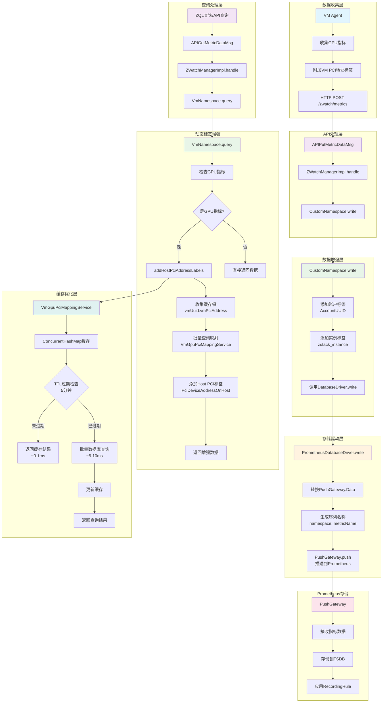
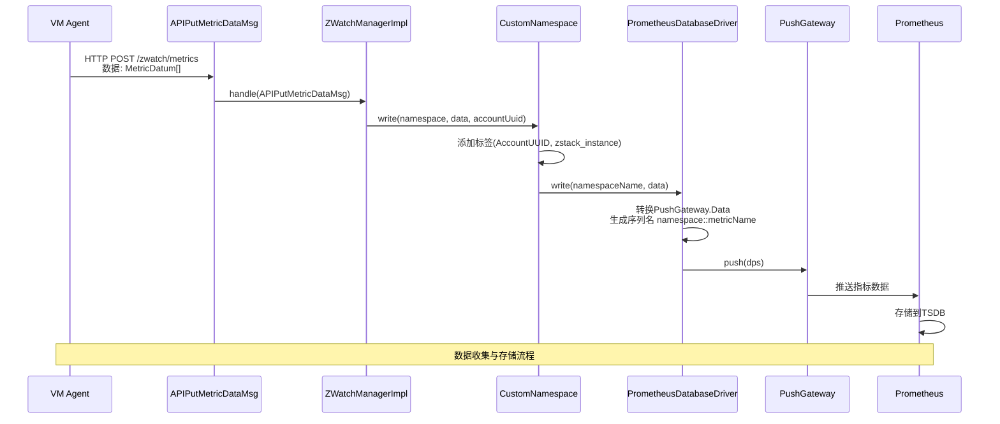
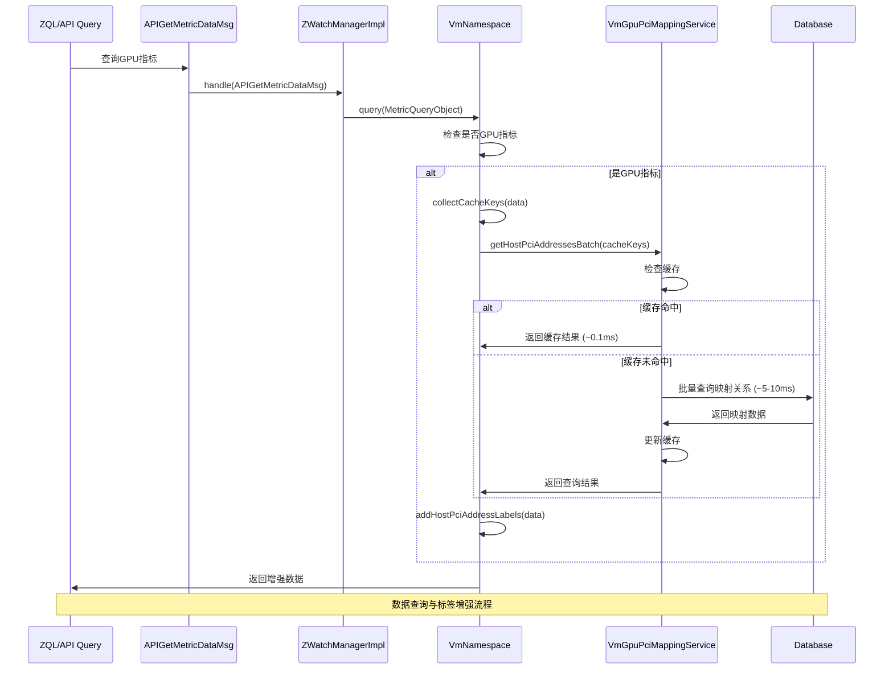
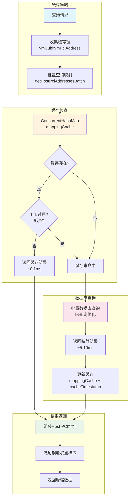
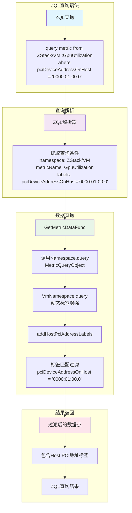
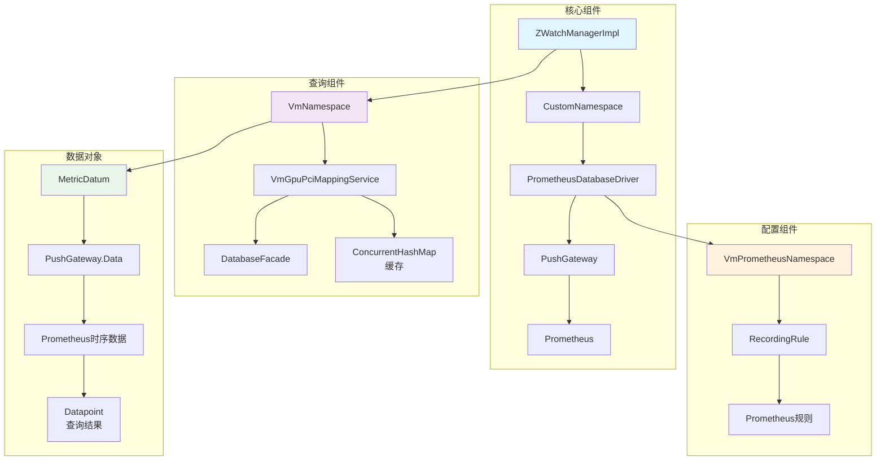

# ZStack GPU PCI地址映射监控数据流流程图

## 完整数据流架构图



## 核心组件交互时序图





## 关键数据转换图

```mermaid
graph LR
    subgraph "Agent原始数据"
        A1[MetricDatum<br/>metricName: gpu_utilization<br/>value: 45.5<br/>labels: {vm_uuid, host_uuid}<br/>time: timestamp]
    end

    subgraph "API消息数据"
        B1[APIPutMetricDataMsg<br/>namespace: "vm"<br/>data: List<MetricDatum>]
    end

    subgraph "Namespace增强数据"
        C1[MetricDatum<br/>metricName: gpu_utilization<br/>value: 45.5<br/>labels: {<br/>  vm_uuid, host_uuid,<br/>  AccountUUID: "acc-xxx",<br/>  zstack_instance: "Custom"<br/>}<br/>time: timestamp]
    end

    subgraph "PushGateway数据"
        D1[PushGateway.Data<br/>metricName: "vm::gpu_utilization"<br/>value: 45.5<br/>labels: {vm_uuid, host_uuid, AccountUUID, zstack_instance}<br/>time: timestamp]
    end

    subgraph "Prometheus存储"
        E1[时序数据<br/>__name__: "vm::gpu_utilization"<br/>vm_uuid: "vm-123"<br/>host_uuid: "host-456"<br/>AccountUUID: "acc-xxx"<br/>zstack_instance: "Custom"]
    end

    subgraph "查询时标签增强"
        F1[Datapoint<br/>labels: {<br/>  vm_uuid, host_uuid,<br/>  AccountUUID, zstack_instance,<br/>  PciDeviceAddressOnHost: "0000:01:00.0"<br/>}<br/>value: 45.5<br/>time: timestamp]
    end

    A1 --> B1
    B1 --> C1
    C1 --> D1
    D1 --> E1
    E1 --> F1

    style A1 fill:#e1f5fe
    style B1 fill:#f3e5f5
    style C1 fill:#e8f5e8
    style D1 fill:#fff3e0
    style E1 fill:#fce4ec
    style F1 fill:#e0f2f1
```

## 性能优化流程图



## ZQL查询支持流程图



## 组件依赖关系图



## 总结

### 数据流关键节点
1. **Agent收集** → **API接收** → **Namespace增强** → **Driver存储** → **Prometheus持久化**
2. **查询请求** → **Namespace查询** → **动态标签增强** → **缓存优化** → **结果返回**

### 性能优化点
- **批量查询**：N个数据点1次DB查询 vs N次查询
- **内存缓存**：~0.1ms响应 vs ~5-10ms DB查询
- **TTL过期**：5分钟自动清理，防止内存泄漏

### 扩展性设计
- **插件化架构**：DatabaseDriver接口支持不同存储后端
- **动态标签**：查询时实时增强，支持灵活的标签组合
- **缓存抽象**：ConcurrentHashMap + TTL，支持高并发场景

### 监控指标
- 缓存命中率：目标 > 95%
- 查询延迟：缓存命中 < 1ms，DB查询 < 10ms
- 内存占用：映射关系缓存 < 10MB（取决于VM/GPU数量）</content>
<parameter name="filePath">/Users/jinjin/dev/zstack-2/zstack/zstack-gpu-pci-monitoring-data-flow.md